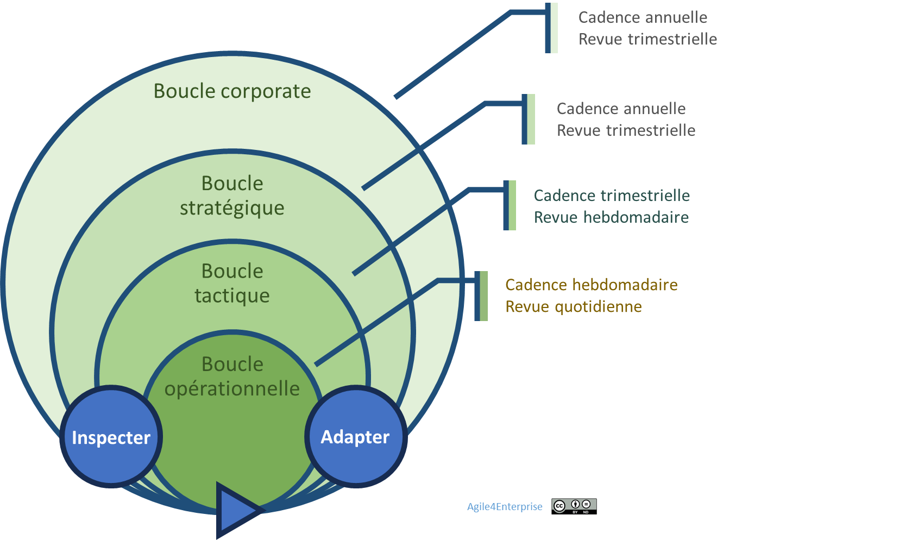
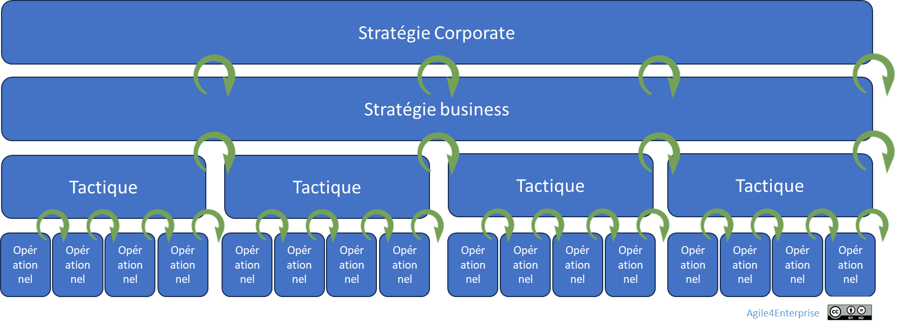
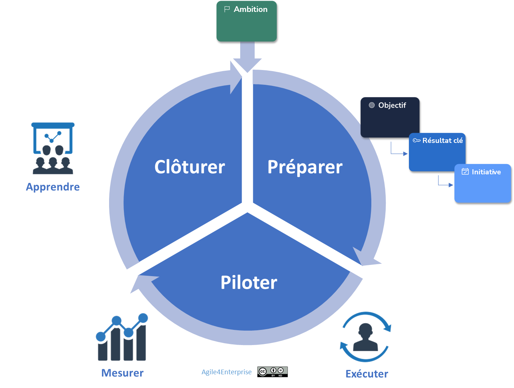

# Agile4B : Les 4 boucles adaptatives

✨**Objectif**

Chaque boucle adaptative associe une dimension de l’agilité à une cadence de changement. Nous ajoutons ici la dimension temporelle, permettant la synchronisation des décisions aux portées, enjeux et horizons différents.

Ce chapitre présente les **4 cadences du changement** qui définissent le rythme d’adaptation de l’entreprise.

📚**Petit lexique**

- **Boucle adaptative** : enchaînement décision → action → apprentissage dans une temporalité spécifique.

## Le cœur battant : les boucles adaptatives

Le changement continu n’avance pas sans cohérence : des cadences régulières en rythment la progression. Ce sont les **boucles adaptatives**. Chacune s’articule autour de :

- Une dimension **Agile4D** : Corporate, stratégique, tactique et opérationnelle
- Une **fréquence** de feed-back : annuelle, trimestrielle, mensuelle et hebdomadaire
- Un **processus d’ajustement collectif** : pilotage par l’impact.

Ces boucles imbriquées permettent un **alignement fluide entre tous les niveaux** (du terrain à la direction) et une synchronisation des prises de décisions. Chacune alimente les autres, favorisant ainsi une dynamique d’adaptation grâce à une **circulation continue de l’information**. Elles constituent le système nerveux de l’entreprise.

### Une orchestration vivante

> *« Nos équipes sont agiles, mais nos priorités ne changent jamais quand il le faut. » — verbatim d’un manager*

Généralement, l’entreprise dispose déjà de **cadences établies** à chaque niveau. Dressez simplement la liste **des instances en vigueur** : comités de suivi, de pilotage, revues de performance, etc.

Il s’agit de partir de l’existant et d’y apporter un cadre cohérent, grâce à l’introduction de **respirations imbriquées**.

➿**TechNova**

> Pour le PDG, « L’agilité, ce n’est pas aller plus vite. C’est rester aligné quand tout s’accélère. »

*L’entreprise a structuré son pilotage en commençant par synchroniser les cadences de décisions :*

- ***Stratégique***

    *Tous les ans, le PDG révise les ambitions avec les actionnaires. Tous les 3 mois, le comité exécutif revoit les grands objectifs.*

- ***Tactique***

    *Chaque trimestre, les comités de direction fixent les objectifs tactiques. Chaque mois, les managers évaluent les initiatives en cours et réallouent les ressources vers de nouvelles priorités.*

- ***Exécution opérationnelle***

    *Chaque semaine, les équipes adaptent leur Backlog en fonction des retours clients et de la progression vers les objectifs.*

***Résultat** : La stratégie n’est plus un document figé : elle évolue en même temps que son exécution.*

## Les 4 cadences du changement

### Principe général

Chaque niveau agit de façon autonome dans sa boucle, puis se synchronise en fin de cycle.

🌀**Exemple** :
*
Par exemple :

- L’équipe Scrum s’aligne avec sa chaîne de valeur en fin de sprint.
- La chaîne s’ajuste à son unité stratégique en fin de mois.
- L’unité s’accorde avec le groupe chaque trimestre.

*

Cette coordination assure une cohérence, et permet d’éviter l’écueil d’une agilité cloisonnée.

⚠️

Cependant, ce processus doit rester **léger, rapide et utile**. Si l’organisation consacre trop d’énergie à préparer ces moments — au point qu’ils deviennent un travail en soi — alors le système se grippe. Au-delà de deux ou trois semaines de délai pour clôturer un cycle de trois mois et élaborer le suivant, c’est un frein, non un levier.

### Cadence corporate — Le tempo de l’entreprise

- **Rythme** : Typiquement annuel, les revues d’ajustement sont, elles, trimestrielles.
- **Sans elle** : Les sujets sont pilotés de manière indépendante, sans synergie ou mobilité stratégique entre activités, créant des silos entre les unités d’affaires.

### Cadence stratégique — Le tempo des unités d’affaires

- **Rythme** : Typiquement annuel, avec des revues a minima trimestrielles.
- **Sans elle** : Les décisions de la direction et les actions du terrain se désalignent, et ne s’alimentent plus. Cette cadence réconcilie intention et réalité.

### Cadence tactique — Le tempo des chaînes de valeur

- **Rythme** : Typiquement trimestriel. Les revues sont plus fréquentes : au minimum tous les 15 jours, plus souvent si nécessaires.
- **Sans elle** : Les équipes tirent dans des directions différentes. La stratégie s’érode dans les frictions de terrain.

### Cadence opérationnelle — Le tempo des équipes

- **Rythme** : Hebdomadaire ou bimensuel, selon les besoins des équipes. Les revues sont quotidiennes.
- **Sans elle** : Les signaux terrain ne remontent plus, les ajustements deviennent trop lents.

L’agilité d’entreprise repose sur la **synchronisation de ces boucles**, et non sur une hiérarchie de commandement.

## Les OKR pour piloter ces boucles

Les **OKR** (Objectives & Key Results) permettent :

- D’articuler vision et exécution,
- De formuler des objectifs clairs,
- D’aligner toutes les unités sur une intention commune.

Le processus orchestre ces cadences en trois phases :

- Préparation (OKR et initiatives),
- Pilotage (exécution et mesures),
- Clôture (bilan et apprentissages).

C’est un outil de gestion agile d’objectifs d’entreprise, pour concentrer les efforts sur les initiatives ayant le plus grand impact.

### OKR ou KPI ?

Les **KPI** (Key Performance Indicators) et les **OKR** ont des finalités différentes, mais complémentaires.

Les **KPI** évaluent la performance actuelle. Ils reflètent l’état de santé de l’organisation, en lien avec les choix passés. Ils permettent d’optimiser l’exploitation des actifs : chiffre d’affaires, taux de satisfaction, disponibilité des services, productivité…

Les **OKR**, eux, sont tournés vers l’exécution de la stratégie. Ils reflètent l’ambition de transformation : ce que l’entreprise veut changer, améliorer ou construire pour rester compétitive demain. Ils sont donc orientés vers le futur, souvent porteurs d’incertitudes, et nécessitent une mobilisation collective.

#### Une métaphore pour bien comprendre

Imaginez que l’entreprise soit une voiture en mouvement.

- Les **KPI** sont le **tableau de bord** : niveau d’essence, vitesse, pression des pneus…

    Ils assurent que le véhicule fonctionne correctement, pour les trajets quotidiens comme pour les longs parcours.

    Sans KPI, on risque la panne ou l’accident à court terme.

- Les **OKR**, eux, jouent le rôle du **GPS** : ils indiquent la direction à prendre, la destination à atteindre, et permettent de s’adapter en temps réel si la route change.

    Sans GPS, on roule peut-être très bien… mais sans savoir si l’on va dans le bon sens.

### Les cycles imbriqués

Les **cadences de changement** sont mises en musique par des **cycles OKR alignés sur différents niveaux de décision** :

| Niveau | Cadence |
| --- | --- |
| Stratégique | Annuelle |
| Tactique | Trimestrielle |
| Opérationnel | hebdomadaire/bimensuelle |

> Le niveau corporate ne suit pas de cycle OKR : il guide par la vision et les arbitrages, non par des objectifs mesurables.

## 🔑 Points clés à retenir

| Niveau | Cadence | Revues | Portée |
| --- | --- | --- | --- |
| **Corporate** | Annuelle | Trimestrielle | Ajustement des paris stratégiques |
| **Stratégique** | Annuelle | Trimestrielle | Cap business et ajustement des priorités |
| **Tactique** | Trimestrielle | Hebdomadaire | Ajustement des initiatives |
| **Opérationnelle** | hebdomadaire ou bimensuelle | Quotidienne | Ajustement des actions |

- L’entreprise agile vit au rythme **de ses boucles adaptatives imbriquées**.

- Les **OKR** sont un **mécanisme de synchronisation**, pas une obligation méthodologique. Vous pouvez utiliser votre propre cadre de pilotage par l’impact.

