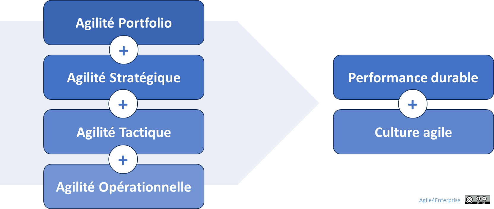

# L’agilité en 4D, les 4 dimensions clés de l’agilité d’entreprise

Propriétaire: Laurent Morisseau

- Sommaire

<aside>
✨

**Objectif**

Dans un environnement en constante évolution, l'agilité d'entreprise ne se limite pas à des pratiques locales, mais implique une transformation systémique. Nous présentons ici les 4 dimensions clés de l'agilité d'entreprise – Portfolio, Stratégique, Tactique et Opérationnelle – et explique comment elles s'imbriquent pour permettre une adaptation efficace aux changements.

</aside>

# L’alignement stratégique

Alignement entre le modèle d’affaire et le modèle opératoire

Dans un environnement en constante évolution, le modèle d’affaire de l’entreprise doit lui aussi s’adapter. L’entreprise agile commence par être une entreprise capable de faire évoluer son business model. Pour soutenir cette évolution, elle doit donc être capable d’adapter son modèle opératoire, la manière dont elle fonctionne. Un alignement dynamique et fluide entre ces deux composantes est essentiel pour assurer la cohérence et la pertinence stratégique de l'organisation. Son modèle opératoire doit donc permettre cette adaptation, il doit être agile.

Pour comprendre cet alignement, nous nous appuyons sur les [**4 niveaux de prises de décision**](https://www.notion.so/Les-4-niveaux-de-prises-de-d-cisions-19290eaf28ff80049db0c684a64e4fb0?pvs=21) de l'entreprise :

# Les 4 dimensions clés de l’agilité d’entreprise

Les 4 dimensions de l’agilité d’entreprise

L’agilité d’entreprise nécessite une approche intégrée et multi-niveaux. Elle repose sur quatre dimensions fondamentales, qui structurent les prises de décisions et assurent un alignement entre la vision, la stratégie et l’exécution :

1. **L’Agilité Portfolio** – Capacité à gérer un portefeuille d’activités et d’investissements aligné sur une vision durable.
2. **L’Agilité Stratégique** – Adaptabilité et pilotage des stratégies business pour naviguer dans l’incertitude.
3. **L’Agilité Tactique** – Capacité d’exécution dynamique et alignement entre stratégie et opérationnel.
4. **L’Agilité Opérationnelle** – Organisation agile du travail et pilotage efficace des équipes.

Chaque dimension joue un rôle spécifique, permettant à l’entreprise d’articuler à la fois **exploration et exploitation**, **planification et adaptation**, **vision long terme et exécution court terme**.

## L’Agilité Portfolio : Piloter dynamiquement un portefeuille stratégique

Une entreprise doit gérer son portefeuille de modèles d’affaires, car il est rare qu’elle puisse prospérer durablement en restant cantonnée à un unique marché ou produit. Dans un environnement incertain, elle doit en permanence explorer de nouvelles opportunités tout en exploitant efficacement ses actifs existants.

L’[**Agilité Portfolio**](https://www.notion.so/Le-mod-le-A4E-de-l-agilit-portfolio-13490eaf28ff803a884fc20066900149?pvs=21) repose sur la capacité à :

- Maintenir une **vision durable**, qui sert de repère stratégique.
- Ajuster le **portefeuille stratégique**, en arbitrant entre activités à consolider, accélérer ou abandonner.
- Assurer la **mobilité stratégique**, en allouant dynamiquement les ressources vers les initiatives à plus fort potentiel.
- Construire une [**organisation ambidextre**](https://www.notion.so/Faire-cohabiter-plusieurs-horizons-strat-giques-13690eaf28ff816f931efc5a173335bc?pvs=21), capable d’innover tout en optimisant ses opérations existantes.

C’est à ce niveau que se décide la [stratégie corporate](https://www.notion.so/Explorer-et-comprendre-la-strat-gie-13690eaf28ff81d18468ca20936fdecc?pvs=21) qui se traduit concrètement dans le [portefeuille stratégique](https://www.notion.so/Faire-cohabiter-plusieurs-horizons-strat-giques-13690eaf28ff816f931efc5a173335bc?pvs=21). Introduire de l’agilité ici signifie rendre la gestion de ce portefeuille plus dynamique, en facilitant les ajustements stratégiques corporate face aux évolutions de l’environnement.

## L’Agilité Stratégique : Construire une stratégie adaptative

L’[**Agilité Stratégique**](https://www.notion.so/L-agilit-strat-gique-13490eaf28ff80e2b4d8f6ab581de0f3?pvs=21) consiste à concevoir une [stratégie business](https://www.notion.so/Explorer-et-comprendre-la-strat-gie-13690eaf28ff81d18468ca20936fdecc?pvs=21) [adaptative](https://www.notion.so/La-fabrique-de-la-strat-gie-13690eaf28ff81429de6ef6e608ea01a?pvs=21), capable de s’adapter aux évolutions du marché tout en maintenant un cap cohérent. Elle repose sur plusieurs principes :

- **Une stratégie mixte** combinant approche délibérée (cadre structurant) et émergente (capacité d’ajustement continu).
- **Un pilotage par l’impact**, intégrant des boucles de feedback régulières pour ajuster les orientations stratégiques.
- **Une réactivité accrue**, avec une gouvernance distribuée qui accélère la prise de décision.
- **Une gestion du [changement stratégique](https://www.notion.so/La-fabrique-de-la-strat-gie-13690eaf28ff81429de6ef6e608ea01a?pvs=21)**, assurant que l’organisation est capable d’intégrer ces ajustements sans friction excessive.

## L’Agilité Tactique : Orchestrer l’exécution et l’adaptation

L’[**Agilité Tactique**](https://www.notion.so/L-agilit-tactique-13490eaf28ff806cb428d9b27abb1f82?pvs=21) assure la connexion entre la stratégie et l’opérationnel. Elle permet d’articuler les ajustements stratégiques avec l’exécution quotidienne, en prenant en compte les contraintes terrain et en exploitant les opportunités émergentes.

Elle repose sur :

- **Un alignement dynamique** entre objectifs stratégiques et initiatives opérationnelles.
- **Une capacité d’apprentissage rapide**, en intégrant les feedbacks du marché et des équipes.
- **Une exécution flexible**, s’appuyant sur des cycles courts et des expérimentations régulières.
- **Une orchestration des décisions tactiques**, en veillant à ce que chaque unité prenne des initiatives cohérentes avec les priorités globales.

L’Agilité Tactique est particulièrement critique pour éviter l’**érosion de la stratégie**, où les décisions locales déconnectées finissent par affaiblir l’exécution globale.

## L’Agilité Opérationnelle : Construire une organisation agile au quotidien

L’[**Agilité Opérationnelle**](https://www.notion.so/L-agilit-op-rationnelle-13490eaf28ff80e5b767fd273784c80b?pvs=21) concerne l’organisation du travail et la structuration des équipes pour garantir une exécution rapide et efficace.

Elle intègre :

- **Des équipes pluridisciplinaires autonomes**, capables de prendre des décisions locales sans dépendre d’une hiérarchie lourde.
- **Une exécution en flux continu**, grâce à des méthodes comme Scrum, Kanban, SAFe, LeSS.
- **Une optimisation des interdépendances**, pour éviter que les gains d’agilité au niveau des équipes ne soient annulés par une rigidité organisationnelle.
- **Une responsabilisation des équipes**, leur donnant la capacité de s’adapter en fonction des besoins et des contraintes du marché.

L’Agilité Opérationnelle ne consiste pas simplement à appliquer des méthodes agiles, mais à développer une culture organisationnelle qui favorise la flexibilité et l’amélioration continue.

## L’Agilité Opérationnelle

L’[Agilité Opérationnelle](https://www.notion.so/L-agilit-op-rationnelle-13490eaf28ff80e5b767fd273784c80b?pvs=21) se concentre sur l’organisation du travail des équipes. Elle englobe des méthodologies comme **Scrum, Kanban, Extreme Programming** et des Frameworks d’agilité à l’échelle tels que [**SAFe](https://www.notion.so/A4E-et-SAFe-Scaled-Agile-Framework-13490eaf28ff802da4d9d0513fd502b7?pvs=21), LeSS, Agile@Scale**. Certains de ces Frameworks vont au-delà de l’agilité à l’échelle pour intégrer des aspects de la **Business Agility**.

## Alignement des dimensions avec les niveaux de décision

Les 4 dimensions clés de l’agilité sont naturellement alignées avec les niveaux de décisions de l’entreprise :

| **Dimension** | **Niveau décisionnel** | **Objectif** |
| --- | --- | --- |
| [**Agilité Portfolio**](https://www.notion.so/Le-mod-le-A4E-de-l-agilit-portfolio-13490eaf28ff803a884fc20066900149?pvs=21) | [Stratégie corporate](https://www.notion.so/Explorer-et-comprendre-la-strat-gie-13690eaf28ff81d18468ca20936fdecc?pvs=21) (portefeuille d’activités) | Gestion dynamique du portefeuille stratégique |
| [**Agilité Stratégique**](https://www.notion.so/L-agilit-strat-gique-13490eaf28ff80e2b4d8f6ab581de0f3?pvs=21) | [Stratégie business](https://www.notion.so/Explorer-et-comprendre-la-strat-gie-13690eaf28ff81d18468ca20936fdecc?pvs=21) (unités d’affaires) | Adaptation continue aux évolutions du marché |
| [**Agilité Tactique**](https://www.notion.so/L-agilit-tactique-13490eaf28ff806cb428d9b27abb1f82?pvs=21) | [Exécution de la stratégie](https://www.notion.so/L-art-de-l-ex-cution-de-la-strat-gie-et-de-la-tactique-14590eaf28ff8094aff8d88d6b871ea8?pvs=21) (unités tactiques) | Orchestration et alignement des initiatives |
| [**Agilité Opérationnelle**](https://www.notion.so/L-agilit-op-rationnelle-13490eaf28ff80e5b767fd273784c80b?pvs=21) | Opérationnel (équipes) | Mise en œuvre efficace des décisions |

Cet alignement assure une cohérence entre vision, stratégie et exécution, et permet d’éviter l’écueil d’une agilité cloisonnée à un seul niveau.

## Vers une agilité d’entreprise intégrée

L’agilité d’entreprise ne peut être réduite à la somme d’initiatives locales. Elle repose sur **l’articulation fluide de ces quatre dimensions**, en assurant :

- **Une cohérence stratégique**, pour ne pas naviguer à vue.
- **Une exécution orchestrée**, afin que l’action quotidienne serve les objectifs long terme.
- **Une capacité d’adaptation continue**, sans rupture brutale ou réorganisation permanente.
- **Un pilotage par l’impact**, avec des boucles de feedback fréquentes à tous les niveaux.

Ce cadre permet d’éviter les pièges classiques des transformations agiles : **agilité déconnectée de la stratégie, initiatives dispersées, rigidité excessive ou, à l’inverse, chaos organisationnel**.

L’entreprise agile est **un système vivant**, en perpétuelle évolution, qui ne subit pas le changement mais l’intègre dans son ADN.

---

# 🔑Points clés à retenir

L'agilité d'entreprise repose sur **4 dimensions** : Portfolio, Stratégique, Tactique et Opérationnelle.

- L'**agilité portfolio** assure une **vision durable** tout en permettant des ajustements stratégiques.
- L'**agilité stratégique** permet à chaque unité d'affaires de s'adapter rapidement aux évolutions du marché.
- L'**agilité tactique** garantit l'exécution efficace de la stratégie.
- L'**agilité opérationnelle** optimise le travail des équipes en facilitant une **réponse rapide et efficace** aux changements.