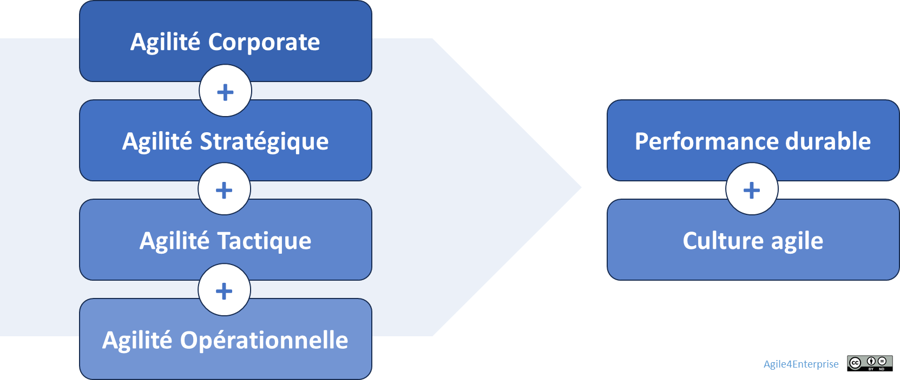

# Agile4D : Les 4 dimensions clés de l’agilité d’entreprise

Propriétaire: Laurent Morisseau

- Sommaire

<aside>
✨

**Objectif**

Dans un environnement en constante mutation, l'agilité d'entreprise ne se limite pas à des pratiques locales :

➔ **Elle construit un système vivant d'adaptation stratégique**, orchestré à travers **quatre boucles adaptatives synchronisées** — Portfolio, Stratégique, Tactique, Opérationnel.

Chaque boucle est constituée d’un niveau de décision, d’une dimension de l’agilité, et d’une cadence de changement. Dans ce chapitre, nous allons explorer les **4 dimensions vivantes de l’agilité d’entreprise**.

</aside>

# Les 4 dimensions clés de l’agilité d’entreprise

Les 4 dimensions de l’agilité d’entreprise

<aside>
💡

**Boucle adaptative = Dimension Agile4D + Cadence de feedback vivant.**

- Chaque **niveau de décision** dans l’entreprise n’est pas statique : **c’est un rythme d’adaptation vivant**.
- Les [4 niveaux de décisions](https://www.notion.so/Les-4-niveaux-de-prise-de-d-cision-Piloter-un-syst-me-vivant-19290eaf28ff80049db0c684a64e4fb0?pvs=21) ne sont pas **des couches hiérarchiques**, mais **des boucles synchronisées**, respirant chacune à son propre rythme.
- C’est la **synchronisation dynamique de ces boucles** qui crée **l’alignement vivant** de l’entreprise agile.
</aside>

**Agile4D** repose sur **quatre dimensions fondamentales**, chacune représentant **une dimension de l’agilité**, connectée aux autres :

1. **Agilité Portfolio** – Ajuster les grands équilibres stratégiques alignés sur une vision durable.
2. **Agilité Stratégique** – Adapter en continu la stratégie business.
3. **Agilité Tactique** – Synchroniser exécution et adaptation.
4. **Agilité Opérationnelle** – Réagir et apprendre au quotidien.

Chaque dimension joue un rôle spécifique, permettant à l’entreprise d’articuler à la fois :

- **Exploration et exploitation**,
- **Planification et adaptation**,
- **Vision long terme et exécution immédiate**.

---

## Agilité Portfolio : Piloter dynamiquement les horizons stratégiques

<aside>
💡

**Boucle vivante**

Ajuster le portefeuille d'activités selon l'évolution du marché et des opportunités.

</aside>

Une entreprise doit gérer son portefeuille de modèles d’affaires, car il est rare qu’elle puisse prospérer durablement en restant cantonnée à un unique marché ou produit. Dans un environnement incertain, elle doit en permanence explorer de nouvelles opportunités tout en exploitant efficacement ses actifs existants.

L’[**Agilité Portfolio**](https://www.notion.so/Agile4E-La-cartographie-strat-gique-vivante-13490eaf28ff803a884fc20066900149?pvs=21) repose sur la capacité à :

- Maintenir une **vision durable**, qui sert d’étoile du nord.
- Ajuster le [**portefeuille stratégique**](https://www.notion.so/Faire-cohabiter-plusieurs-horizons-strat-giques-13690eaf28ff816f931efc5a173335bc?pvs=21), en arbitrant entre activités à consolider, accélérer ou abandonner. C’est la traduction concrète de la [stratégie corporate](https://www.notion.so/Explorer-et-comprendre-la-strat-gie-13690eaf28ff81d18468ca20936fdecc?pvs=21).
- Assurer la **mobilité stratégique**, en allouant dynamiquement les ressources vers les initiatives à plus fort potentiel.
- Construire une [**organisation ambidextre**](https://www.notion.so/Faire-cohabiter-plusieurs-horizons-strat-giques-13690eaf28ff816f931efc5a173335bc?pvs=21), capable d’innover tout en optimisant ses opérations existantes.

> *Par exemple : Dans un groupe de services, la stratégie de croissance était a priori basée sur des partenaires. Elle a été révisée en une croissance organique et des acquisitions après des expérimentations dans divers pays.*
> 

## Agilité Stratégique : Construire une stratégie adaptative

<aside>
💡

**Boucle vivante** :

Adapter continuellement la stratégie business aux signaux émergents.

</aside>

L’[**Agilité Stratégique**](https://www.notion.so/L-agilit-strat-gique-13490eaf28ff80e2b4d8f6ab581de0f3?pvs=21) consiste à concevoir une [stratégie business](https://www.notion.so/Explorer-et-comprendre-la-strat-gie-13690eaf28ff81d18468ca20936fdecc?pvs=21) [adaptative](https://www.notion.so/La-fabrique-de-la-strat-gie-13690eaf28ff81429de6ef6e608ea01a?pvs=21), capable de s’adapter aux évolutions du marché tout en maintenant un cap cohérent. Elle repose sur plusieurs principes :

- **Une stratégie mixte** combinant approche délibérée (cadre structurant) et émergente (capacité d’ajustement continu).
- **Un pilotage par l’impact**, intégrant des boucles de feedback régulières pour ajuster les orientations stratégiques.
- **Une réactivité accrue**, avec une gouvernance distribuée qui accélère la prise de décision.
- **Une gestion du [changement stratégique](https://www.notion.so/La-fabrique-de-la-strat-gie-13690eaf28ff81429de6ef6e608ea01a?pvs=21)**, assurant que l’organisation est capable d’intégrer ces ajustements sans friction excessive.

> *Par exemple : Dans une entreprise Saas, le segment de client principal était les grands groupes. Le choix de basculer sur le segment des TPE/PME, plus scalable a été décidé et exécuter en quelques mois.*
> 

## Agilité Tactique : Orchestrer exécution et adaptation

<aside>
💡

**Boucle vivante** :

Connecter la vision stratégique aux réalités du terrain opérationnel.

</aside>

L’[**Agilité Tactique**](https://www.notion.so/L-agilit-tactique-13490eaf28ff806cb428d9b27abb1f82?pvs=21) assure la connexion entre la stratégie et l’opérationnel. Elle permet d’articuler les ajustements stratégiques avec l’exécution quotidienne, en prenant en compte les contraintes terrain et en exploitant les opportunités émergentes.

Elle repose sur :

- **Un alignement dynamique** entre objectifs stratégiques et initiatives opérationnelles.
- **Une capacité d’apprentissage rapide**, en intégrant les feedbacks du marché et des équipes.
- **Une exécution flexible**, s’appuyant sur des cycles courts et des expérimentations régulières.
- **Une orchestration des décisions tactiques**, en veillant à ce que chaque unité prenne des initiatives cohérentes avec les priorités globales.

L’Agilité Tactique est particulièrement critique pour éviter l’**érosion de la stratégie**, où les décisions locales déconnectées finissent par affaiblir l’exécution globale.

> *Par exemple : Une équipe produit a mis en place une boucle de synchronisation mensuelle avec son directeur de BU. Résultat : une réduction de 30 % du Backlog « inutile » et une plus grande lisibilité sur les arbitrages.*
> 

## Agilité Opérationnelle : Réagir et apprendre en continu

<aside>
💡

**Boucle vivante** :

Organiser l'exécution agile du travail quotidien.

</aside>

L’[**Agilité Opérationnelle**](https://www.notion.so/L-agilit-op-rationnelle-13490eaf28ff80e5b767fd273784c80b?pvs=21) concerne l’organisation du travail et la structuration des équipes pour garantir une exécution rapide et efficace.

Elle intègre :

- **Des équipes pluridisciplinaires autonomes**, capables de prendre des décisions locales sans dépendre d’une hiérarchie lourde.
- **Une exécution en flux continu**, grâce à des méthodes comme Scrum, Kanban, SAFe, LeSS.
- **Une optimisation des interdépendances**, pour éviter que les gains d’agilité au niveau des équipes ne soient annulés par une rigidité organisationnelle.
- **Une responsabilisation des équipes**, leur donnant la capacité de s’adapter en fonction des besoins et des contraintes du marché.

> *Par exemple : Une équipe de maintenance a mis en place des mini-retrospectives hebdomadaires. En 2 mois, elle a réduit de 40 % le temps de résolution d’anomalies grâce à des décisions locales rapides.*
> 

## À quoi sert Agile4D ? Se repérer pour mieux agir

Une des difficultés récurrentes dans les transformations agiles est de **ne pas savoir à quel niveau on se situe**. Or sans cela, impossible de choisir les bons outils, les bons principes, ou de résoudre les tensions au bon endroit.

**Agile4D est conçu comme un système de repérage.**

> Il ne décrit pas seulement « comment agir », chaque dimension agile va apporter son lot de principes et d’outils; mais d’abord où on agit, sur quel type de décisions, et donc à quel niveau de la boucle adaptative on se trouve.
> 

### Comment se repérer ?

Posez-vous cette question :

> Quel est le niveau de décision activé ?
> 
- Si les décisions concernent toute l’entreprise → **Agilité Portfolio**
- Si elles concernent la direction d’une unité stratégique (BU, entité, pays) → **Agilité Stratégique**
- Si elles concernent la coordination de plusieurs équipes ou produits → **Agilité Tactique**
- Si elles concernent uniquement mon équipe → **Agilité Opérationnelle**

> Ce repérage est essentiel pour que les rôles soient clairs, les outils bien ciblés, et la gouvernance adaptée.
> 

*Par exemple :*

- ***Un Product Owner SAFE (ART)** est souvent **tactique** (synchronisation inter-équipes).*
- ***Un LPM SAFE (Lean Portfolio Management)** agit au niveau **Portfolio**.*
- ***Une équipe Scrum** est **opérationnelle**, même dans une grande orga*

| **Dimension** | **Niveau décisionnel** | **Objectif** |
| --- | --- | --- |
| [**Agilité Portfolio**](https://www.notion.so/Agile4E-La-cartographie-strat-gique-vivante-13490eaf28ff803a884fc20066900149?pvs=21) | [Stratégie corporate](https://www.notion.so/Explorer-et-comprendre-la-strat-gie-13690eaf28ff81d18468ca20936fdecc?pvs=21) (entreprise) | Mobilité stratégique, pilotage du portefeuille d’activités |
| [**Agilité Stratégique**](https://www.notion.so/L-agilit-strat-gique-13490eaf28ff80e2b4d8f6ab581de0f3?pvs=21) | [Stratégie business](https://www.notion.so/Explorer-et-comprendre-la-strat-gie-13690eaf28ff81d18468ca20936fdecc?pvs=21) (unités d’affaires) | Adaptation continue aux évolutions du marché |
| [**Agilité Tactique**](https://www.notion.so/L-agilit-tactique-13490eaf28ff806cb428d9b27abb1f82?pvs=21) | [Exécution de la stratégie](https://www.notion.so/L-art-de-l-ex-cution-de-la-strat-gie-et-de-la-tactique-14590eaf28ff8094aff8d88d6b871ea8?pvs=21) (unités tactiques) | Synchronisation des initiatives et des feedbacks |
| [**Agilité Opérationnelle**](https://www.notion.so/L-agilit-op-rationnelle-13490eaf28ff80e5b767fd273784c80b?pvs=21) | Opérationnel (équipes) | Réaction rapide, amélioration continue |

## Les 4 niveaux d’agilité : uniquement si nécessaire

### Quels pièges éviter dans l’activation des 4D

Toutes les entreprises **n'ont pas besoin d'activer les 4 niveaux d’agilité**, correspondant à [**4 types de décisions**](https://www.notion.so/Les-4-niveaux-de-prise-de-d-cision-Piloter-un-syst-me-vivant-19290eaf28ff80049db0c684a64e4fb0?pvs=21) qui **ne sont pas présents dans toutes les organisations**.

L’agilité doit être adaptée au **contexte** et à la **structure de l’entreprise**, selon sa **maturité**, son **modèle économique** et sa **stratégie dominante**.

### **Startup** : Agilité tactique & opérationnelle

Par nature, une startup est en **phase d’exploration**. Elle dispose d’une **vision** mais n’a pas encore validé son **business model**. Sa stratégie est **émergente**, opportuniste, et s’ajuste au fil des retours du terrain.

Elle mobilise surtout :

- L’**agilité tactique**, pour structurer l’exécution de ses paris stratégiques,
- L’**agilité opérationnelle**, pour apprendre vite, itérer et s’adapter au quotidien.

Elle **n’a pas besoin** d’un niveau stratégique ou portfolio, tant que son modèle d’affaires n’est pas stabilisé.

### **Scale-up** : Agilité stratégique en croissance

La scale-up a validé son modèle économique à petite échelle et entre dans une phase d’**expansion**. Elle doit **passer à l’échelle de son marché**, structurer son organisation, tout en maintenant l’agilité de ses équipes.

Elle mobilise :

- L’**agilité stratégique**, pour piloter le développement du business à plus grande échelle,
- L’**agilité tactique**, pour aligner les initiatives à cette nouvelle stratégie.
- L’**agilité opérationnelle**, pour assurer la continuité et l’efficience de l’exécution.

C’est une phase clé où l’**ambidextrie organisationnelle** devient essentielle. Au début de la vie de la Scale-up, les niveaux tactiques et opérationnels sont fusionnés. C’est le passage à l’échelle qui scinde les deux niveaux de prise de décisions.

### **Entreprise mono-activité** : Agilité opérationnelle prioritaire

Une entreprise centrée sur une seule activité (produit ou service stable) évolue dans une **zone d’exploitation**. Elle se concentre sur l’**excellence opérationnelle** et l’amélioration continue.

Elle mobilise principalement :

- L’**agilité opérationnelle**, pour maintenir l’efficience, la qualité et l’adaptation aux demandes clients,
- Une **agilité tactique légère**, pour ajuster ses priorités internes aux évolutions de l’environnement.

Elle **ne mobilise pas** d’agilité au niveau portfolio, car elle ne gère pas plusieurs modèles d’affaires simultanément.

---

# 🔑Points clés à retenir

- **Agile4D est l’architecture adaptative de l’entreprise agile.**
- Chaque dimension est **une boucle de feedback synchronisée** à un niveau de décision.
- L’agilité **n’est pas cloisonnée**, mais **coordonnée**.
- **On active ce dont on a besoin, quand c’est nécessaire et non par principe.**
- **Le changement devient un rythme intégré, et non un projet temporaire.**

---

### 👉 Et maintenant ? [Les 4 cadences du changement](https://www.notion.so/Agile4B-Les-4-boucles-adaptatives-13b90eaf28ff8091b4cce85974f50938?pvs=21) !

Pour boucler les boucles adaptatives, détaillons maintenant les cadences de changement et leur orchestration.