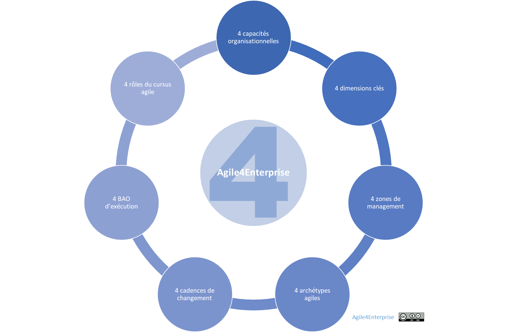
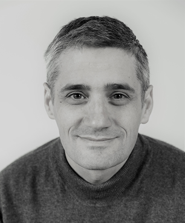

# En savoir plus

Propriétaire: Laurent Morisseau

- Sommaire

# Les points clés d’Agile4Enterprise

## L’approche

Le Framework Agile4Enterprise propose une approche structurée et pragmatique pour répondre aux défis posés par l’environnement VUCA en intégrant différentes dimensions et capacités clés pour une gestion agile réussie :

### [4 dimensions clés](https://www.notion.so/L-agilit-en-4D-les-4-dimensions-cl-s-de-l-agilit-d-entreprise-15f90eaf28ff80bf80d2eef1834aec41?pvs=21) de l'agilité :

- **Portfolio** (long terme, portefeuille d’investissement stratégique)
- **Stratégique** (quelques années, stratégie d’entreprise)
- **Tactique** (mois à annuel, objectifs intermédiaires)
- **Opérationnel** (jours à semaines, exécution terrain)

Ces dimensions favorisent un **alignement continu et cohérent** entre la vision stratégique et l’exécution opérationnelle.

### [4 capacités organisationnelles](https://www.notion.so/Les-4-capacit-s-organisationnelles-cl-s-13790eaf28ff8077bff1ecf61771656f?pvs=21) à développer :

- **Réactive** : gestion rapide des urgences.
- **Flexible** : ajustement interne sans perturbations majeures.
- **Adaptative** : évolution à moyen et long terme.
- **Proactive** : anticipation et innovation stratégique.

Ces capacités permettent à l’entreprise de maîtriser le changement, de saisir les opportunités émergentes et de rester compétitive dans un environnement complexe et dynamique.

### [4 Archétypes agiles](https://www.notion.so/Les-4-arch-types-agiles-14290eaf28ff8004874de93022c243f8?pvs=21) pour définir la cible organisationnelle :

- **Flux** (services, amélioration continue avec Kanban)
- **Réseau** (collaboration et coopération dynamique)
- **Produit** (innovation et développement agile avec Scrum)
- **Projet** (pilotage agile des initiatives temporaires)

Chaque archétype guide l’organisation vers une structure adaptée à son environnement et à ses objectifs stratégiques.

## Approche intégrative du Framework Agile4Enterprise :

Agile4Enterprise ne remplace pas les autres Frameworks agiles mais les intègre dans une approche globale cohérente, couvrant toutes les dimensions nécessaires à l’agilité d’entreprise. Il combine une approche **descendante et délibérée** (stabilité stratégique) avec une approche **ascendante et émergente** (adaptation locale).

---

## Les outils

### [Modèle 4E](https://www.notion.so/Le-mod-le-agile-A4E-13490eaf28ff80529f43eb6739221080?pvs=21) du portefeuille stratégique et l’outil [PACTE](https://www.notion.so/Guide-de-l-outil-PACTE-17a90eaf28ff8007ae71e576ac507f7e?pvs=21) (Portfolio Agile Canevas pour la Trajectoire d’Entreprise) :

- **Exploration** : innovation et nouvelles opportunités à long terme.
- **Expansion** : croissance stratégique à moyen terme.
- **Exploitation** : optimisation de l’opérationnel à court terme.
- **Exclusion** : libération de ressources via la « destruction créatrice ».

Ce modèle facilite la gestion dynamique du portefeuille d’investissement stratégique de l’entreprise.

### [ACTE](https://www.notion.so/Guide-de-l-outil-ACTE-13490eaf28ff802e8fcde2047f78143b?pvs=21) (Agile Canevas pour la Transformation d’Entreprise) :

Permet de décliner la vision stratégique annuelle en objectifs trimestriels, puis en plan mensuel concret, tout en assurant un alignement cohérent à travers les cinq dimensions clés :

- Structure
- Processus
- Capacités organisationnelles
- Individus
- Reconnaissance & métriques

### [Les 4 cadences](https://www.notion.so/Les-4-cadences-du-changement-et-de-l-apprentissage-13b90eaf28ff8091b4cce85974f50938?pvs=21) de changement et gestion du risque :

- Portfolio
- Stratégie business
- Tactique
- Opérationnelle

Chacune à une fréquence adaptée (annuelle, trimestrielle, mensuelle, hebdomadaire), permettant une adaptation permanente et maîtrisée aux changements internes et externes.

### Modèle [IMPACTE](https://www.notion.so/Le-mod-le-de-maturit-IMPACTE-18b90eaf28ff8053a419ccaa7d91bc21?pvs=21) – évaluation de la maturité agile :

Ce modèle combine les dimensions, capacités et niveaux de décision pour évaluer et piloter l’évolution de l’agilité d’entreprise.

---

# A qui s’adresse ce Framework ?

Le **Framework Agile4Enterprise** est conçu pour aider **les dirigeants d’entreprise** et **les coachs agiles** à relever les défis actuels en facilitant :

- **Une prise de décision rapide et éclairée**.
- **Un alignement dynamique** entre la stratégie et l’exécution.
- **Le développement d’une culture agile** à tous les niveaux de l’organisation.

Il permet ainsi à l’entreprise d’adopter une gestion véritablement adaptative, lui permettant non seulement de répondre aux défis immédiats, mais aussi de saisir les opportunités futures en transformant le changement en un **avantage concurrentiel durable**.

## Pour quelles entreprises ?

Bien qu’adaptable à toutes les organisations, **ce Framework a été spécialement conçu pour les PME françaises évoluant dans un [environnement VUCA](https://www.notion.so/S-adapter-au-monde-incertain-et-complexe-en-constante-volution-14a90eaf28ff80d8aef5e1eb635744e2?pvs=21)**, où **la capacité d’adaptation est un facteur clé de succès**.

### **Les TPE**

Par nature, elles sont **déjà agiles**. Leur enjeu est de préserver cette agilité tout en se développant. Agile4Enterprise les aide à structurer une croissance **maîtrisée et durable**.

### **Les grands groupes**

Ces organisations doivent relever le défi du **passage à l’échelle**, avec une multitude d’équipes à coordonner. Cela explique le succès de Frameworks comme [SAFe](https://www.notion.so/A4E-et-SAFe-Scaled-Agile-Framework-13490eaf28ff802da4d9d0513fd502b7?pvs=21). **Agile4Enterprise** prend en compte cette complexité via l’[agilité tactique](https://www.notion.so/L-agilit-tactique-13490eaf28ff806cb428d9b27abb1f82?pvs=21), sans développer spécifiquement des modèles de passage à l’échelle tactique. Il reste compatible avec les solutions existantes, tout en se concentrant sur **l’essentiel** avec une approche **simple et pragmatique**.

### **Les PME**

Coincées entre la nécessité d’une gestion **efficiente** et la pression de nouveaux entrants plus agiles, les PME doivent conjuguer **réactivité, flexibilité, adaptabilité, et proactivité** pour maintenir leur compétitivité. Agile4Enterprise leur apporte une approche structurée pour atteindre cet équilibre.

Ce Framework est **contextualisable** selon chaque entreprise et **compatible avec les autres Frameworks existants**. Il s’adresse particulièrement aux organisations ayant déjà initié une **transformation agile au niveau opérationnel** et souhaitant maintenant **étendre cette agilité à l’ensemble de l’entreprise** pour en faire un **levier stratégique**.

---

## Pour qui ?

### **En tant que dirigeant**

> Quels bénéfices attendre de l’agilité pour la réussite de mon entreprise ?
> 

Diriger ne se limite pas à assurer la croissance de l’entreprise : il s’agit aussi de **créer les conditions d’une croissance durable et alignée sur les objectifs stratégiques**.

Agile4Enterprise **maximise la valeur des investissements déjà réalisés** en agilité opérationnelle et les **transforme en résultats concrets au niveau business**. Son approche pragmatique **préserve la continuité stratégique et opérationnelle** sans nécessiter de rupture culturelle.

### **En tant que coach agile**

> Quelles compétences et solutions mobiliser ? Jusqu’où va ma mission dans l’accompagnement de l’entreprise ?
> 

Plutôt que de remplacer les approches existantes, **ce Framework les complète et les valorise**, s’appuyant sur des décennies d’expérience agile pour **fournir un cadre cohérent et global**.

Grâce à Agile4Enterprise, un coach agile peut évoluer vers :

- **Un rôle de coach en organisation agile**, spécialisé selon les **archétypes agiles**, avec une expertise en [agilité stratégique](https://www.notion.so/L-agilit-strat-gique-13490eaf28ff80e2b4d8f6ab581de0f3?pvs=21), [organisationnelle](https://www.notion.so/L-agilit-organisationnelle-13490eaf28ff80918f84ee8e39eddc99?pvs=21), [tactique](https://www.notion.so/L-agilit-tactique-13490eaf28ff806cb428d9b27abb1f82?pvs=21), [managériale](https://www.notion.so/13490eaf28ff809a8119fc11f7020f79?pvs=21) et [RH](https://www.notion.so/L-agilit-RH-et-culture-agile-13490eaf28ff80d5955dd24b80af5cff?pvs=21).
- **Un rôle de coach en entreprise agile**, maîtrisant également l’[agilité Portfolio](https://www.notion.so/L-agilit-Portfolio-18f90eaf28ff8009b702d2aa0eae18cf?pvs=21) et l’alignement stratégique.

Cela lui permet de :

✔ Accompagner l’entreprise dans sa transformation globale.

✔ Devenir un **interlocuteur privilégié** de la direction.

✔ **Briser le plafond de verre** souvent rencontré dans les transformations agiles.

✔ Accéder à des **leviers d’action puissants** pour structurer et réussir la transition.

### **En tant que collaborateur**

> Quel impact sur mon travail et quels bénéfices en tirer ?
> 

Agile4Enterprise clarifie la **vision stratégique de l’entreprise** et les **choix organisationnels qui la guident**, permettant aux collaborateurs de mieux comprendre **le lien entre leurs actions et les résultats globaux**.

Il permet de :

✔ **Donner du sens** aux transformations en cours ou passées.

✔ **Faciliter la prise de décisions éclairées** dans chaque rôle.

✔ **Valoriser la contribution individuelle et collective** en l’alignant aux objectifs stratégiques.

Ce Framework ne se contente pas de structurer l’agilité au sein des équipes, il vise à **faire de l’agilité un véritable levier stratégique et concurrentiel**, accessible à toutes les entreprises engagées dans une transformation durable.

---

# **Pourquoi le nom Agile4Enterprise ?**

**Agile4Enterprise pour “Agile for Enterprise”,** reflète l’ambition d’une **agilité globale**, applicable à l’ensemble de l’entreprise. Bien que conçu dans un contexte **francophone**, son objectif dépasse les frontières pour répondre aux enjeux des entreprises.

Le A symbolise bien sûr l’agilité, mais également la recherche de la performance durable, celle d’un A-player.

Le **4** symbolise plusieurs dimensions essentielles :

- **Le quatrième niveau** du modèle de maturité **Agile Fluency**, qui représente une agilité aboutie et durable à l’échelle organisationnelle.
- Aux 4 dimensions de l’agilité associées aux 4 niveaux de prises de décisions,
- Aux 4 capacités organisationnelles à développer,
- Aux 4 archétypes agiles à implémenter,
- Aux 4 cadences pour la transformation,
- Aux 4 boîtes à outils pour l’exécution,
- Aux 4 zones de management (Exploration, Expansion, Exploitation, Exclusion),
- Aux 4 rôles pour un cursus agile.

---

# Les ressources de ce Framework

Ce Framework puise ses origines dans l’essai [**“Repenser l’agilité pour l’entreprise”**](https://www.notion.so/Livre-Repenser-l-agilit-pour-l-entreprise-13790eaf28ff80b2a82adc283b67ba15?pvs=21), résultat de plusieurs années de réflexion approfondie sur le sujet. Depuis, il a évolué en un [**wiki**](https://www.notion.so/13690eaf28ff80ea9d55d7d1c545597e?pvs=21) régulièrement mis à jour, permettant d’explorer les **principes** et la **théorie** qui soutiennent ce Framework.

Conçu pour un **public francophone**, ce Framework s’accompagne de ressources adaptées pour en **faciliter l’adoption** et créer une **communauté locale engagée**.

## **Rejoignez la communauté**

Vous pouvez dès maintenant participer au [**Meetup de l’Entreprise Agile**](https://www.meetup.com/business-agility-meetup-group/), actif depuis 2023. **Une communauté de soutien**, composée de coachs, formateurs et praticiens, partageant les **meilleures pratiques** pour réussir la transformation agile.

## **Formations dédiées**

Un **cursus de formation** spécifique au Framework est actuellement en développement, afin de fournir un accompagnement structuré pour sa mise en œuvre.

---

# **Laurent Morisseau, auteur de** ce Framework

**Coach et formateur en entreprise agile**

#BusinessAgility #OKR

[MorisseauConsulting.com](http://morisseauconsulting.com/)

### **Parcours et réalisations**

- **Auteur** des ouvrages :
    - *La boîte à outils de la méthode OKR*
    - *Kanban pour l’IT*
    - *Kanban, l’approche en flux pour l’entreprise agile*
    - **Co-auteur** de *Rupture Douce V1 & V2*
- **Créateur d’événements et de communautés** :
    - Conférences **Agile Tour Rennes** et **Lean Kanban France** (devenu *FlowCon*),
    - Meetup **de l’Entreprise Agile**, dédié aux échanges sur l’agilité d’entreprise.
- **Reconnaissance internationale** :
    - Certified OKR professional Coach et Accredited OKR Trainer par OKR Mentors et Betterworks
    - Premier **Certified Scrum Coach (CSC)** de la ScrumAlliance en France,
    - Premier **Kanban Certified Coach (KCP)** et **Accredited Kanban Trainer (AKT)** avec la **Kanban University** en France.
    - Agile Ambassador Award 2011 par l’association Agile World

### **Contributions**

Conférencier reconnu, blogueur engagé et acteur de l’écosystème agile en France, Laurent Morisseau accompagne les entreprises dans leur transformation vers la **Business Agility**, en combinant expertise stratégique et pragmatisme opérationnel.

**➡️ À vous de jouer ! Développez l’agilité à tous les niveaux pour maximiser l’impact et assurer un avenir prospère à votre entreprise !**