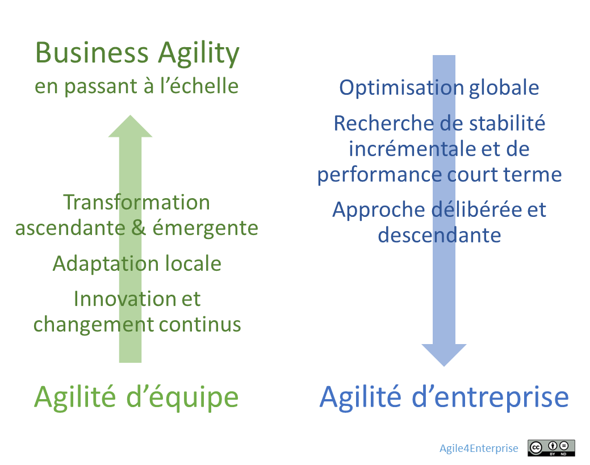
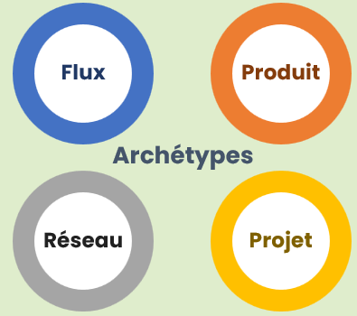
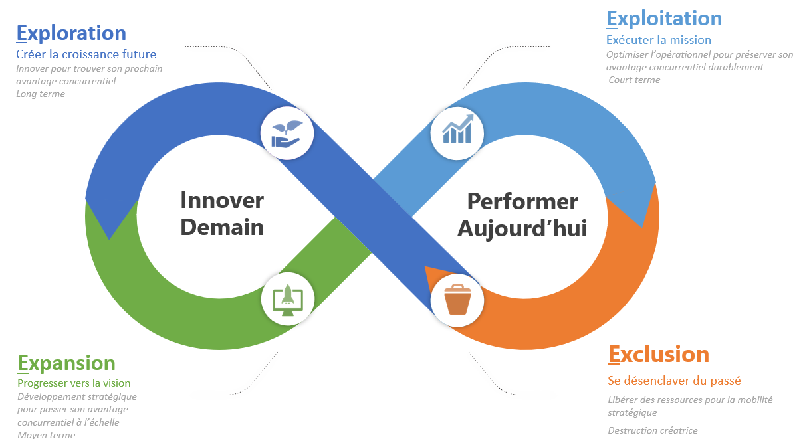
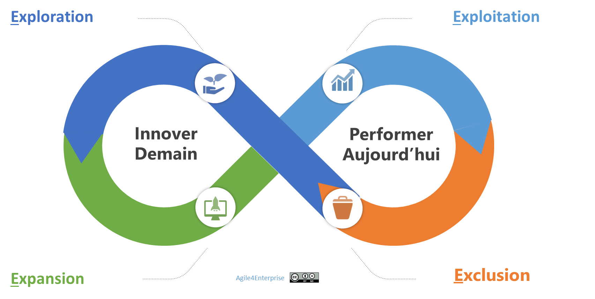
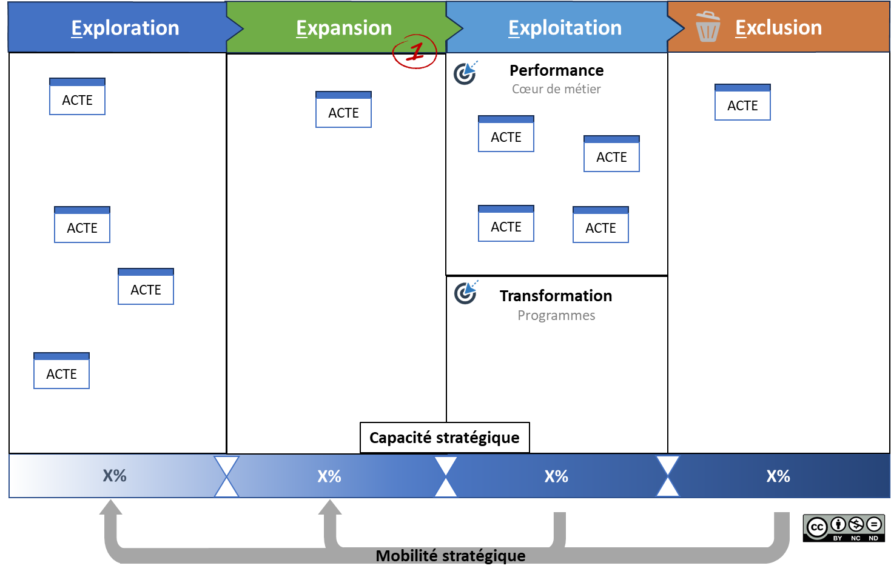

# Le Framework Agile4Enterprise

✨ **Objectif** Présenter la **proposition de valeur** du Framework **Agile4Enterprise**, conçu pour accompagner les entreprises dans leur transformation agile en structurant un système capable d’évolution continue. **Agile4Enterprise** repose sur quatre piliers et quatre principes.

# **Proposition de valeur du Framework Agile4Enterprise**

> *“On est devenus bons en delivery agile, mais on n’a pas changé notre façon de piloter l’entreprise.” — Verbatim d’un directeur produit.*
> 

Adopter l'agilité comme méthode est une première étape. **Construire une entreprise adaptative est le vrai objectif.** Le Framework Agile4Enterprise propose une approche systémique et organique de l’entreprise, permettant aux organisations de s'adapter durablement dans un monde incertain et en évolution permanente.

Il cherche à structurer un **système d’adaptation stratégique**, soutenu par :

- **Des boucles de décision synchronisées**,
- **Des feedbacks cadencés**,
- **Des ajustements évolutifs**.

## Les 4 piliers essentiels

> *“On a 3 comités de pilotage pour la stratégie, mais personne ne sait quand changer une priorité produit.”*
> 

Le modèle repose sur **quatre piliers essentiels**, qui soutiennent l’équilibre entre **stabilité** et **évolution** :

- **Finalité stable** : ancrage identitaire clair et porteur de sens.
- **Stratégie adaptative** : pilotage dynamique du cap en fonction des signaux du réel.
- **Alignement dynamique** : cohérence entre vision, décisions et actions.
- **Développement stratégique** : exécution de la stratégie en parallèle de son évolution, alimentée par les feedbacks du terrain. Il est également appelé management stratégique.

Ces piliers sont des fonctions vivantes, pas des cases à cocher.

L’objectif n’est pas de rendre l’entreprise « agile » au sens strict, mais de faire de **l’agilité un avantage concurrentiel durable**, sans nécessiter de transformation brutale.

## **Les 4 principes du Framework Agile4Enterprise**

### Une évolution, pas une révolution

Le cadre invite à :

- Faire évoluer progressivement les structures existantes,
- Ajuster la gouvernance et les centres de décision intelligemment,
- Développer progressivement les capacités d’adaptation dans le système en place.

### Un moyen au service de l’entreprise, pas un but en soi

> *“On a déployé l’agilité dans toutes les équipes, mais la stratégie reste pilotée en silos.” — Verbatim d’un directeur général d’un groupe de services*
> 

L’agilité n’est pas une fin en soi. C’est **un levier stratégique**, une source d’**avantage concurrentiel durable,** conçu pour maximiser :

- L’impact réel des décisions et des actions,
- La rapidité et la pertinence de l’adaptation,
- La capacité à évoluer de manière fluide.

### Pas un modèle unique, mais des agilités d’entreprise

**Agile4Enterprise** se distingue par sa capacité à s’adapter aux réalités du terrain. Il est :

- **Ouvert / agnostique** : Il ne propose pas de méthode en tant que tel et s’articule avec les autres approches et outils : Scrum, Kanban, SAFe, LeSS, OKR…
- **Contextualisable** : selon maturité, stratégie, enjeux,
- Propose des formes d’agilités d’entreprise différentes selon les contextes.

> Pas un modèle rigide. Un cadre à orchestrer.
> 

### **L’agilité d’entreprise est différente de l’agilité d’équipe : approche mixte**

> **Le problème** : L’agilité d’équipe n’a pas modifié durablement les capacités stratégiques des entreprises.
> 

La **Business Agility** repose sur l’élargissement des pratiques agiles, initialement déployées au niveau des équipes, à l’ensemble de l’organisation. Mais l’agilité d’équipe, par nature, reste un **levier local d’adaptation**. Or, une entreprise cherche à **optimiser sa performance à l’échelle globale**.

Pour y parvenir, elle ne peut s’appuyer uniquement sur l’auto-organisation locale ou sur des dynamiques émergentes isolées. Cela conduirait à une juxtaposition d’optimisations locales, sans garantie d’un impact positif sur l’ensemble.

Dans un système complexe, la **performance globale ne résulte pas de la somme des performances locales**. Elle nécessite un **cadre commun**, qui oriente, aligne et structure. Et c’est là tout l’enjeu, celui de **trouver le bon équilibre** entre :

- Autonomie locale vs cohérence globale,
- transformation émergente vs Arbitrages stratégiques ,
- Innovation et apprentissage continus vs recherche de stabilité et de performance.

C’est pourquoi les deux, agilité d’équipe et agilité d’entreprise, sont complémentaires — mais **ni interchangeables, ni suffisantes l’une pour l’autre**. **L’entreprise agile est un tout vivant, pas une somme d’équipes agiles.**

**Un cadre Post Agile**

Ce cadre fait donc le constat de l’émergence d’une forme d’agilité dite « **post agile** », c’est-à-dire allant au-delà du Manifeste Agile initial. Cette agilité nouvelle associe deux dimensions : l’agilité d’équipe, issue historiquement du Manifeste Agile pour le développement logiciel, et l’agilité d’entreprise, adaptée aux enjeux actuels auxquels le Manifeste ne répond plus pleinement. 

# **Un Framework structuré et outillé**

✨ **Le système vivant d’Agile4Enterprise repose sur les 4D (quoi), les 4C (quand), les 4X (comment), et les 4E (où).**

Le Framework Agile4Enterprise

Ce Framework repose sur des modèles et des outils :

### **Agile4B : Les 4 boucles adaptatives**

**Le cœur du système sont les boucles adaptatives.** Chaque boucle est définie par l’articulation de :

- **Une dimension de l’agilité** :
    
    ➔ Portfolio, **Stratégique**, **Tactique**, **Opérationnelle**,
    
- **Une cadence du changement** spécifique à chaque boucle.
    
    ➔ *Annuelle*, *Trimestrielle*, *Mensuelle/Bimensuelle*, *Hebdomadaire*.
    

*4B (boucle) = 4D (dimension) + 4C (cadence)*

### Agile4X : Les 4 archétypes agiles

Ce sont des modèles organisationnels alignés qui fournissent des cibles **adaptables**, facilitant la mise en œuvre des principes agiles dans des contextes variés.

**Chaque archétype organise l'agilité selon une stratégie dominante :**

Une approche rapide et exploratoire en adoptant une organisation Projet%2013490eaf28ff8030a8aeecf9206d94ea.md), 

Une approche fluide et intégrée en adoptant une organisation Flux, 

Une approche scalable et évolutive en adoptant une organisation Produit,

Une approche distribuée en adoptant une organisation Réseau.

### **Agile4E**

Le **modèle d’alignement stratégique agile** pour définir les zones stratégiques : Exploration, expansion, exploitation, et exclusion.

### **PACTE**

Le **Portfolio Agile Canevas pour la Transformation d’Entreprise** est conçu pour structurer et piloter le changement au niveau du portefeuille.

### **ACTE**

L’ **Agile Canevas pour la Transformation d’Entité** est conçu pour structurer et piloter le changement.

Et d’autres outils à découvrir :

- Un cursus pour les coach agiles
- Un modèle de maturité

---

#