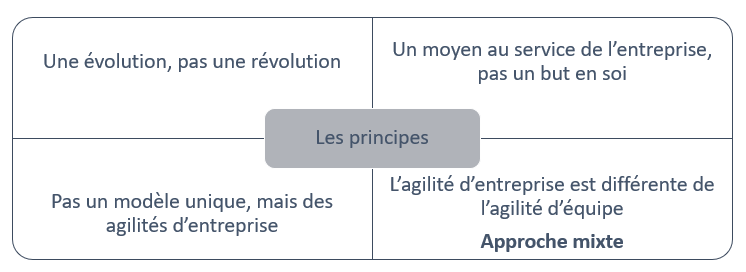

# Le Framework Agile4Enterprise

Propriétaire: Laurent Morisseau

- Sommaire

<aside>
✨

**Objectif**

Cette section présente la **proposition de valeur** du Framework **Agile4Enterprise**, conçu pour accompagner les entreprises dans leur transformation agile de manière **adaptative et systémique**. Il repose sur **quatre piliers** : **vision**, **stratégie adaptative**, **alignement dynamique** et **exécution stratégique**, permettant aux entreprises d'intégrer l'agilité pour en faire un **avantage concurrentiel durable**.

L’approche se distingue par son équilibre entre **agilité d’équipe** et **agilité d’entreprise**, et par une **évolution progressive** plutôt qu’une transformation brutale. Elle s’appuie sur des **boîtes à outils** et des **modèles adaptatifs**, favorisant une mise en œuvre contextualisée et alignée sur les réalités de chaque organisation.

</aside>

# **Proposition de valeur du Framework Agile4Enterprise**

### **Un cadre agile pour une entreprise adaptative et performante**

> *Le **Framework Agile4Enterprise** propose une approche **holistique et intégrée** de l’agilité d’entreprise, permettant aux organisations de **s’adapter durablement** dans un monde incertain, concurrentiel et en perpétuelle évolution.*
> 

Il ne se limite pas à une **simple extension des pratiques agiles** aux équipes ou aux processus. Il apporte une **vision structurée et systémique** de l’agilité, garantissant une [**gestion adaptative**](https://www.notion.so/Pourquoi-une-entreprise-agile-Pourquoi-maintenant-19190eaf28ff8011ae3eecfe210badba?pvs=21) et alignée sur les enjeux stratégiques de l’entreprise.

### **Les 4 piliers fondamentaux**

Ce modèle repose sur **quatre piliers essentiels**, qui assurent un équilibre entre **stabilité stratégique** et **capacité d’adaptation continue** :

- **Une vision durable** : Fondée sur une ambition claire et porteuse de sens.
- **Une stratégie adaptative** : Capable d’évoluer en fonction des changements du marché et de l’environnement.
- **Un alignement dynamique** : Assurant la cohérence et la coordination entre les décisions stratégiques et leur exécution opérationnelle.
- **Une exécution stratégique agile** : Permettant une mise en œuvre flexible et réactive des priorités de l’entreprise.

L’objectif est de faire de **l’agilité un avantage concurrentiel durable**, permettant à l’entreprise de prospérer **sans restructuration radicale**, en s’appuyant sur des mécanismes d’adaptation progressifs et continus.

Ce Framework renforce la compétitivité actuelle tout en préparant la performance future, en recherchant un **impact maximal**.

# **Principes fondamentaux du Framework Agile4Enterprise**

## **Une approche évolutive et non révolutionnaire**

L’entreprise agile représente une **évolution** des principes fondamentaux de l’entreprise et non une rupture radicale. Elle s’inscrit dans une tendance globale d’adaptation des entreprises à leur époque et à une évolution sociétale plus large. Agile4Enterprise ne cherche pas à **réinventer l’entreprise**, mais à **optimiser et renforcer ses capacités existantes** en intégrant des principes agiles adaptés à son fonctionnement.

- Il ne s’agit **pas de remplacer** les processus et structures en place, mais de les **faire évoluer progressivement** vers plus de flexibilité et de résilience.
- La nature et la fréquence des décisions, ainsi que le degré de décentralisation, doivent être ajustés **sans bouleverser inutilement l’organisation**.
- L’objectif est d’introduire **des mécanismes d’agilité systémique** **et** développer certaines de ses capacités organisationnelles afin d’avoir des réponses adaptées aux changements et des transformations durables.

<aside>
💡

Le concept d’entreprise agile n’est pas une révolution, mais une évolution des entreprises qui s’adaptent à leur époque et à leur environnement en mutation. L’agilité doit s’inscrire dans l’existant des entreprises, **s’appuyant sur des fondations solides et adaptées au contexte de chaque organisation.**

</aside>

## **L’agilité au service de l’entreprise, pas une fin en soi**

- Principe trop souvent oublié, l’agilité ne doit **pas être perçue comme une finalité**, mais comme **un levier stratégique** pour renforcer son **avantage concurrentiel** dans un environnement [VUCA](https://www.notion.so/S-adapter-au-monde-incertain-et-complexe-en-constante-volution-14a90eaf28ff80d8aef5e1eb635744e2?pvs=21).
- Elle permet d’**accroître l’impact des décisions**, en assurant une **meilleure réactivité et une prise de décision éclairée** face aux incertitudes du marché.

> L’objectif n’est pas d’être "agile" pour l’être, mais de créer un modèle d’entreprise plus efficace, capable de saisir rapidement les opportunités et d’ajuster ses choix stratégiques en continu.
> 

## **Un cadre flexible, contextualisable et multi-niveaux**

Autre principe oublié des [Frameworks agiles prescriptifs](https://www.notion.so/Pourquoi-un-nouveau-Framework-agile-Pourquoi-maintenant-19190eaf28ff80adbe81dfbe22f6555e?pvs=21), l’agilité ne repose pas sur un **modèle unique et rigide**. Agile4Enterprise adopte une approche **agnostique et adaptable** :

- **Multiméthodes et multi-Frameworks** : Il peut être combiné avec des approches agiles existantes (Scrum, Kanban, SAFe, LeSS, OKR, Lean Portfolio Management, …).
- **Contextualisation selon l’entreprise** : Il s’adapte aux **choix stratégiques, à la maturité organisationnelle et aux objectifs spécifiques** de chaque entreprise.
- **Intégration des [4 archétypes agiles](https://www.notion.so/Les-4-arch-types-agiles-14290eaf28ff8004874de93022c243f8?pvs=21)** : Chaque entreprise peut structurer son agilité en fonction de ses horizons d’investissement et de son modèle économique.

> L’agilité d’entreprise n’est pas une méthode unique, mais un cadre adaptable qui s’intègre aux réalités spécifiques de chaque organisation.
> 

## **Une synergie entre agilité d’équipe et agilité d’entreprise**

L’agilité d’entreprise **ne consiste pas uniquement** à **généraliser les pratiques agiles des équipes** à l’ensemble de l’organisation. Elle implique une [approche mixte](https://www.notion.so/Pourquoi-un-nouveau-Framework-agile-Pourquoi-maintenant-19190eaf28ff80adbe81dfbe22f6555e?pvs=21), équilibrant :

- **L’optimisation locale et l’adaptation des équipes** ([agilité opérationnelle](https://www.notion.so/L-agilit-op-rationnelle-13490eaf28ff80e5b767fd273784c80b?pvs=21) et [tactique](https://www.notion.so/L-agilit-tactique-13490eaf28ff806cb428d9b27abb1f82?pvs=21)).
- **L’alignement stratégique et la cohérence globale** ([agilité stratégique](https://www.notion.so/L-agilit-strat-gique-13490eaf28ff80e2b4d8f6ab581de0f3?pvs=21)).
- L’enjeu est de **permettre une autonomie des équipes**, tout en garantissant un **cadre cohérent à l’échelle de l’organisation**.

> Les entreprises agiles ne sont pas simplement une somme d’équipes agiles. Elles doivent structurer leur agilité pour assurer un équilibre entre adaptation locale et vision stratégique.
> 

# **Principes directeurs de la transformation agile**

## **Un processus évolutif, pas une destination finale**

L’agilité d’entreprise ne se résume pas à un **état figé** à atteindre. Elle repose sur une dynamique de transformation continue :

- L’entreprise **ne devient pas agile une fois pour toutes**, mais développe des **capacités d’adaptation constantes**.
- L’enjeu est d’**évaluer régulièrement** son niveau d’agilité et d’**ajuster sa trajectoire en fonction de son contexte et de ses priorités stratégiques**.

> Devenir une entreprise agile est une évolution continue, non une transformation ponctuelle. Ce qui compte, ce n’est pas d’atteindre un état "agile", mais d’instaurer une capacité continue d’adaptation et d’amélioration.
> 

## **Une évolution progressive, pas une rupture**

L’entreprise agile sait **gérer le changement en continu** tout en [**créant de la valeur**](https://www.notion.so/Piloter-le-changement-continu-19190eaf28ff803887cce848d3e35489?pvs=21) et en cherchant à maximiser la **valeur perçue**. Cette démarche repose sur une **évolution douce**, qui s’appuie sur l’existant au lieu d’imposer une solution « idéale » peu adaptés aux entreprises déjà établies.

> La différence clé : se définir un archétype pour orienter la transformation plutôt que d’appliquer de manière rigide des Frameworks à l’échelle.
> 

## **Une transformation agile... menée avec agilité**

La transition vers l’agilité **doit elle-même être agile** :

- Elle repose sur une **progression maîtrisée**, en testant et en ajustant en fonction des retours d’expérience.
- Elle ne doit **pas être imposée de manière descendante**, mais émerger progressivement en fonction des besoins et du contexte de l’organisation.
- Chaque entreprise développe son propre **rythme de transformation**, combinant des **pratiques matures et des expérimentations émergentes**.

> Une transformation agile ne se décrète pas, elle se construit progressivement, avec pragmatisme et alignement stratégique.
> 

# Un Framework outillé et structuré

La boîte à outils Agile4Enterprise

Ce Framework repose sur des principes et des boîtes à outils.

## Les principes

### Les 4 dimensions clés de l’agilité 4D

Les [4 dimensions clés de l’agilité](https://www.notion.so/L-agilit-en-4D-15f90eaf28ff80bf80d2eef1834aec41?pvs=21), adossées aux [4 niveaux de décisions](https://www.notion.so/Les-4-niveaux-de-prises-de-d-cisions-19290eaf28ff80049db0c684a64e4fb0?pvs=21) incarnant le changement à tous les niveaux de l’entreprise :

- L’[Agilité Portfolio](https://www.notion.so/L-agilit-Portfolio-18f90eaf28ff8009b702d2aa0eae18cf?pvs=21) au niveau Corporate,
- L’[**Agilité Stratégique**](https://www.notion.so/L-agilit-strat-gique-13490eaf28ff80e2b4d8f6ab581de0f3?pvs=21) au niveau des unités stratégiques,
- L’[**Agilité Tactique**](https://www.notion.so/L-agilit-tactique-13490eaf28ff806cb428d9b27abb1f82?pvs=21) au niveau des chaînes de valeurs,
- L’[**Agilité Opérationnelle**](https://www.notion.so/L-agilit-op-rationnelle-13490eaf28ff80e5b767fd273784c80b?pvs=21) au niveau des équipes.

**Quatre boîtes à outils [Portfolio](https://www.notion.so/Le-mod-le-A4E-de-l-agilit-portfolio-13490eaf28ff803a884fc20066900149?pvs=21), [stratégiques](https://www.notion.so/L-agilit-Strat-gique-en-action-13490eaf28ff80d7ab1de95853019041?pvs=21), [tactiques](https://www.notion.so/L-agilit-Tactique-en-action-13490eaf28ff805bb9f7f2562f76465e?pvs=21) et [opérationnelles](https://www.notion.so/L-agilit-op-rationnelle-en-action-13490eaf28ff80579b3ffe55c3cb1bca?pvs=21)**

Ces boîtes à outils facilitent la prise de décision et l’exécution, en garantissant un **alignement global**.

### Les 4 capacités organisationnelles à développer

Les 4 capacités organisationnelles à développer pour devenir une entreprise agile : 

Pour faire face aux défis actuels, une entreprise doit développer des [**capacités agiles à tous les niveaux](https://www.notion.so/Les-4-capacit-s-organisationnelles-cl-s-13790eaf28ff8077bff1ecf61771656f?pvs=21) :**

- [**Réactif](https://www.notion.so/Les-4-capacit-s-organisationnelles-cl-s-13790eaf28ff8077bff1ecf61771656f?pvs=21)** : répondre aux urgences immédiates.
- [**Flexible**](https://www.notion.so/Les-4-capacit-s-organisationnelles-cl-s-13790eaf28ff8077bff1ecf61771656f?pvs=21) : ajuster ses processus rapidement.
- [**Adaptable](https://www.notion.so/Les-4-capacit-s-organisationnelles-cl-s-13790eaf28ff8077bff1ecf61771656f?pvs=21)** : évoluer sur le long terme.
- [**Proactif**](https://www.notion.so/Les-4-capacit-s-organisationnelles-cl-s-13790eaf28ff8077bff1ecf61771656f?pvs=21), provoquer le changement de demain et anticiper les évolutions futures.

<aside>
💡

Ce sont **quatre stratégies de réponse variées face au changement continu, et à la gestion du risque et de l’incertitude, en d**éveloppant une posture **réactive** autant que **proactive**, intégrant gestion à court et long terme.

</aside>

### Les 4 archétypes agiles

Les 4 archétypes agiles fournissent des cibles **adaptables**, facilitant la mise en œuvre des principes agiles dans des contextes variés.

<aside>
💡

La **gestion adaptative** prend des formes différentes, en réponse à une stratégie dominante :

- Rapide et exploratoire pour une organisation [Projet](https://www.notion.so/Agile4Project-Arch-type-Projet-agile-13490eaf28ff8030a8aeecf9206d94ea?pvs=21),
- Fluide et intégré pour une organisation [Flux](https://www.notion.so/Agile4Flow-Arch-type-Flux-13490eaf28ff809bac54ed5deaa8a257?pvs=21),
- Scalable et évolutif pour une organisation [Produit](https://www.notion.so/Agile4Product-Arch-type-Produit-13490eaf28ff80b29733f767568ab6a5?pvs=21),
- Distribué pour une organisation [Réseau](https://www.notion.so/Agile4Network-Arch-type-R-seau-13490eaf28ff805c8fcfeed28b68a77b?pvs=21).
</aside>

## Les outils

Il repose également sur une série d’**outils concrets** pour accompagner les entreprises dans leur transformation agile :

### **Le portefeuille d’investissement et la stratégie**

Ces éléments sont les **points d’entrée** pour orienter les décisions stratégiques et garantir une réponse alignée aux priorités de l’entreprise.

**A4E**

Le [**modèle d’alignement stratégique agile](https://www.notion.so/Le-mod-le-A4E-de-l-agilit-portfolio-13490eaf28ff803a884fc20066900149?pvs=21)** pour définir les zones stratégiques.

**PACTE**

Le [**Portfolio Agile Canevas pour la Transformation d’Entreprise**](https://www.notion.so/Guide-de-l-outil-PACTE-17a90eaf28ff8007ae71e576ac507f7e?pvs=21), conçu pour structurer et piloter le changement au niveau du portefeuille stratégique.

### **Accompagner les entreprises dans leur transformation**

**ACTE**

L’ [**Agile Canevas pour la Transformation d’Entreprise**](https://www.notion.so/Guide-de-l-outil-ACTE-13490eaf28ff802e8fcde2047f78143b?pvs=21), conçu pour structurer et piloter le changement.

Les [**4 cadences du changement**](https://www.notion.so/Les-4-cadences-de-changement-et-d-apprentissage-13b90eaf28ff8091b4cce85974f50938?pvs=21), alignées sur les **4 niveaux de décision** :

- Stratégie corporate,
- Stratégie business,
- Tactique,
- Opérationnelle.

Ce processus garantit un **pilotage aligné** des évolutions à tous les niveaux de l’organisation.

### **Élever les compétences des coachs agiles**

En s’appuyant sur les 4 dimensions principales **de l’agilité d’entreprise**, ce Framework permet aux coachs agiles de développer leurs compétences, au sein d’un cursus agile pour devenir coach d’entreprise :

- [Agilité portfolio](https://www.notion.so/L-agilit-Portfolio-18f90eaf28ff8009b702d2aa0eae18cf?pvs=21)
- [Agilité stratégique](https://www.notion.so/L-agilit-strat-gique-13490eaf28ff80e2b4d8f6ab581de0f3?pvs=21)
    - [Agilité organisationnelle](https://www.notion.so/L-agilit-organisationnelle-13490eaf28ff80918f84ee8e39eddc99?pvs=21)
    - [Agilité RH](https://www.notion.so/L-agilit-RH-et-culture-agile-13490eaf28ff80d5955dd24b80af5cff?pvs=21)
- [Agilité tactique](https://www.notion.so/L-agilit-tactique-13490eaf28ff806cb428d9b27abb1f82?pvs=21)
    - [Agilité managériale](https://www.notion.so/13490eaf28ff809a8119fc11f7020f79?pvs=21)
- [Agilité opérationnelle](https://www.notion.so/L-agilit-op-rationnelle-13490eaf28ff80e5b767fd273784c80b?pvs=21)

### **Évaluer l’agilité d’entreprise**

Le Framework propose un **radar d’évaluation** pour chaque **pilier agile** et chaque **archétype**, permettant de mesurer et d’ajuster l’agilité à tous les niveaux.

[Radar](https://www.notion.so/Radar-de-l-entreprise-agile-13490eaf28ff80288f7dcd0fee927567?pvs=21)

C’est l’outil associé au [modèle de maturité IMPACTE](https://www.notion.so/Le-mod-le-de-maturit-IMPACTE-18b90eaf28ff8053a419ccaa7d91bc21?pvs=21). Il permet de s’évaluer. Ce radar est constitué de 4 axes correspondants aux [4 capacités organisationnelles principales de l’agilité d’entreprise](https://www.notion.so/Les-4-capacit-s-organisationnelles-cl-s-13790eaf28ff8077bff1ecf61771656f?pvs=21) : Réactif, flexible, adaptable, et proactif.

[**IMPACTE**](https://www.notion.so/Le-mod-le-de-maturit-IMPACTE-18b90eaf28ff8053a419ccaa7d91bc21?pvs=21), le modèle de maturité pour évaluer l’organisation.

---

## **En synthèse**

Agile4Enterprise est :

- Une grille de lecture d’une entreprise Agile
- Un guide de transformation
- Un modèle opératoire
- Un cursus pour les coach agiles

| **Dimensions de l’agilité** | **Portée** | **Cadences de changement** | **Modèles** | **Boîte à outils** | **Rôles de transformation** |
| --- | --- | --- | --- | --- | --- |
| Portfolio stratégique | Entreprise | Cycle OKR stratégique | Modèle 4E | IMPACTE, PACTE | Coach agile entreprise |
| Stratégique | Unité stratégique (Organisation)
*BU* | Cycle OKR stratégique | Agilité RH et organisationnelle 
*Principes de design stratégique* | Archétypes
ACTE stratégique | Coach agile organisation
*Par archétype* |
| Tactique | Unité tactique
*Chaîne de valeur* | Cycle OKR tactique | Agilité managériale
Agilité à l’échelle
*Principes de design tactique* | ACTE tactique | Coach agile |
| Opérationnel | Unité opérationnelle
*Equipe* | Revue opérationnelle | *Principes de design opérationnel*
*Méthodes agiles* | ACTE opérationnel | Agile master |

---

# 🔑 **Points clés à retenir**

1. **Une approche évolutive et adaptable**
    - L’agilité n’est **pas une finalité** mais un **levier stratégique**.
    - Ce Framework **ne suit pas un modèle rigide**, il est **multiméthodes et multi-Frameworks** pour s’adapter à chaque entreprise.
2. **Une vision holistique de l’agilité**
    - Il structure l’agilité à travers **4 niveaux de décision** : **Portfolio, Stratégique, Tactique et Opérationnel**.
    - Il repose sur **les 4 archétypes agiles** : Projet, Produit, Flux et Réseau, pour ajuster l’approche selon le contexte.
3. **Une transformation progressive et continue**
    - Plutôt qu’une rupture brutale, l’agilité doit être un **processus d’adaptation continue**.
    - L’outil **IMPACTE** permet d’évaluer la maturité agile et d’ajuster le niveau d’agilité en fonction des besoins de l’organisation.
4. **Un cadre structuré et outillé**
    - Des **outils concrets** comme **PACTE** et **ACTE** aident à piloter la transformation.
    - Le **radar d’évaluation** permet de mesurer l’impact et d’assurer un alignement stratégique agile.
5. **Un accompagnement à tous les niveaux**
    - Le Framework définit **les rôles de transformation** et les **cadences du changement** pour garantir une intégration fluide de l’agilité.
    - Il propose un **cursus de formation** pour les coachs agiles et leaders organisationnels.