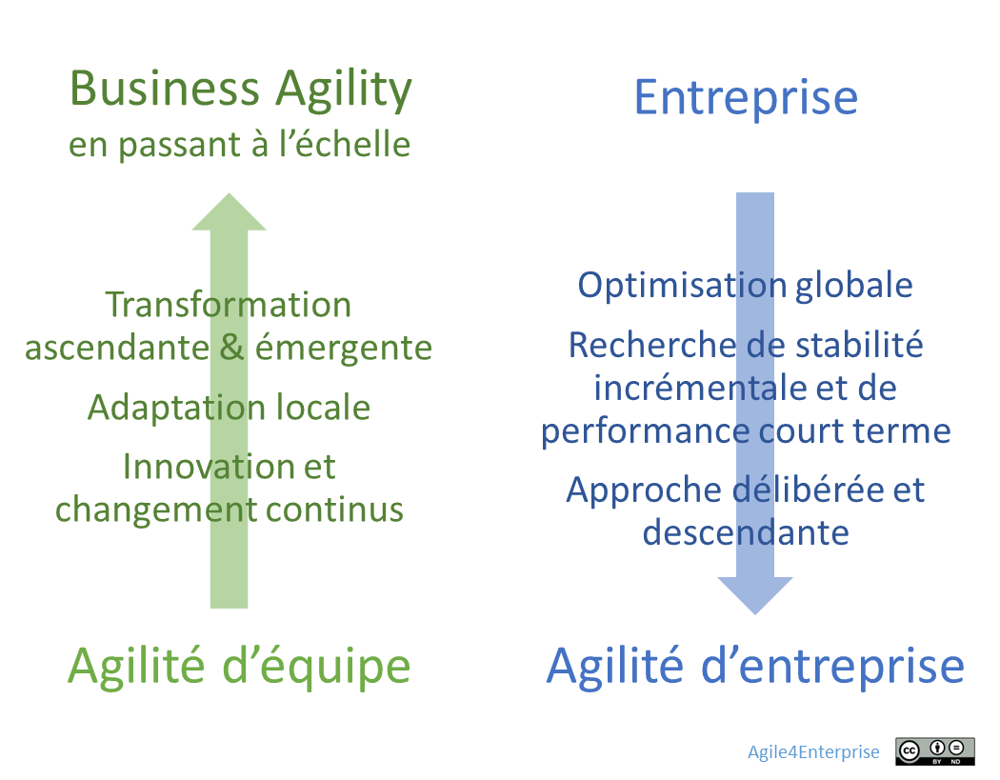
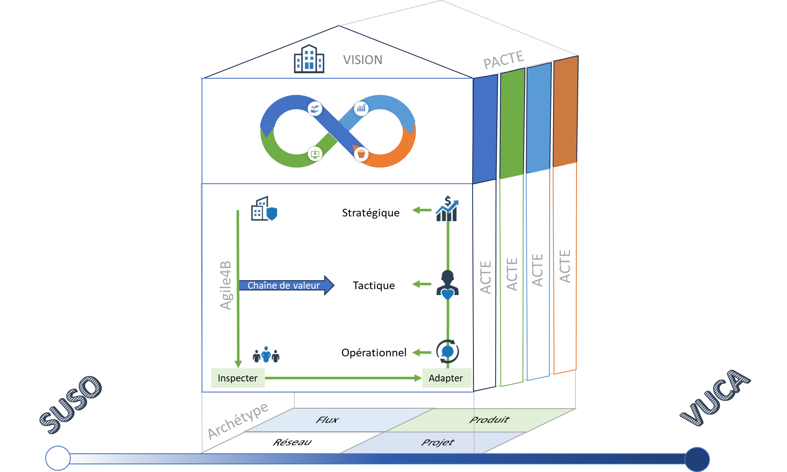
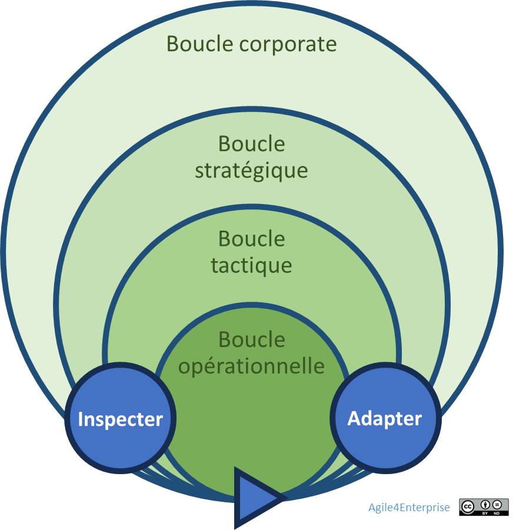
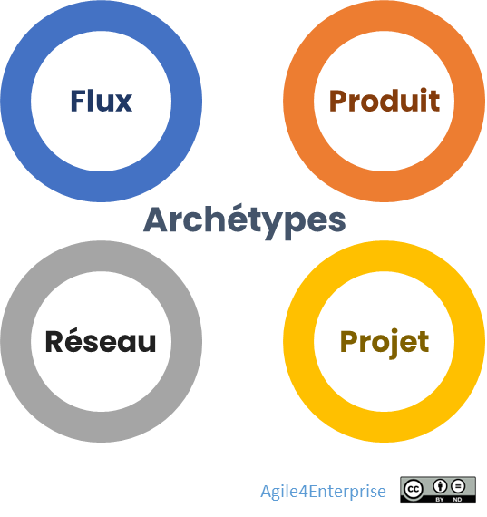

# Le Framework Agile4Enterprise

✨**Objectif**

Présenter la **proposition de valeur** du Framework **Agile4Enterprise**, conçu pour accompagner les entreprises dans leur transformation, en structurant un système capable d’évolution continue.

Découvrir les quatre piliers et quatre principes de ce cadre.

## Proposition de valeur

> *« On est devenus bons en livraison, mais on n’a pas changé notre façon de piloter » — verbatim d’une directrice produit.*

Adopter l’agilité comme méthode est une première étape. **Concevoir une entreprise adaptative est le vrai objectif.** Ce cadre propose une approche systémique et organique. Il cherche à structurer un **système global** de :

- **Boucles de décision synchronisées**,
- **Feed-back cadencés**,
- **Ajustements évolutifs**.

### Les 4 piliers essentiels

Le modèle repose sur **quatre piliers essentiels**, qui soutiennent l’équilibre entre **stabilité** et **changement** :

- **Finalité stable,**
- **Stratégie adaptative**,
- **Alignement dynamique**,
- **Management (ou développement) stratégique**.

### Les 4 principes du Framework Agile4Enterprise

Le cadre invite à :

- Faire évoluer progressivement les structures existantes,
- Ajuster la gouvernance et les centres de décision intelligemment,
- Développer les capacités d’adaptation dans le système en place.

Le but n’est pas de rendre l’entreprise « agile », mais de créer **une source d’avantage concurrentiel durable**, sans nécessiter de transformation brutale.

Ce cadre ne propose pas un modèle unique, mais des agilités d’entreprise. Il se distingue par sa capacité d’adaptation, aux réalités du terrain, aux contraintes locales, aux dynamiques changeantes. Ses principales caractéristiques sont :

- **Ouvert et agnostique** : Il ne propose pas de méthode en tant que telle et s’articule avec les autres approches et outils : Scrum, Kanban, SAFe, LeSS, OKR…
- **Contextualisable** : selon la maturité, la stratégie, ou les enjeux de l’entreprise.

#### L’agilité d’entreprise est différente de l’agilité d’équipe

> *« On a déployé l’agilité dans toutes les équipes, mais la stratégie reste pilotée en silos. » — verbatim d’un directeur général d’un groupe de services*

**Le problème** :

L’agilité d’équipe n’a pas modifié durablement les capacités stratégiques des entreprises. Pourtant, la **Business Agility** repose sur l’élargissement de ces pratiques, initialement déployées au niveau des équipes, à l’ensemble de l’organisation. Mais, par nature, cela reste un levier d’adaptation locale. Or, une entreprise cherche à optimiser sa performance de manière globale.

Pour y parvenir, elle ne peut s’appuyer uniquement sur l’auto-organisation des équipes ou sur des dynamiques émergentes isolées. Cela conduirait à une somme d’améliorations locales. Et cela, sans garantie d’impact positif pour le groupe. Alors, changeons de paradigme. Cela nécessite un cadre commun, qui oriente, aligne et structure.

**L’ère Post Agile** :

Ce cadre s’inscrit dans l’émergence d’une approche dite « **post agile** ». Elle prend ses distances avec le Manifeste Agile, conçu pour le développement logiciel, et peu adapté aux enjeux de l’entreprise.
Cette nouvelle approche combine les deux dimensions complémentaires : équipe et entreprise. Elles ne sont pas interchangeables et ne suffisent pas isolément.

## Un cadre structuré et outillé

Ce cadre repose sur des modèles et des outils :

### Agile4B : Les 4 boucles adaptatives

Les boucles adaptatives constituent le cœur du système. Chacune se définit par l’articulation d’une :

- Dimension de l’agilité : Corporate, stratégique, tactique, opérationnelle
- Cadence du changement spécifique à chaque boucle : *Annuelle*, *Trimestrielle*, *Bimensuelle*/*hebdomadaire et quotidien*.

### Agile4X : Les 4 archétypes agiles

Ce sont des modèles alignés qui fournissent des cibles contextuelles, facilitant ainsi la mise en œuvre des principes agiles dans des situations variées. Chaque archétype répond à une stratégie dominante :

- Rapide et exploratoire en adoptant une organisation Projet%2013490eaf28ff8030a8aeecf9206d94ea.md),

- Fluide et intégrée en adoptant une organisation Flux,

- Scalable et évolutive en adoptant une organisation Produit,

- Distribuée en adoptant une organisation Réseau.

### Agile4E

Le **modèle d’alignement agile** pour définir les zones stratégiques : Exploration, expansion, exploitation, et exclusion.

### PACTE

Le **Portfolio Agile Canevas pour la Transformation d’Entreprise** est conçu pour structurer et piloter le changement au niveau du portefeuille.

### ACTE

L’**Agile Canevas pour la Transformation d’Entité** est conçu pour structurer et piloter le changement.

## 🔑 Points clés à retenir

**Le système vivant d’Agile4Enterprise repose sur les 4D (quoi), les 4C (quand), les 4X (comment), et les 4E (où).**

> *4B (boucle) = 4D (dimension) + 4C (cadence)*

C’est :

- Une grille de lecture d’une entreprise Agile
- Un guide de transformation
- Un modèle opératoire
- Une boîte à outils
- Un cursus pour les coachs agiles

