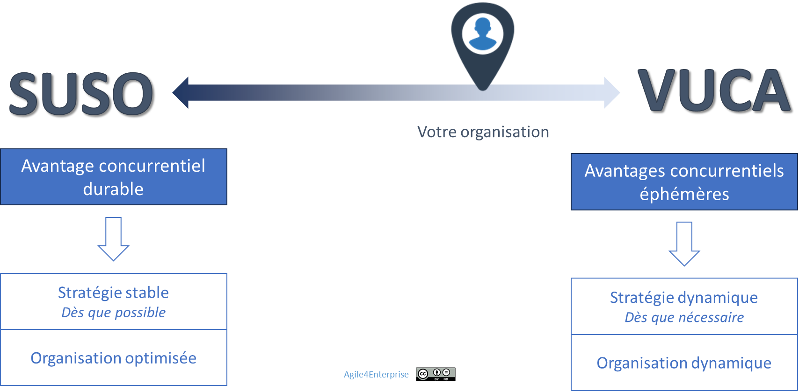

# Quand Agile4Enterprise est pertinent — et quand il ne l’est pas

✨ **Objectif** Clarifier pour quels contextes **Agile4Enterprise** est conçu, et ceux pour lesquels il n’est pas adapté, et comment ajuster l’intensité et la fréquence de ses boucles adaptatives selon le continuum **SUSO-VUCA**.

# Pour quels contextes Agile4Enterprise est-il conçu ?

Et si la vraie question n’était pas “Est-ce que l’agilité marche ici ?” mais “À quelle intensité, selon quelles tensions et dans quel but” ? **Agile4Enterprise** ne cherche pas à être universel, mais pertinent — là où le vivant veut se structurer sans se figer.

Il s’adresse aux organisations qui :

- **Veulent construire un changement durable**, pas lancer des projets isolés.
- **Recherchent un alignement dynamique**, plutôt qu’une conformité hiérarchique.
- Cherchent une **structure évolutive**, pas une **instabilité stratégique**.

Cela implique un changement :

- **Évolutif** : qui ne repose pas sur un big bang,
- **Cumulatif** : chaque boucle produit un apprentissage réutilisable,
- **Consolidant** : qui renforce la capacité à se piloter collectivement dans la durée.

## Pour quels contextes Agile4Enterprise n’est-il pas adapté ?

Agile4Enterprise **n’est pas efficace** si vous évoluez dans un environnement caractérisé par :

| Situation | Par exemple |
| --- | --- |
| Instabilité permanente recherchée | **Newsroom 24/7** : décisions en flux continu, sans timebox. |
| Chaos créatif avec un cadre minimaliste | **Troupe d’impro** : spectacle auto-organisé chaque soir. |
| Décisions illisibles ou mouvantes | **Oticon 1988** : structure « spaghetti » sans gouvernance, *tout le monde peut proposer des projets* |
| Refus de toute synchronisation | **Startup bossless** : aucune réunion de coordination, auto gestion. |

*Dans ces environnements :*

- La cohérence globale est secondaire,
- Le changement de forme est constant,
- L’ancrage stratégique est vu comme un frein.

> Si votre organisation coche l’une de ces cases, **Agile4Enterprise** peut servir de grille de lecture et de langage commun—sans en faire un cadre de pilotage principal.
> 

---

# Calibrer son agilité selon le continuum SUSO–VUCA

Ayant défini où ce cadre s’applique (ou pas), explorons **comment doser** son intensité selon la nature de votre environnement.

## Comprendre le continuum

On définit les environnements en deux types :

### Environnement SUSO

💡 **Environnement SUSO** : Stable, Compréhensible (Understood), Simple et Évident (Obvious).

Ce sont des environnements prévisibles où les cycles longs peuvent être planifiés. Dans un tel contexte, la stratégie est stable, et recherche un avantage concurrentiel durable. C’est pourquoi le performance durable par standardisation, et l’excellence opérationnelle priment.

**Caractéristiques**

- Modèle économique prévisible et solide.
- Peu d’innovation de rupture.
- Cycles de décision longs, structures éprouvées.

**Exemples d’entreprises**

- **Industries à forte intensité capitalistique et cycles longs**
    - Aéronautique (ex : Airbus, Boeing)
    - Automobile thermique (ex : Toyota, Volkswagen)
    - Construction navale ou infrastructure lourde
    - Nucléaire, ferroviaire
    
    *Ces secteurs reposent sur des chaînes de valeur longues, des normes strictes, et une gestion fine du risque. L’incertitude est coûteuse.*
    
- **Banques et assurances traditionnelles**
    - Acteurs centrés sur la conformité, la stabilité réglementaire, les opérations récurrentes
    - Exemple : caisses régionales, assureurs généralistes
    
    *Le cœur de métier reste structuré autour d’activités régulées, avec une grande aversion au risque.*
    
- **Administrations publiques et entreprises parapubliques**
    
    *Ces structures évoluent dans un cadre réglementaire, juridique et politique relativement stable.*
    
- **Groupes industriels en phase de maturité**
    - Exemples : fabricants de composants standards, biens intermédiaires non innovants
    
    *Peu d’évolution côté client, forte optimisation des chaînes internes, enjeux de compétitivité par l’échelle.*
    

### Environnement VUCA

💡 Environnement VUCA : Volatile, Incertain, Complexe, et Ambigu.

Ce sont des environnements changeants. La stratégie y est dynamique, et recherche un avantage concurrentiel éphémère. C’est pourquoi l’adaptation rapide et l’expérimentation permanente sont vitales. L’objectif y est de survivre et prospérer par ajustement permanent.

**Caractéristiques**

- Marché évolutif et concurrents disruptifs.
- Besoin de pivots fréquents.
- Priorité à la capacité d'apprendre et d'agir vite.

**Exemples d’entreprises**

- **Startups et scale-ups technologiques**
    - SaaS B2B, plateformes, marketplace, IA, biotech
    - Exemples : OpenAI, Stripe, Revolut, Doctolib, Mistral AI
    
    *Modèle économique en construction, marché incertain, besoin de pivoter rapidement, innovation au cœur du produit.*
    
- **Entreprises dans des marchés émergents ou géopolitiquement instables**
    - Energie en transition (ex : hydrogène, solaire offshore)
    - Télécoms dans les pays en développement
    
    *Le contexte exogène est imprévisible : réglementation mouvante, volatilité monétaire, instabilité politique.*
    
- **Industries culturelles et créatives**
    - Jeux vidéo, musique, médias, entertainment
    - Exemples : Ubisoft, Netflix, Spotify
    
    *Les tendances changent rapidement, les goûts des publics sont volatils, les technologies transforment les usages en continu.*
    
- **Entreprises en pleine transformation ou repositionnement stratégique**
    - Grands groupes en rupture de modèle (mobilité, énergie, retail digital)
    - Exemples : Renault (passage du thermique à l’électrique), TotalÉnergies (transition énergétique), Carrefour (digitalisation)
    
    *Même les acteurs historiques peuvent basculer dans un environnement VUCA lorsqu’ils remettent en cause leur modèle historique.*
    

Dans le **VUCA**, l’avantage concurrentiel ne repose plus sur la maîtrise ou la prédiction, mais sur la **vitesse d’adaptation, la capacité d’apprentissage et la résilience organisationnelle**.

➿ ### TechNova : entre deux mondes Pendant 20 ans, l’entreprise a prospéré dans un environnement stable et prévisible. Ses capteurs B2B adressaient des marchés industriels à cycles longs, où l’excellence opérationnelle faisaient la différence. Mais le virage vers la **domotique B2C**, puis l’irruption soudaine de l’**IA**, ont tout changé. Nouveaux usages, rythmes accélérés, incertitudes stratégiques : l’entreprise se retrouve projetée en zone **VUCA**. C’est ce qui a déclenché son besoin en agilité. Parce que ces deux mondes cohabitent désormais. Et qu’aucune organisation ne peut rester performante en **VUCA avec un modèle SUSO**. Pour TechNova, devenir agile, c’est : - Maintenir la robustesse de son activité historique, - Soutenir l’innovation sans exploser, - Et piloter l’alignement malgré la divergence des dynamiques. > Ce n’est pas une option méthodologique. C’est une nouvelle exigence de pilotage. >

## Ajuster les boucles adaptatives

| Environnement | Fréquence des boucles adaptatives | Intensité du changement | Approche |
| --- | --- | --- | --- |
| Stable, Compréhensible, Simple et Évident | Trimestrielle à semestrielle | Faible | Optimiser sans déséquilibrer : stabiliser le flux existant |
| Intermédiaire | Mensuelle à trimestrielle | Moyenne | Adapter localement, piloter les tensions avant qu’elles ne deviennent critiques |
| Volatile, Incertain, Complexe, et Ambigu | Hebdomadaire à mensuelle | Forte | Stimuler la plasticité organisationnelle, expérimenter et pivoter rapidement |

En réalité, chaque organisation se situe quelque part sur ce continuum entre ces deux extrêmes.

> **L’enjeu** est de calibrer les boucles à la bonne fréquence — ni trop faible (risque d’inertie, perte de compétitivité), ni trop forte (risque d’instabilité, perte de performance) selon l’environnement.
> 

Une cadence trop lente dans un environnement VUCA transforme l’agilité en reporting. Une cadence trop rapide dans un environnement SUSO rend l’organisation instable et épuisée, sans gain réel.

L’objectif est de **maîtriser sa fréquence de transformation**, comme un athlète adapte son souffle à l’effort.

### Questions clés pour situer son organisation

**Diagnostiquez** votre position sur le continuum SUSO–VUCA à l’aide des questions-clés :

1. Mon marché est-il plutôt stable ou volatile ?
2. **Les cycles d’innovation** sont-ils lents ou rapides ?
3. **La tolérance** aux essais/erreurs est-elle élevée ?
4. Privilégie-t-on plutôt la **prédictibilité** ou l’**innovation** ?
5. Quel est le **seuil d’inacceptabilité** du statu quo ?

Les réponses déterminent la **densité**, la **fréquence** (à quel rythme) et l’**intensité** (profondeur des apprentissages) de vos boucles adaptatives.

## 👣 Et concrètement, lundi matin ?

- [ ]  Faîtes un diagnostic SUSO–VUCA.
- [ ]  **Adapter la fréquence** des prises de décisions à la volatilité de votre environnement.
- [ ]  **Tableau de bord** : Mettez en place un indicateur simple de suivi : Le nombre de repriorisation ou replanifications. Si vous devez changer vos objectifs au sein d’un cycle, il est trop long.
- [ ]  **Retours rapides** : Après 1 mois, notez 3 enseignements clés, ajustez vos actions et vos fréquences.

---

#