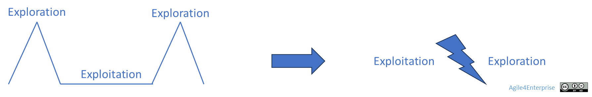
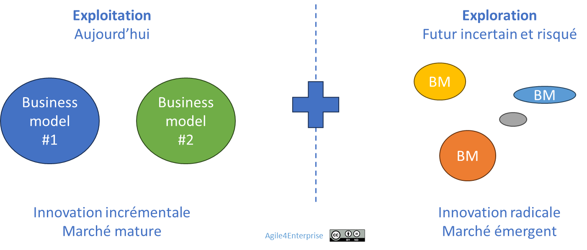

# Piloter le changement continu

✨**Objectif**

Aujourd’hui, le changement est donc devenu permanent et structurel. Il ne s’agit plus de piloter des transformations ponctuelles, mais de les intégrer au fonctionnement quotidien de l’organisation.

L’enjeu consiste à **concilier adaptation et création de valeur durable**, tout en évitant les pièges de l’inertie ou de la désorganisation.

🧑‍🎓**Ce que vous allez apprendre ici**

- Pourquoi l’ambidextrie (« explorer » et « exploiter » en même temps) est-elle une compétence clé ?
- Comment gérer une stratégie **qui évolue sans perdre son cap** ?

## L’enjeu du changement

### Décrypter les mécanismes

L’agilité est souvent perçue comme la capacité à s’adapter rapidement. Mais plus que cela, **c’est naviguer dans l’incertitude et la complexité du changement**.

❓
De quoi parle-t-on ?

- D’une évolution progressive et incrémentale, avec un impact quotidien ?

- D’un bouleversement brutal, provoqué par une crise ou une rupture technologique ?

- De dynamiques internes à l’organisation, ou de mutations externes du marché ?

Comprendre ces nuances est essentiel pour bâtir une entreprise qui **transforme le changement en levier d’opportunités, sans le subir**. Cela suppose d’ajuster en conséquence sa gouvernance, son leadership et son modèle opératoire.

Encore faut-il respecter la capacité d’absorption réelle par les individus. Elle ne se décrète pas : elle se vit, elle se négocie. Elle peut susciter résistances et craintes légitimes. Mais surtout, elle ne dépasse jamais celle de son collectif et ne peut se construire au détriment de l’humain.

### Vers une nouvelle gestion

🌀**Exemple** :
*

**Un changement radical** : Michelin

*Pendant 125 ans, Michelin a construit son empire sur un produit unique : le pneu. En 2012, alors que 97 % de son chiffre d’affaires vient encore de cette activité, Jean-Dominique Senard, son nouveau PDG, décide de transformer Michelin en acteur de la mobilité durable.*

*Plutôt que d’attendre la rupture, il l’anticipe et l’oriente avec :*

- *La création d’un écosystème d’innovation ouverte,*
- *Le lancement d’un produit révolutionnaire
: le pneu VISION — sans air, biodégradable, connecté.*

*Michelin n’a pas seulement réagi au marché : la société a redéfini sa place et son modèle économique.*

> *Résultat : valorisation doublée, diversification réussie, avec un leadership technologique renforcé.*
*

### Exploitation vs exploration

La transformation radicale est-elle la seule issue ? Historiquement, la gestion du changement reposait sur une alternance :

- De **phases d’exploration** pour préparer l’avenir. Elles sont accompagnées de mutations profondes, généralement liées à un renouvellement de la direction, à l’image de Michelin,
- Puis de **périodes d’exploitation** des actifs existants.

🧑‍🎓

**L’exploration** :

Elle implique la recherche et le développement de nouvelles opportunités, produits ou marchés, en quête d’innovations pour rester compétitif.

Le changement se traduit ici par un repositionnement stratégique.

🧑‍🎓

**L’exploitation** :

Elle se concentre sur l’optimisation des activités pour en améliorer l’efficacité et la rentabilité, et pour préserver les avantages concurrentiels viables le plus longtemps possible.

Le changement se traduit cette fois par des programmes de transformation, par exemple pour tendre vers l’excellence opérationnelle.

### Une dynamique entre adaptation et intention stratégique

Deux forces complémentaires animent ces phases :

- **L’intention stratégique** : choisir d’agir sur son avenir en créant ses propres opportunités,
- **L’adaptation** : survivre en s’ajustant continuellement à un environnement instable.

L’entreprise vit dans la tension entre ces deux forces. C’est dans cette polarité que réside la capacité réelle de changement.

- Trop d’intentions sans adaptation = elle tombe dans le dogmatisme et l’idéologie.
- Trop d’adaptation sans intention = c’est l’inefficience organique qui prend le dessus.

Entre ces deux extrêmes, l’**inertie organisationnelle** agit souvent comme un frein au changement.

➿**TechNova**

Pendant 17 ans, l’entreprise a mis à profit son modèle B2B : des capteurs industriels, fiables, prévisibles et optimisés à l’extrême. Elle vit de l’exploitation maîtrisée, sans profonde remise en question.

TechNova a patienté des années pour oser s’engager pleinement quand la domotique est apparue comme nouveau relais de croissance.

Mais l’IA, elle, n’a pas attendu. En quelques mois seulement, la clientèle l’exige. La concurrence l’intègre. Un prototype fonctionne. Et déjà, tout le système coince.

> La direction découvre qu’exploiter après avoir exploré ne suffit plus. Elle devra apprendre à faire les deux… en même temps.

### L’ambidextrie organisationnelle

Car aujourd’hui, cette alternance n’est plus viable. Les cycles se raccourcissent et se télescopent : Exploitation et Exploration doivent cohabiter. C’est l’**ambidextrie organisationnelle**. Pour que cela tienne dans le temps, l’entreprise doit :

- Basculer de l’une à l’autre sans rupture. Elle se pilote comme une dynamique, plutôt qu’une opposition à arbitrer une fois pour toutes.
- Maintenir une cohérence collective sans figer l’organisation.

### Le changement continu : Un nouvel impératif stratégique

Le changement n’est plus un projet ou un programme à initier. C’est un système vivant, intégré aux processus de l’entreprise, au même titre que les autres, tels que la gestion de risque :

- La stratégie devient **adaptative**, nourrie en continu par les signaux faibles issus du terrain et de son environnement.
- Le design organisationnel devient, lui, **flexible et reconfigurable**, pour permettre de faire émerger de nouvelles capacités stratégiques.
- **L’exécution** intègre l’expérimentation et l’apprentissage en continu.

Cette approche implique une transformation en profondeur de la manière dont l’entreprise conçoit son fonctionnement. Piloter les changements est alors une **compétence clé du leadership**.

### Flux continu de création de valeur

> L’agilité permet de créer de la valeur en continu même dans le changement.

Si ce n’est pas le cas, alors l’organisation a un problème lorsque la perturbation est permanente !
**La continuité de la création de valeur doit être garantie**, qu’il s’agisse de celle :

- Perçue par les utilisateurs et clients,
- Pour les parties prenantes de l’entreprise.

Cela suppose un **pilotage par l’impact** : s’assurer le plus rapidement possible que ce que nous réalisons produit l’effet souhaité. Un pilotage par les livrables, s’il reste essentiel, n’est plus suffisant.

### Préserver son identité

Changer en permanence peut, à terme, créer une perte de référentiel : évoluer, oui, mais en préservant ses repères essentiels.
Cela implique de savoir protéger son identité organisationnelle tout en se transformant. Et soulève une question de fond : **l’agilité doit-elle encourager l’évolution de la raison d’être de l’entreprise ?** Certaines approches le proposent.

Ici, **la stratégie guide le changement**, elle-même conçut pour se développer dans un cadre stable. Cela implique un véritable travail de fond sur son identité et sur l’ensemble des artefacts qui l’incarnent : mission, raison d’être, vision et valeurs.

## Alors, s’adapter ou oser ?

Le changement continu peut conduire l’organisation à devenir une machine à optimiser l’existant, et opter pour une posture d’ajustement permanente, trop modeste pour se transformer vraiment. Pour contrer cette dérive — se contenter de « fluidifier les processus » ou de « responsabiliser les équipes » — une autre ambition s’impose :

> **Retrouver une liberté de manœuvre, là où l’incertitude paralyse l’action**.

On ne cherche pas à éviter les risques associés, mais à en prendre de manière lucide et maîtrisée. C’est une discipline pour rendre possibles les paris stratégiques dans des conditions où le collectif est outillé pour naviguer dans l’instabilité. Ce n’est pas parce qu’on évolue en continu qu’on transforme petit.

> L’organisation qui sait gérer le changement, tout en créant de la valeur, sans perdre son identité, se crée un réel **avantage concurrentiel**. Et cet avantage ne peut ni s’acheter ni être copié facilement !

## 👣 Et concrètement, lundi matin ?

Demandez-vous où vous en êtes concrètement ?

  -[ ] Nous avons une **vision stratégique**, revue régulièrement, et partagée.

  -[ ] Les membres des équipes savent **qui prend les décisions**, quand, et dans quel domaine.

  -[ ] Nous adaptons nos projets en fonction des retours terrain, **sans attendre la fin d’un cycle**.

  -[ ] Les priorités sont révisées au minimum **une fois par mois**.

  -[ ] La valeur produite est mesurée **autrement que par les livrables ou les délais**.

> **Au moins 3 cases cochées ?** Félicitations, vous êtes en mouvement !

## 🔑 Points clés à retenir

- Passer **d’une alternance exploration/exploitation à une cohabitation ambidextre** et fluide des deux dynamiques.

- **Le changement est permanent** et ne peut plus être géré comme un projet ponctuel.

- La transformation réussie repose sur **l’équilibre entre intention stratégique et adaptation continue**. Trop de l’un sans l’autre mène à l’échec.

- Piloter le changement, c’est **garantir la continuité de création de valeur** tout au long de la transformation.

🔥
La performance de l’agilité se mesure par son efficacité et son efficience dans le changement et l’apprentissage, ainsi que dans l’augmentation de valeur, durablement.

