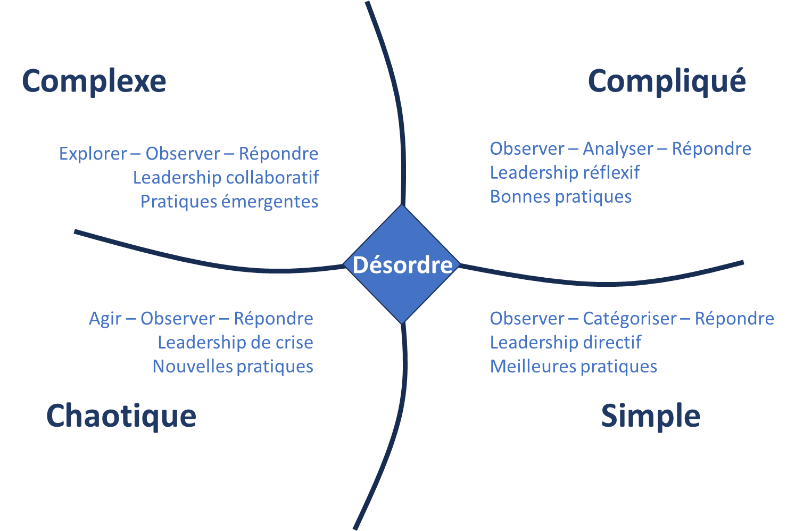
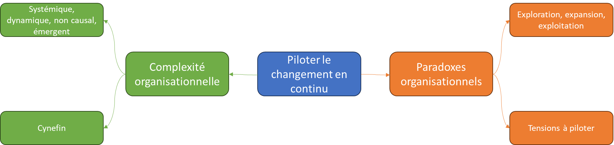

# Les défis du changement continu

✨**Objectif**

Passer d’un changement alterné à continu expose l’entreprise à des tensions organisationnelles : entre exploitation et exploration, optimisation et innovation, centralisation et autonomie.

Pour y faire face, l’organisation se décrypte comme un **système paradoxal et complexe**, où ces tensions ne se résolvent pas, mais coexistent.

🧑‍🎓**Ce que vous allez apprendre ici**

- Ce qu’est une **tension stratégique**.

- Pourquoi les **organisations vivantes** doivent-elles naviguer entre des polarités ?

- Comment le cadre **Cynefin** aide-t-il à ajuster les modes de gestion ?

## L’entreprise paradoxale

### Piloter les tensions

🧑‍🎓

Une **tension** est une polarité durable entre deux besoins organisationnels essentiels, mais opposés. Elle ne se résout pas : elle se pilote dans le temps.

*Par exemple, entre stabilité et changement*.

Les entreprises doivent maintenant intégrer en permanence les deux dynamiques contradictoires d’exploration et d’exploitation, générant une pression continue entre réussite immédiate et anticipation du futur. Mais ce ne sont pas les seules oppositions auxquelles sont confrontées les directions :

❓

**Exemples de tensions organisationnelles** :

- Comment assurer la stabilité nécessaire à la performance actuelle tout en favorisant l’innovation ?

- Faut-il privilégier des résultats à court terme ou investir dans des transformations structurelles de longs termes ?

- Doit-on établir des alliances stratégiques avec des acteurs qui sont en concurrence sur d’autres marchés ?

Autrefois abordées de manière séquentielle, ces tensions internes se pilotent aujourd’hui simultanément. L’entreprise en connaît de nombreuses :

🧑‍🎓
Une entreprise agile est une organisation paradoxale, où l’on accepte la coexistence de ces logiques opposées, mais complémentaires. Elle ne choisit pas entre deux pôles : elle apprend à piloter leur dynamique dans le temps. Mal gérées, elles se traduisent par des injonctions contradictoires.

🔥

Naviguer dans un monde paradoxal, c’est comme manœuvrer une montgolfière :

- Trop de lest (structure) et elle ne décolle pas.
- Trop de feu (innovation) et elle dérive sans contrôle.

La quantité de chaleur et de poids doit s’ajuster selon les vents du contexte.

➿**TechNova**

**Piégée entre ses deux moteurs** :

Une équipe produit identifie une opportunité IA. Un client pilote est prêt. Il ne manque plus qu’un peu de budget pour réaliser un premier prototype. Mais cette allocation a été décidée pour l’année, et tout changement nécessite un arbitrage hiérarchique.

**Problème ?**

Ce budget est principalement accordé à l’exploitation des capteurs industriels. C’est ce qui finance l’entreprise aujourd’hui. L’IA ? C’est ce qui pourrait assurer sa place demain. Mais l’un empêche l’autre. L’équipe ne peut pas avancer sans briser les règles. La direction ne peut pas bouger sans trahir ses priorités actuelles.

Et chez TechNova, comme ailleurs, le dilemme n’est pas abstrait : il bloque un projet, une décision.

## L’entreprise complexe

> *« Ce n’est pas tant l’incertitude qui nous bloque. C’est notre incapacité à l’assumer collectivement sans chercher à tout figer. »* — Parole de coach agile

### Naviguer dans l’incertitude et l’émergence

Une organisation n’est pas une machine. C’est un écosystème vivant, composé d’individus, de relations et de dynamiques, qui :

- Évolue en interaction permanente avec son environnement,
- Se transforme par émergence, non par planification,
- Produit des comportements globaux non réductibles à la somme de ses parties.

Dans cet écosystème, **l’intelligence collective devient une ressource stratégique**. Ce sont les connexions humaines, la capacité à coopérer, à apprendre ensemble et à sentir les signaux faibles qui permettent de rester en mouvement.

Cette complexité impose de repenser les modèles traditionnels de gestion, hérités d’un monde mécaniste, linéaire et prévisible.

### 4 propriétés d’un système complexe

Un **système complexe** se distingue par quatre propriétés fondamentales :

1. **Systémique** : tout est interdépendant.
2. **Dynamique** : il change en permanence.
3. **Non linéaire** : de petites variations locales peuvent produire des impacts globaux, l’effet papillon.
4. **Émergent** : le résultat d’ensemble n’est pas prévisible à partir de celui des parties.

### Une nouvelle approche de la gestion

Cela nécessite l’adoption de **la pensée complexe**, qui combine plusieurs perspectives :

- **Holistique** : pour appréhender le système dans sa globalité, au-delà de ses parties individuelles.
- **Systémique** : pour comprendre les interactions et les rétroactions qui influencent son fonctionnement.
- **Latérale** : pour stimuler la créativité et explorer des alternatives en dehors des cadres établis.
- **Paradoxale** : pour gérer des contradictions inhérentes à l’organisation.

## Adapter le pilotage grâce au modèle Cynefin

Heureusement, toutes les situations rencontrées en entreprise ne sont pas complexes. Certaines relèvent de contextes connus et maîtrisés ; d’autres exigent une adaptation constante. Connaître la nature du problème à résoudre permet de choisir une posture de management appropriée. C’est ce que propose le **modèle Cynefin**, développé par Dave Snowden :

| Domaine | Nature du problème | Approche recommandée | Exemple de posture de pilotage |
| --- | --- | --- | --- |
| **Simple** | Stable, prévisible, bien connu | Observer → catégoriser → répondre | Appliquer des règles établies |
| **Compliqué** | Analysable, mais qui nécessite de l’expertise. | Observer → analyser → répondre | Recourir à des spécialistes |
| **Complexe** | Inédit, incertain, en évolution | Explorer → observer → répondre | Expérimenter, apprendre collectivement |
| **Chaotique** | Urgent, instable, sans repère clair | Agir → observer → répondre | Agir rapidement pour stabiliser |
| **Désordre** | Indéterminé, non encore clarifié | – | Clarifier avant de décider |

🧑‍🎓

Ce modèle souligne qu’il n’existe pas qu’une seule manière de piloter une organisation. La posture de management dépend du contexte, de la capacité à reconnaître les dynamiques à l’œuvre, puis à adapter son mode de décision en conséquence.

### Pourquoi bien diagnostiquer la complexité est-il essentiel

Évitez trois pièges fréquents face à la complexité :

- **Agir par réflexe** : appliquer une solution connue à un problème inédit.
- **S’enliser dans l’analyse** : chercher des certitudes là où seules des expérimentations peuvent faire émerger des réponses.
- **Mobiliser une expertise inadaptée** : un spécialiste d’un domaine stable peut être désarmé face à la dynamique d’un cas complexe.

Ces pièges ne sont pas anodins : ils produisent du sur-place coûteux, empêchent l’apprentissage collectif, et peuvent figer l’organisation dans des routines inadéquates. Mal poser le problème revient à aggraver la situation. C’est pourquoi bien diagnostiquer n’est pas une étape accessoire, mais le préalable stratégique à tout modèle global.

### Vers une résolution efficace des problèmes complexes

Pour aborder les contextes complexes, plusieurs approches sont recommandées :

1. Si le problème peut être découpé en sous-éléments :

    - **L’approche par hypothèses** : utile, mais attention au biais de confirmation.
    - **L’approche par questionnement ouvert** commence par une analyse des questions plutôt que par des solutions préconçues.

2. Le cas échéant :

    - **Le Design Thinking** : méthode collaborative centrée utilisateur, favorisant l’émergence de réponses innovantes à travers le prototypage et l’itération.

    D’autres approches, telles que les **options réelles**, consistent à explorer plusieurs pistes en parallèle, sans chercher à converger trop tôt. Elle permet de préserver la flexibilité face à des problèmes dont les contours évoluent encore.

Dans tous les cas, la **résolution de problèmes complexes** repose sur une logique adaptative, avec des cycles d’essai-erreur, d’ajustements en fonction du feed-back et d’apprentissage continu. C’est l’approche que nous allons privilégier dans ce cadre.

## 👣 Et concrètement, lundi matin ?

- Créez une carte des tensions propres à votre organisation.

- Et si… ? Projetez-vous dans des scénarios fictifs inversés pour tester ces tensions :

    Et si vous choisissiez de ne pas explorer du tout cette année ? Imaginez les conséquences.

    Et si vous décidiez de centraliser toute la stratégie cette année ? Que constatez-vous ?

    Et si vous laissiez une équipe agir seule ? Que se passe-t-il ?

- Utiliser **Cynefin** pour juger du bon mode de gestion selon les contextes.

## 🔑 Points clés à retenir

- **Les tensions stratégiques sont inévitables.** Ce sont des leviers, pas des problèmes. Il ne tient qu’à nous qu’elles restent positives et constructives, sans devenir des injonctions paradoxales.
- **Le cadre Cynefin** aide à adapter la gouvernance selon le degré de complexité.

