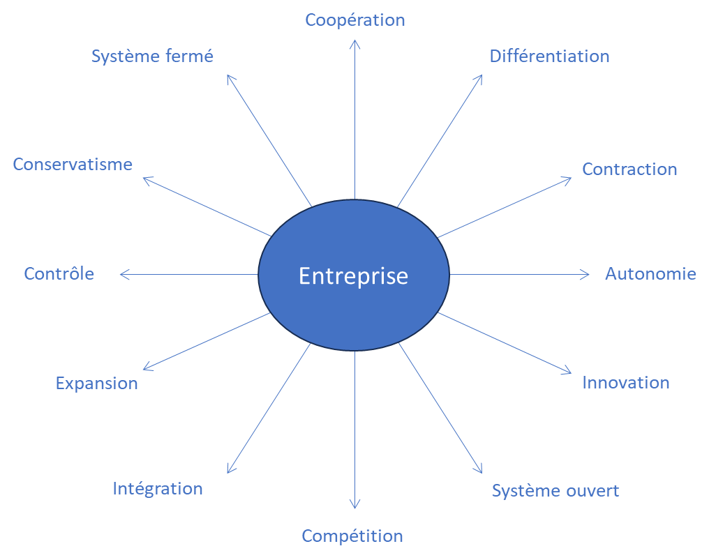

# Les défis du changement continu

Propriétaire: Laurent Morisseau

- Sommaire

<aside>
✨

**Objectif :**

Passer d’un changement ponctuel à un **changement continu** expose l’entreprise à des tensions entre exploitation et exploration, entre **optimisation et innovation**, nécessitant un modèle organisationnel dynamique et adaptatif.

Pour y faire face, il faut considérer l’entreprise comme un **système complexe**, où les décisions sont décentralisées et où la gestion des paradoxes devient un levier stratégique.

</aside>

# L’entreprise paradoxale

## Concilier stabilité et transformation continue

L’évolution vers une entreprise agile ne consiste pas simplement à adopter de nouvelles méthodes, mais à repenser fondamentalement son rapport au changement. Traditionnellement, les organisations abordaient le changement sous forme de projets ou de transformations ponctuelles, séparant nettement les phases d’**exploitation** (optimisation des processus existants) et d’**exploration** (innovation et adaptation au marché). Aujourd’hui, cette dichotomie s’estompe : les entreprises doivent intégrer en permanence ces deux dynamiques, générant une tension continue entre **performance immédiate** et **anticipation du futur**.

Cette exigence crée des **dilemmes stratégiques** que l’entreprise doit apprendre à gérer :

<aside>
❓

Comment assurer la stabilité nécessaire à la performance actuelle tout en favorisant l’innovation ?

</aside>

<aside>
❓

Faut-il privilégier des résultats à court terme ou investir dans des transformations structurelles de long terme ?

</aside>

Autrefois abordées de manière séquentielle, ces tensions doivent aujourd’hui être gérées simultanément. Face à cette complexité croissante, l’entreprise doit se structurer en un **modèle organisationnel dynamique**, dans lequel le changement devient un processus **continu et intégré**. Cela implique une **nouvelle approche de la gouvernance**, où la prise de décision est distribuée et où les équipes sont responsabilisées pour ajuster leurs actions en fonction des évolutions du marché.

## Un modèle organisationnel dynamique pour embrasser les paradoxes

Le passage à un modèle dynamique repose sur **une approche managériale capable de naviguer entre des logiques contradictoires**, conciliant performance immédiate et adaptation stratégique. Les dirigeants ne doivent plus chercher à **résoudre** les paradoxes, mais à les **exploiter comme leviers de performance**, entre résilience et innovation. Cette posture exige de :

- **Décentraliser la prise de décision**, en s’appuyant sur des équipes autonomes et responsabilisées.
- **Favoriser une culture de l’expérimentation**, pour permettre des ajustements rapides sans remettre en cause la stabilité globale de l’organisation.
- **Instaurer des cycles d’apprentissage continus**, intégrant des boucles de feedback à tous les niveaux de l’entreprise.

Loin d’être une faiblesse, l’existence de tensions internes devient alors un atout. L’entreprise agile assume ces contradictions et les transforme en sources d’innovation et de résilience.

<aside>
💡

Une entreprise agile est une entreprise paradoxale, **où coexistent et s’entrelacent des logiques opposées mais complémentaires.**

</aside>

<aside>
👋

Bienvenue dans l’ère de l’[entreprise paradoxale](https://www.notion.so/L-entreprise-paradoxale-14a90eaf28ff801db7c0fdcea85e40f3?pvs=21) !

</aside>

# L’entreprise complexe

## Naviguer dans l’incertitude et l’émergence

Pour répondre aux défis de l’entreprise agile, il est essentiel d’adopter une **vision systémique** et de considérer l’organisation comme un **système complexe**, évoluant dans un environnement dynamique et incertain. Contrairement à une vision mécaniste où l’entreprise est perçue comme un simple ensemble de processus linéaires et prévisibles, une organisation complexe fonctionne selon des dynamiques imprévisibles et interconnectées.

Cette complexité impose de **repenser les modèles traditionnels de gestion**, qui reposent souvent sur des approches linéaires et causales. Il ne s’agit plus seulement d’optimiser des processus isolés, mais de comprendre les **interactions et interdépendances** qui façonnent la performance globale.

## Les caractéristiques d’un système complexe

Un **système complexe** se distingue par plusieurs propriétés fondamentales :

- **Systémique** : ses performances ne peuvent être comprises en analysant isolément ses composants. Toute modification locale a des répercussions globales. Un système complexe suit [trois principes](https://www.notion.so/L-entreprise-complexe-14a90eaf28ff803e9a40c1c2d3a78b1b?pvs=21) :
    1. Optimiser le système global implique nécessairement de sous-optimiser certains de ses composants.
    2. Inversement, optimiser les composants individuellement peut nuire à la performance globale.
    3. Les sous-systèmes au sein de l’organisation reproduisent ces mêmes dynamiques.
- **Dynamique** : il évolue en permanence sous l’influence de son environnement et de son histoire. Les ajustements stratégiques doivent donc être **itératifs et adaptatifs**, plutôt que figés dans des plans rigides.
- **Non-linéaire** : l’impact d’une action n’est pas proportionnel à sa cause. Un changement mineur peut provoquer des transformations majeures, c’est l’illustration de l’**effet papillon,** tandis que des efforts conséquents peuvent n’avoir qu’un effet limité.
- **Émergent** : les comportements collectifs ne sont pas la simple somme des comportements individuels, mais résultent des interactions entre les éléments du système. L’innovation et l’adaptation ne peuvent donc pas être **prédéterminées**, mais doivent être favorisées par des conditions propices à l’expérimentation et à l’apprentissage.

## Une nouvelle approche de la gestion

Face à cette complexité, l’approche traditionnelle basée sur la planification et le contrôle montre ses limites. L’entreprise doit privilégier une gestion fondée sur l’**adaptabilité, l’apprentissage et la capacité à naviguer dans l’incertitude**.

Cela nécessite l’adoption de **la pensée complexe**, qui combine plusieurs perspectives :

- **Holistique** : pour appréhender le système dans sa globalité, au-delà de ses parties individuelles.
- **Systémique** : pour comprendre les interactions et les rétroactions qui influencent son fonctionnement.
- **Latérale** : pour stimuler la créativité et explorer des alternatives en dehors des cadres établis.
- **Paradoxale** : pour gérer des contradictions inhérentes à l’entreprise, sans injonction paradoxale.

## Trouver un équilibre entre structure et agilité

Dans un environnement complexe, la gestion d’une entreprise ne peut pas être réduite à un choix entre **ordre et chaos**, **centralisation et décentralisation**, ou encore **stabilité et innovation**. Il s’agit d’**orchestrer ces tensions** pour en faire des moteurs de performance et d’évolution.

Une organisation performante ne repose donc pas uniquement sur l’excellence individuelle de ses équipes, mais sur la capacité du système à générer de la valeur à travers **ses interactions, son adaptabilité et son intelligence collective**.

<aside>
💡

La performance globale d’une entreprise ne réside pas dans la somme des performances locales des équipes, **mais dans l’émergence d’une dynamique collective** au sein de logiques et d’orientations contradictoires.

</aside>

<aside>
👋

Bienvenue dans l’ère de l’[entreprise complexe](https://www.notion.so/L-entreprise-complexe-14a90eaf28ff803e9a40c1c2d3a78b1b?pvs=21) !

</aside>

# Les bénéfices pour l’entreprise agile

<aside>
🚀

**Maximiser la performance d’aujourd’hui tout en construisant l’innovation de demain**

</aside>

Pourquoi est-ce important de savoir gérer des forces contradictoires au sein d’une même entreprise ? L’agilité ne doit pas se limiter pas à la gestion du changement : elle consiste aussi à trouver le bon **équilibre entre stabilité et adaptation**, entre **exploitation des ressources existantes** et **exploration de nouvelles opportunités**. Une entreprise agile ne fonctionne pas uniquement sur l’innovation et la transformation permanente ; elle doit aussi tirer parti de ses actifs actuels pour assurer sa rentabilité et financer son développement.

Ainsi, pour être véritablement agile, une entreprise doit être **à la fois efficace dans l’optimisation de son fonctionnement quotidien et capable d’innover en continu**.

## **Optimiser la performance et la rentabilité aujourd’hui**

À court terme, l’entreprise doit maximiser sa compétitivité et sa rentabilité en améliorant ses processus et en renforçant ses avantages stratégiques. Cela passe par :

- **L’optimisation des ressources et des flux financiers**
    - Réduction des stocks intangibles pour libérer du capital et des capacités.
    - Diminution des **temps de cycle** entre la conception et la mise en marché des produits et services.
    - Réduction des besoins en fonds de roulement, augmentant ainsi la résilience financière.
    - Amélioration des **marges** grâce à une meilleure gestion des coûts et une allocation plus efficace des ressources.
    - Création de synergies entre les actifs existants pour maximiser leur impact.
- **Une meilleure gestion du risque opérationnel**
    - Flexibilité accrue face aux imprévus du marché.
    - Adaptation rapide des processus et des modèles d’affaires pour **réagir efficacement aux changements**.
    - Décentralisation de la prise de décision pour accélérer l’exécution stratégique.

## **Accélérer le développement des produits et services**

Grâce à des mises sur le marché incrémentales, l’entreprise bénéficie d’un **retour sur investissement plus rapide** et limite les risques liés aux grands projets de transformation. Cette approche permet de :

- **Accélérer la mise sur le marché (Time-to-Market)**
    - Tester rapidement des solutions et ajuster en fonction des retours utilisateurs.
    - Faciliter l’adoption progressive des innovations au sein des marchés existants.
- **Exploiter au mieux les actifs existants pour innover efficacement**
    - Maximiser la valeur des produits et services déjà en place en **les améliorant en continu**.
    - Réduire les coûts d’innovation en capitalisant sur les compétences et ressources internes.
- **Favoriser l’efficacité collective et l’intelligence organisationnelle**
    - Renforcer la collaboration transversale pour éviter les silos.
    - Fluidifier la coordination entre équipes et métiers pour améliorer la réactivité organisationnelle.

## Préparer l’innovation de demain

À moyen et long terme, une entreprise agile ne se contente pas d’exploiter ses atouts actuels : elle **anticipe les évolutions du marché, se réinvente et se prépare aux défis futurs**.

- **Construire une organisation capable de s’adapter aux incertitudes**
    - Mise en place d’un cadre de gouvernance qui permet des ajustements stratégiques fréquents.
    - Création de mécanismes d’apprentissage en continu pour intégrer **rapidement** les nouvelles tendances et les évolutions du marché.
- **Encourager une culture d’innovation et d’apprentissage permanent**
    - Adoption d’un modèle où l’expérimentation et l’amélioration continue sont intégrées à tous les niveaux.
    - Accroissement des compétences organisationnelles par des cycles d’apprentissage rapides et des feedbacks en temps réel.
- **Diminuer les risques liés aux transformations majeures**
    - Favoriser une approche **itérative et progressive du changement**, réduisant ainsi l’impact des erreurs stratégiques.
    - Rechercher une **agilité stratégique**, permettant de repositionner l’entreprise avant que l’environnement ne l’y contraigne.

Cette démarche offre l’opportunité de réinventer les modes de travail. 

## Un équilibre optimal entre exploitation, expansion et exploration

Une entreprise agile ne se contente pas d’innover : elle doit structurer sa stratégie autour de **trois dynamiques complémentaires** :

✅ **Exploitation** → Maximiser la valeur des activités existantes et améliorer leur efficacité.

✅ **Expansion** → Identifier et conquérir de nouveaux marchés pour diversifier les revenus.

✅ **Exploration** → Tester et développer de nouveaux modèles pour préparer l’avenir.

Cette approche repose sur :

- **Une gestion flexible du portefeuille d’activités**, permettant de réallouer les ressources en fonction des opportunités émergentes.
- **Une mobilité stratégique**, facilitant la réallocation des talents et des investissements en fonction des priorités évolutives.
- **Un alignement dynamique entre la stratégie et l’opérationnel**, assurant que chaque initiative contribue directement aux objectifs globaux.

**L’agilité n’est pas une fin en soi : c’est un levier stratégique pour améliorer la performance d’aujourd’hui, accélérer l’innovation et construire la résilience de demain.**

<aside>
⚠️

**Le véritable défi réside dans l’optimisation globale, tout en reconnaissant la diversité et la complexité de l’entreprise.** Il n’existe **pas de solution universelle**, chaque organisation au sein de l’entreprise doit trouver **son propre équilibre** entre stabilité et transformation.

</aside>

# Cynefin : Un cadre pour naviguer dans la complexité

*Modèle Cynefin, adapté de Dave Snowden*

Le **modèle Cynefin** est un cadre permettant de catégoriser les situations en **cinq domaines** afin d'adopter l'approche de gestion la plus appropriée.

1. **Simple** : Les relations de cause à effet claires et prévisibles. Les **meilleures pratiques** suffisent pour résoudre les problèmes. Approche : *observer → catégoriser → répondre*.
2. **Compliqué** : Les relations de cause à effet existent mais nécessitent une **analyse et une expertise** pour être comprises. L'utilisation de **bonnes pratiques** est efficace. Approche : *observer → analyser → répondre*.
3. **Complexe** : L'imprévisibilité domine, et les solutions émergent grâce à **l'expérimentation et l’intelligence collective**. L'agilité y est bien adaptée. Approche : *explorer → observer → répondre*.
4. **Chaos** : Aucune relation de cause à effet perceptible, nécessitant des **actions immédiates** pour stabiliser la situation avant toute analyse. Approche : *agir → observer → répondre*.
5. **Désordre** : Une zone de transition où la nature du problème est **indéterminée** et doit être clarifiée avant de choisir une approche.

<aside>
💡

**Cynefin nous apprend qu’il n’existe pas une seule et unique manière de gérer une entreprise. La clé est de savoir reconnaître le type de contexte dans lequel on évolue et d’adapter son mode de management en conséquence.**

</aside>

<aside>
🔎

En savoir plus sur [Cynefin](https://www.notion.so/Cynefin-1b490eaf28ff80009c93e721eeab985c?pvs=21)

</aside>

---

# 🔑 **Points clés à retenir**

1. **Entreprise paradoxale** : Nécessité d’allier des forces contraires dans un environnement incertain.
2. **Entreprise complexe** : Un système dynamique, non linéaire et émergent, nécessitant une vision globale.
3. **Pensée complexe** : Une approche **holistique, systémique, latérale et paradoxale** pour naviguer dans l’incertitude.
4. **Agilité stratégique** : Transformer la complexité et les paradoxes en opportunités.
5. Cynefin : Un cadre pour naviguer dans la complexité