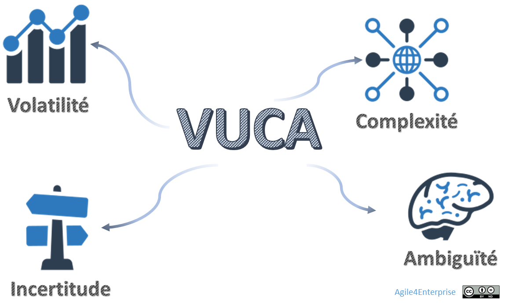

# Pourquoi une entreprise agile ? Pourquoi maintenant ?

Propriétaire: Laurent Morisseau

- Sommaire

<aside>
✨

**Objectif**

Donner aux dirigeants de PME et aux coachs agiles une vision claire des enjeux et de la raison d’être de l’entreprise agile. Et mettre en lumière la nécessité pour les entreprises d’adopter l’agilité afin de survivre et prospérer dans un environnement incertain et hyperconcurrentiel. Face à l’accélération des mutations économiques, technologiques et sociétales, les approches traditionnelles basées sur la planification rigide ne suffisent plus.

L’agilité devient un **cadre de gestion du risque** permettant aux organisations de s’adapter en continu, d’expérimenter rapidement et de transformer l’incertitude en opportunité. Plutôt que de chercher à prédire l’avenir avec précision, les entreprises doivent adopter une approche favorisant la mise en action, les feedbacks, **l’apprentissage, et l’amélioration continu**.

</aside>

# **Pourquoi l’agilité pour l’entreprise ?**

## **Les défis stratégiques et opérationnels à surmonter**

Les entreprises sont aujourd’hui confrontées à des défis et des obstacles auxquelles elles doivent apporter des réponses concrètes et adaptées à leur contexte :

### **Subir les urgences et les crises**

- Les urgences et les crises se multiplient, mais l’entreprise met du temps à réagir.
- L’organisation est prisonnière de cycles de décisions trop longs, freinant la réactivité face aux imprévus.
- Une opportunité commerciale apparaît, mais l’entreprise n’a pas la capacité d’en tirer parti suffisamment rapidement.

---

### Perdre des opportunités à cause d’une organisation rigide

- L’entreprise est confrontée à des variations de la demande, mais son organisation interne ne permet pas d’y répondre efficacement.
- Les changements internes (nouvelles équipes, nouvelles offres) créent des **frictions entre les silos organisationnels**.
- La gestion budgétaire est rigide et empêche d’investir dans des projets stratégiques et tactiques en cours d’année. Pire, la direction n’a pas confiance dans la capacité de l’organisation de changer le plan initial.
- Les clients demandent des ajustements rapides aux produits ou services, mais l’entreprise n’est pas en capacité d’y répondre facilement, perdant des opportunités, voire des clients.

---

### Se laisser dépasser par l’évolution du marché

- L’entreprise est bien positionnée aujourd’hui, mais son modèle économique devient obsolète dans un marché en mutation.
- Les nouveaux usages, demandes ou technologies s’accélèrent, mais l’entreprise peine à les adopter.
- Il existe un écart entre la stratégie définie et la capacité de l’organisation à la mettre en œuvre, et surtout les résultats finaux.

---

### Être condamné à suivre plutôt qu’à innover

- L’entreprise est toujours en réaction aux tendances du marché et subit les innovations de ses concurrents.
- La culture interne favorise l’immobilisme, et les collaborateurs sont réticents aux nouvelles idées.
- Le développement de nouveaux produits ou services prend trop de temps, faute d’un cadre clair pour l’innovation.

Plus généralement les défis auxquels répondre :

**Aligner vision et exécution**

Pour rendre l’exécution stratégique fluide et impactante.

**Faire face à une concurrence exacerbée**

Pour ajuster rapidement la stratégie aux menaces et opportunités.

**S’adapter à des marchés en mutation**

Pour créer et saisir de nouvelles opportunités, garantir la performance d’aujourd’hui et la croissance de demain.

---

## Comprendre l’environnement business

### Un environnement incertain et complexe

L’environnement VUCA

Bien sûr, ces constats ne sont pas nouveaux. Mais pourquoi ces problèmes s’aggravent-ils aujourd’hui ?

L’époque où les entreprises évoluaient dans un environnement stable et prévisible est révolue. Aujourd’hui, elles doivent naviguer dans un monde marqué par la **volatilité, l’incertitude, la complexité et l’ambiguïté** – un monde VUCA. Ce concept, introduit par l’US Army War College, reflète une réalité où les décisions stratégiques deviennent de plus en plus complexes et imprévisibles.

<aside>
📚

**Les 4 dimensions du VUCA**

- **Volatilité**
    
    Les changements rapides et imprévisibles des marchés, réglementations et technologies, exigeant une forte réactivité, entraînent une instabilité dans les besoins, les prix, les législations et l’économie.
    
- **Incertitude**
    
    L’impossibilité de tout prévoir rend l’apprentissage et l’adaptation indispensables.
    
- **Complexité**
    
    La multiplication des interactions et des interdépendances complique la prise de décision.
    
- **Ambiguïté**
    
    Le manque de clarté et la diversité des interprétations augmentent les risques d’erreurs stratégiques et de prises de décision incertaines.
    

En savoir plus sur l’environnement [VUCA](https://www.notion.so/S-adapter-au-monde-incertain-et-complexe-en-constante-volution-14a90eaf28ff80d8aef5e1eb635744e2?pvs=21)

</aside>

**Les organisations face à l’indéterminisme**
Ces concepts VUCA, ou le nouveau [BANI](https://www.notion.so/S-adapter-au-monde-incertain-et-complexe-en-constante-volution-14a90eaf28ff80d8aef5e1eb635744e2?pvs=21) - Fragile (Brittle), Anxieux, Non-linéaire et Incompréhensible, ne sont qu’un aperçu d’un principe plus large : l’[indéterminisme des organisations](https://www.notion.so/S-adapter-au-monde-incertain-et-complexe-en-constante-volution-14a90eaf28ff80d8aef5e1eb635744e2?pvs=21). En clair, il est devenu impossible de prédire avec précision les résultats futurs d’une entreprise, tant les facteurs d’influence sont nombreux et imprévisibles.

Dans ce contexte, les entreprises ne doivent plus chercher à **contrôler l’incertitude**, mais à **s’y adapter intelligemment**.

**Décider avec des informations incomplètes**

Plus, nos décisions sont prises avec des [informations partielles et imparfaites](https://www.notion.so/S-adapter-au-monde-incertain-et-complexe-en-constante-volution-14a90eaf28ff80d8aef5e1eb635744e2?pvs=21), c’est le principe de rationalité limitée. En entreprise, cela implique que les décisions stratégiques reposent souvent sur des données **tardives, incomplètes et peu fiables**. Les prédictions sont incertaines, notre compréhension du présent est imparfaite et l’avenir reste fondamentalement inconnu.

<aside>
🌟

**Clé de réussite** : Apprendre à décider dans l’incertitude plutôt que d’attendre la certitude.

</aside>

**Impact sur les entreprises**

<aside>
💡

Dans un environnement externe VUCA, c’est une large part de la rentabilité de l’entreprise qui devient volatile, incertaine, complexe et ambiguë ! 

</aside>

Les marchés fluctuent sans prévenir, les innovations technologiques émergent à une vitesse fulgurante, et les attentes des clients évoluent constamment. Dans ce contexte, prendre des décisions éclairées devient un défi, et ceux qui s’accrochent à des modèles rigides prennent le risque d’être dépassés.

Dans ce contexte,  la prédictibilité et la confiance dans nos décisions ne sont plus au rendez-vous. L’entreprise doit donc s’adapter en permanence, ajuster sa stratégie en temps réel et **transformer l’incertitude en opportunité**. Plutôt que de chercher à tout prévoir, il est essentiel d’adopter une approche basée sur l’expérimentation, le feedback et l’adaptation continue.

---

### Un environnement en mutation rapide : **L’[accélération du changement](https://www.notion.so/S-adapter-au-monde-incertain-et-complexe-en-constante-volution-14a90eaf28ff80d8aef5e1eb635744e2?pvs=21)**

L’incertitude n’est pas la seule raison de changer d’approche. Le monde de l’entreprise évolue plus vite que jamais, impactant les **stratégies, modèles organisationnels, attentes des salariés, technologies et réglementations**. Cette accélération impose aux entreprises de s’adapter rapidement sous peine de perdre en compétitivité.

Ce qui rend la période particulière est l’accélération de ces changements et leur radicalité. Certains parlent même de **changements exponentiels**. **Quelques chiffres révélateurs** :

- L’adoption des nouvelles technologies n’a jamais été aussi rapide : il a fallu **50 ans** à l’électricité pour atteindre 50 millions d’utilisateurs, contre **5 jours** pour ChatGPT !
- La durée de vie moyenne des entreprises a chuté de **50 ans** en 1960 à **moins de 20 ans** aujourd’hui.
- Les compétences deviennent obsolètes en **18 mois** au lieu de 15 ans auparavant, avant même la démocratisation de l’IA générative.

Plus que jamais, les organisations doivent apprendre à évoluer vite sous peine de disparaître. Qui se souvient encore de Yahoo ou MySpace !?

**Le changement devient un flux à piloter en continu**

Plutôt que de réagir aux transformations, il faut **les anticiper et les intégrer** dans le fonctionnement quotidien de l’entreprise, dans son ADN. Le changement devient un levier clé pour :

- Accélérer l’exécution des stratégies,
- Exploiter les opportunités émergentes,
- Transformer l’incertitude en avantage concurrentiel.

<aside>
🌟

**Clé de réussite** : Ne plus subir le changement, mais le provoquer pour rester compétitif.

</aside>

---

### Un environnement en [hypercompétition](https://www.notion.so/S-adapter-au-monde-incertain-et-complexe-en-constante-volution-14a90eaf28ff80d8aef5e1eb635744e2?pvs=21)

**Une concurrence plus intense et imprévisible**

L’évolution rapide des technologies, la mondialisation et l’accès facilité aux ressources accélèrent la compétition. Les entreprises doivent faire face à des cycles de vie de produits plus courts et des concurrents émergents plus nombreux. Aujourd’hui, un nouvel acteur peut devenir leader mondial en quelques années, voire en quelques mois. Et se faire détrôner en quelques jours. Deepseek, startup chinoise fondée en 2023, est devenue un acteur rivalisant avec ChatGpt (OpenAI a été fondé en 2015), réalisant une progression fulgurante, qualifiée de "moment Spoutnik" dans la course mondiale à l'IA.

**Un avantage concurrentiel difficile à maintenir**

Comme l'imitation, autant technique que managériale, devient plus facile, les nouveaux produits, et même les nouveaux modèles d'affaires, ont des durées de vie raccourcies et ne fournissent qu'un avantage concurrentiel de courte durée. Cela renverse les certitudes des stratèges recherchant des avantages concurrentiels les plus pérennes possibles.

L’innovation continue devient indispensable : défendre sa position ne suffit plus, il faut **se réinventer sans cesse** et **dépasser ses concurrents avant qu’ils ne nous dépassent**. Plutôt que de chercher un avantage durable, les entreprises doivent **anticiper et déstabiliser leurs concurrents** pour rester compétitives.

<aside>
🌟

**Clé de réussite** : Dans cet univers ultra-compétitif, la clé n’est plus la prévision, mais **la réactivité, la flexibilité, l’adaptabilité, et la pro activité**.

</aside>

---

# **Piloter le changement : l’Agilité comme levier stratégique**

Dans un environnement incertain, marqué par une concurrence intense, des avancées technologiques rapides et des évolutions réglementaires fréquentes, l’agilité devient un levier essentiel pour assurer la pérennité et la croissance de l’entreprise. Le changement engendre de l’incertitude et, réciproquement, l'incertitude est une source de changement.

Or, l’agilité est conçue pour répondre aux changements en s’appuyant sur :

- Une capacité d’adaptation continue, fondée sur des ajustements itératifs.
- Une organisation capable de **reconfigurer rapidement ses ressources et ses capacités** pour saisir les opportunités émergentes avec réactivité.

L’agilité favorise l’apprentissage par l’action, où chaque décision constitue un levier d’amélioration et d’optimisation. En ce sens, l’agilité d’entreprise se révèle être à la fois **un cadre de gestion du risque et un moteur de différenciation concurrentielle**, en facilitant une réponse rapide et efficace aux transformations du marché.

## **L’Agilité : Un Cadre de Gestion du Risque**

**A l’opposé, l’environnement SUSO**

Pour mieux appréhender le concept du monde **VUCA**, on peut l’opposer à un monde stable, compréhensible, simple et évident. Pour le qualifier, [Beyond Budgeting](https://www.notion.so/Beyond-Budgeting-17690eaf28ff801cb67af44359daca4d?pvs=21), un modèle de gestion adaptatif, propose de le définir par l’acronyme **SUSO**.

Cet environnement, marqué par une plus grande prévisibilité économique, a favorisé des approches reposant sur une forte planification, une moindre nécessité d’adaptation et une capacité accrue à anticiper. Il a ainsi facilité les investissements à long terme et permis une gestion plus linéaire et structurée des activités.

<aside>
💡

[**SUSO**](https://www.notion.so/S-adapter-au-monde-incertain-et-complexe-en-constante-volution-14a90eaf28ff80d8aef5e1eb635744e2?pvs=21) : Stable, Compréhensible (Understood), Simple et Évident (Obvious).

</aside>

En réalité, les entreprises sont soumises à des degrés divers à ce monde VUCA. C’est un continuum entre un monde VUCA et un monde SUSO. Face à cette réalité, chaque entreprise doit se poser trois questions clés :

<aside>
❓

Dans votre organisation

- Où se situe-t-elle entre stabilité et incertitude (SUSO → VUCA) ?
- Jusqu’à quel point le statu quo est-il acceptable ?
- Quel degré d’agilité est nécessaire pour elle ?
</aside>

## **L’Agilité : Une source d’avantage concurrentiel**

### Du développement logiciel à l’entreprise

[Historiquement ancrée dans le logiciel](https://www.notion.so/Une-br-ve-histoire-de-l-agilit-13690eaf28ff81a8b639f28c4c4a6bcd?pvs=21), l'agilité est progressivement devenue une exigence organisationnelle et stratégique, allant au-delà des équipes techniques pour devenir une compétence nécessaire à tous les niveaux de l'entreprise. Face à l'accélération du changement, elle est devenue incontournable pour naviguer dans l'incertitude et préserver un avantage concurrentiel durable.

*Evolution de l’agilité*

Aujourd’hui, loin de n’être qu’un simple outil méthodologique, **l’agilité est une réponse à une problématique réelle : elle permet d’intégrer l’incertitude** comme une opportunité, transformant les risques en avantages concurrentiels par l’expérimentation et l’apprentissage continu.

<aside>
🌟

**Clé de réussite** : Transformer l’incertitude en opportunité grâce à l’agilité.

</aside>

Le changement, devenu une constante de la nouvelle économie, doit être intégré dans la culture de l’entreprise. Le monde de demain ne sera simplement pas une extension de celui que nous connaissons aujourd'hui. Nous sommes engagés dans un jeu où les règles évoluent sans cesse. Le défi est donc de rester aligné avec ces évolutions pour assurer la survie et la compétitivité.

### **Gestion dynamique du portefeuille stratégique**

L’objectif du portefeuille stratégique est d’**optimiser la création de valeur à l’échelle de l’entreprise,**  en s’assurant de la meilleure allocation des ressources dans les différentes activités. Dans un environnement en constante mutation, la capacité à **réallouer rapidement et stratégiquement les ressources** devient un facteur clé de compétitivité, permettant d’anticiper et de saisir les opportunités émergentes avant la concurrence.

Un **portefeuille stratégique agile** repose sur un principe fondamental : la **mobilité stratégique**. Celle-ci consiste à transférer efficacement talents, budgets et investissements d’une activité ou d’une unité stratégique à une autre en fonction des priorités et du potentiel de croissance. Cette flexibilité permet de préserver une **dynamique d’innovation**, d’éviter l’inertie liée aux cycles budgétaires rigides et de garantir une meilleure résilience face aux évolutions du marché.

Une gestion agile du portefeuille stratégique s’appuie sur :

- **Une réévaluation continue des investissements** pour aligner les ressources sur les initiatives les plus prometteuses.
- **Une gouvernance flexible et adaptative**, permettant des décisions rapides sans être entravées par des processus bureaucratiques lourds.
- **Une approche itérative et expérimentale**, favorisant le financement de projets exploratoires tout en ajustant les priorités en fonction des résultats et des apprentissages obtenus.

En intégrant ces principes, l’entreprise renforce sa capacité à évoluer dans un monde incertain, transformant chaque réallocation de ressources en un levier de performance et d’adaptation stratégique.

<aside>
🌟

**Clé de réussite** : L’entreprise agile va privilégier la **mobilité stratégique** sur le **transfert de compétence** pour une gestion dynamique du portefeuille stratégique.

</aside>

### **Développement stratégique : de l’exécution à l’adaptation continue**

L’agilité transforme l’exécution stratégique en un **processus évolutif et adaptatif**, où **l’apprentissage en continu** joue un rôle central. Loin d’une simple mise en œuvre d’un plan figé, le [**développement stratégique**](https://www.notion.so/L-art-de-l-ex-cution-de-la-strat-gie-et-de-la-tactique-14590eaf28ff8094aff8d88d6b871ea8?pvs=21) consiste à **ajuster en permanence** les choix stratégiques en fonction des dynamiques du marché, des retours terrain et des mouvements concurrentiels. Il ne s’agit plus uniquement d’exécuter une stratégie, mais de **la faire évoluer en action**, en conciliant vision long terme et adaptation tactique.

**Passer de l’exécution statique à un développement stratégique agile, c’est :**

- **Reconfigurer la stratégie en fonction des signaux faibles et des évolutions du marché.**
- **Modifier la tactique** selon les résultats obtenus et les apprentissages issus de l’expérimentation.
- **Ajuster l’organisation et allouer les ressources en fonction des priorités stratégiques émergentes.**
- **Maintenir une cohérence globale**, en assurant un alignement entre la vision stratégique, la gestion des opérations et les réalités terrain.

**Un défi systémique : concilier adaptation et continuité opérationnelle**

Transformer une entreprise pour qu’elle puisse **adapter en continu sa stratégie tout en maintenant son activité courante** est un véritable **défi organisationnel**. Cela repose sur :

- **Des mécanismes de décision distribués** à tous les niveaux pour accélérer l’ajustement stratégique.
- **Un design organisationnel flexible**, capable de dépasser les silos et de favoriser la circulation rapide des informations et des ressources.
- **Une gouvernance adaptative**, permettant d’orchestrer efficacement les arbitrages entre innovation, exécution et réallocation des capacités.
- **Une culture de l’apprentissage et du feedback**, intégrant l’expérimentation et l’amélioration continue comme moteurs du progrès stratégique.

Dans un environnement incertain et hautement concurrentiel, la capacité d’une entreprise à **développer sa stratégie en temps réel** devient un avantage clé.

### **Accompagner la croissance : Penser globalement, adapter localement**

L’agilité offre un cadre permettant de **trouver le bon équilibre** entre adaptation locale et vision globale. Une entreprise qui réussit son expansion ne se contente pas d’implanter un modèle standardisé, ni de se disperser dans une adaptation excessive à chaque marché. Elle construit **une approche** combinant :

- **Un cadre global cohérent**, garantissant l’alignement stratégique, la clarté de la marque et l’efficacité des processus.
- **Des adaptations locales**, permettant de répondre aux attentes des clients, aux contraintes réglementaires et aux spécificités culturelles de chaque marché. Cela dans le but de m**aximiser l’impact local**, en créant une offre plus pertinente et différenciante sur chaque marché.

L’enjeu est d’**orchestrer cette flexibilité sans compromettre l’efficacité et la cohérence globale**. Cela passe par une organisation qui favorise :

- **Une prise de décision décentralisée**, laissant aux équipes locales la capacité d’adapter les offres et les processus en fonction des réalités du terrain.
- **Une structure organisationnelle modulaire**, permettant d’expérimenter et d’ajuster rapidement les modèles opérationnels selon les marchés.
- **Un pilotage stratégique agile**, intégrant des boucles de feedback fréquentes pour ajuster les choix en fonction des résultats et des apprentissages.

**Un modèle de croissance évolutif**

Dans un monde en mutation rapide, **l’agilité devient un levier clé pour une croissance durable**. Elle permet de **capitaliser sur l’efficacité d’un cadre global tout en exploitant les opportunités locales**, créant ainsi un **modèle de croissance évolutif**.

En intégrant **une dynamique d’apprentissage et d’amélioration continue**, l’entreprise évite l’écueil d’une approche figée et développe une capacité d’adaptation permanente, lui assurant une compétitivité durable sur ses marchés cibles.

---

# La raison d’être : une gestion adaptative de l’entreprise

<aside>
🚀

**Maximiser l’impact, minimiser les risques**

L’agilité d’entreprise offre un cadre stratégique et opérationnel permettant d’aligner en continu la vision des dirigeants et l’action des équipes, garantissant ainsi une **capacité d’adaptation rapide et efficace** face aux transformations du marché. 

</aside>

## **Vers une gestion adaptative de l’entreprise**

Dans un monde où l’incertitude et la complexité sont devenues la norme, les dirigeants se posent des questions essentielles :

<aside>
❓

 Comment prendre rapidement des décisions rapides et éclairées dans un environnement instable ?

</aside>

<aside>
❓

Comment ajuster la stratégie et aligner l’entreprise en temps réel ?

</aside>

<aside>
❓

Comment mobiliser durablement les équipes pour rester compétitif  ?

</aside>

<aside>
🌟

**Clé de réussite** : Abandonner une gestion purement prédictive au profit d’une **gestion adaptative**, où l’agilité devient un levier stratégique.

</aside>

### **Les fondamentaux d’une entreprise agile**

Développer les capacités agiles d’une entreprise, c’est passer d’une **réaction aux crises** à une **anticipation proactive et maîtrisée** du changement.

Une entreprise agile s’appuie sur un équilibre entre :

- **Stabilité et optimisation**, en exploitant efficacement ses ressources existantes.
- **Innovation et flexibilité**, en explorant de nouvelles approches et en saisissant les opportunités stratégiques.

### **Les défis de la gestion adaptative**

Pour intégrer cette dynamique, l’entreprise doit :

- **Réagir rapidement aux évolutions du marché**, en évitant les lourdeurs décisionnelles.
- **Structurer efficacement ses équipes et processus**, pour fluidifier l’exécution et l’adaptation.
- **Aligner la stratégie avec l’action**, afin de garantir une mise en œuvre cohérente et efficace.
- **Anticiper et gérer les risques**, pour une croissance maîtrisée et sécurisée.
- **S’appuyer sur des retours terrain continus**, pour ajuster la prise de décision en fonction des réalités du marché.

<aside>
🌟

**Clé de réussite** : **Une entreprise agile ne se contente pas de réagir, elle anticipe et transforme chaque changement en opportunité stratégique.**

</aside>

### **Les objectifs d’une entreprise agile**

- Rester compétitive face aux changements rapides, s’adapter plus vite que la concurrence,
- Prendre des décisions efficaces dans un environnement incertain,
- **Aligner vision, stratégie et action** : garantir une exécution fluide et un engagement collectif.

### **Un pilotage dynamique du changement**

L’agilité stratégique repose sur une approche structurée, combinant **vision long terme et flexibilité opérationnelle immédiate**. Cela implique :

- **Des cycles d’adaptation courts** pour ajuster en continu la stratégie et l’exécution.
- **Des boucles d’inspection et d’adaptation rapides**, assurant un alignement constant entre décision et action.
- **Un processus itératif** : 🔄 **Ajustements fréquents** → 🔁 **Feedback rapide** → 🎯 **Décisions prises au plus près du terrain**.

En adoptant cette gestion adaptative, l’entreprise ne subit plus le changement, elle **l’anticipe, l’oriente et en fait un moteur de performance durable**.

## Définir l’entreprise agile

### Sa raison d’être

<aside>
💡

**Prospérer et se développer durablement dans un monde incertain et complexe, hyperconcurrentiel et en constante évolution**

</aside>

L'agilité consiste à répondre aux changements, qu'ils proviennent du marché, des clients, des utilisateurs ou de l'organisation elle-même. L’entreprise y répond en s’adaptant à [tous les niveaux](https://www.notion.so/L-agilit-en-4D-15f90eaf28ff80bf80d2eef1834aec41?pvs=21).

On distingue le résultat attendu de l’agilité des moyens à mettre en place pour l’atteindre :

### L’agilité d’entreprise

<aside>
💡

L’agilité d’entreprise représente le moyen d’action, en modifiant la structure organisationnelle et le modèle opératoire pour développer les [capacités indispensables](https://www.notion.so/Les-4-capacit-s-organisationnelles-cl-s-13790eaf28ff8077bff1ecf61771656f?pvs=21) .

</aside>

### L’Entreprise Agile

<aside>
💡

L’Entreprise Agile est le **résultat observable** d’une transformation agile réussie : **une culture, des comportements et une performance globalement optimisée pour piloter le changement**.

</aside>

---

## **Les rôles clés dans l’entreprise agile**

Pour cela, l’agilité d’entreprise ne repose pas sur quelques acteurs isolés, mais sur une mobilisation active et collective :

- **La direction** impulse la vision et ajuste la stratégie,
- **Le management** orchestre l’exécution et la mise en œuvre tactique,
- **Les équipes** assurent la mise en œuvre opérationnelle et adaptation rapide,
- **Le tout s’appuie sur une collaboration étroite à tous les niveaux pour un changement efficace.**

<aside>
🌟

**Clé de réussite** : **L’entreprise agile fonctionne comme un écosystème dynamique où chaque acteur joue un rôle clé** pour ancrer durablement l’agilité à chaque niveau de l’organisation.

</aside>

---

# 🔑 Points clés à retenir

🚀 **Les entreprises qui prospéreront demain sont celles qui adoptent dès aujourd’hui une approche agile globale, transformant l’incertitude en levier de performance et le** changement en véritable opportunité**.**

1. **Un environnement de plus en plus incertain et complexe**
2. **L’accélération du changement exige de nouvelles approches**
3. **Une hypercompétition qui redéfinit l’avantage concurrentiel**.
4. **L’agilité : un cadre de gestion du risque et un avantage concurrentiel**
5. **Une gestion adaptative pour concilier stabilité et transformation**
6. **Une transformation qui engage toute l’organisation**
7. **L’agilité comme levier de compétitivité durable**

👉 **L’agilité n’est plus une option, mais une nécessité pour survivre et prospérer dans un monde en perpétuelle évolution.**