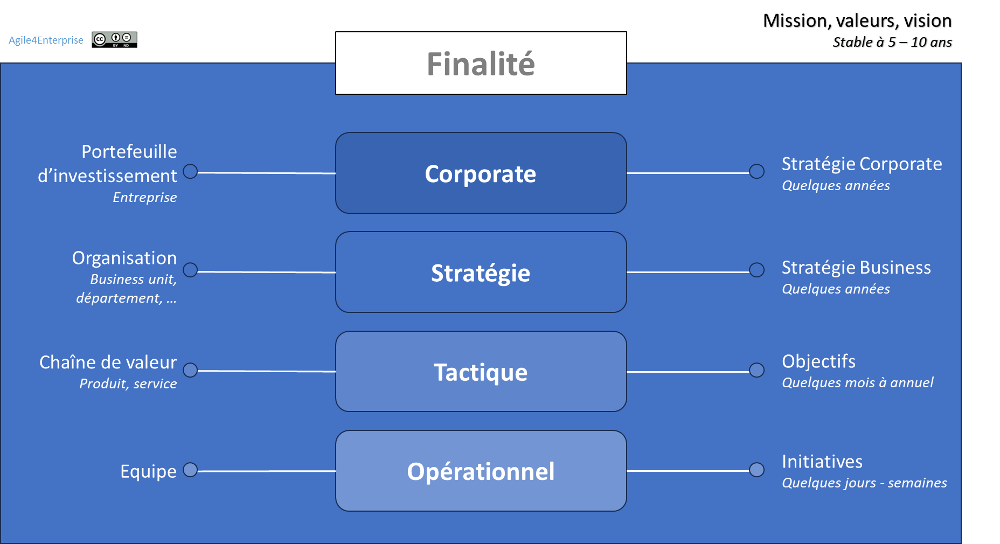
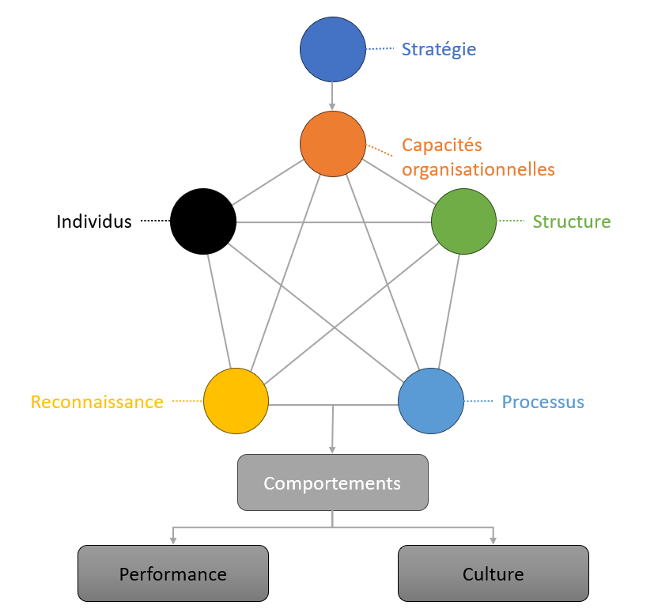
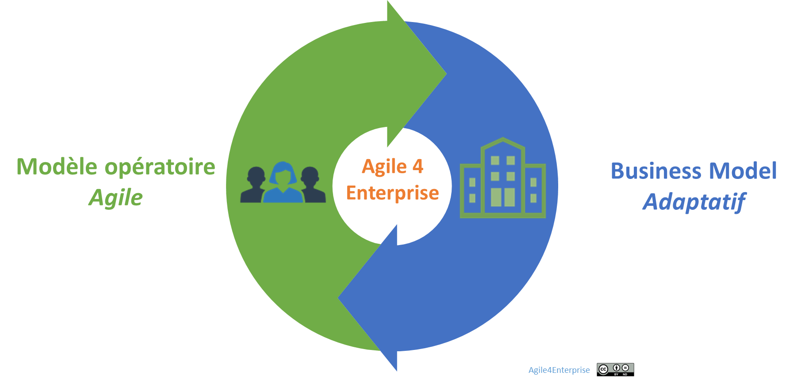

# Les 4 types de prise de décision

✨**Objectif**

La performance **repose sur la capacité collective** à :

- Recentrer l’attention sur les **décisions qui ont de l’impact pour l’organisation**,
- Articuler ces décisions **au bon niveau**,
- Garantir un **alignement stratégique** ancré dans la réalité opérationnelle.

## Le changement : une question de décisions

### Les quatre types de décisions d’une entreprise

L’agilité est **l’art de piloter le changement et la transformation en continu**. Il s’ancre nécessairement **dans les décisions que l’organisation prend**, non dans une structure hiérarchique, et à tous les niveaux de l’entreprise.

🌀**Exemple** :
*

Prenons la métaphore de la canopée d’une forêt.
Dans le **sous-bois**, la visibilité est limitée : on navigue à vue. C’est là que se jouent les interconnexions locales.

Plus haut, dans la zone intermédiaire formée par **les troncs et les branches**, les interactions se multiplient et commencent à structurer l’ensemble.

Au sommet, la **canopée** offre un panorama sur l’écosystème, permettant de percevoir les signaux faibles, venus aussi bien du taillis que de l’extérieur.

Tous ces niveaux sont liés. Vue du sol, cette voûte végétale agit comme une barrière : un **plafond naturel** qui masque la perspective globale. Cela donne un bon cadre pour différencier les types de décisions.
*

🧑‍🎓
Ils se caractérisent par :

🔹 **Une portée** : De l’ensemble de l’entreprise jusqu’aux équipes terrain.

🔹 **Un horizon temporel** : Parce qu’une entreprise fonctionne à plusieurs rythmes. On y trouve le temps long des ambitions, moyen des marchés, court des initiatives et le temps réel de l’exécution.

🔹 **Une complexité** : Gestion de la transversalité, des dépendances, de l’incertitude.

🔹 **Un niveau de risque** : De la transformation profonde aux adaptations opérationnelles.

Ce ne sont pas **des niveaux hiérarchiques**. Chaque type porte une partie du changement. C’est leur synchronisation et leur alignement qui produit la performance d’ensemble.

C’est sur ces natures de décision que nous avons conçu **Agile4Entreprise**.

### La finalité

L’entreprise se définit d’abord par sa mission, sa raison d’être, ses valeurs et sa vision. Ce sont ses racines. Elles ne changent pas au gré des ajustements, mais offrent **la boussole nécessaire à toute évolution**. Sans cap stable, le pilotage dynamique devient erratique.

> **Agile4Enterprise** respecte cette stabilité fondatrice tout en organisant l’adaptation permanente en son sein. La finalité n’en fait pas partie directement, mais demeure omniprésente.

➿**TechNova**

**Mission** :

> Rendre les environnements physiques plus durables et connectés.

**Vision** :

> Rendre les environnements connectés intelligents.

**Valeurs** :

- **Fiabilité** : Nos systèmes doivent tenir dans le temps, même là où la technologie est invisible.
- **Écoute** : Nos innovations partent du terrain, pas des tendances.
- **Responsabilité** : Nous cherchons la durabilité, pas l’effet de mode.
- **Sobriété technologique** : L’intelligence n’est pas dans la surenchère, mais dans la pertinence.
- **Cohérence** : Nous refusons de sacrifier le présent au nom du futur, ou l’inverse.

### Les décisions corporate

- **Portée** : Ensemble de l’entreprise
- **Décisions clés** : Stratégie corporate et portefeuille d’investissement.
- **Horizon de temps** : 5 à 10 ans.

Il définit les grandes orientations et assure une cohérence entre les initiatives et les ressources disponibles.

🧑‍🎓

**Stratégie Corporate** (ou groupe) :

Elle concerne les choix des marchés sur lesquels elle entre en concurrence ou qu’elle quitte, et la manière de s’y prendre. Elle modifie les frontières de l’entreprise.

C’est un cadre partagé par toutes les unités d’affaires. Il vise à rechercher un avantage compétitif pour le groupe multimétier, en créant davantage de valeur que si chaque entreprise était gérée de façon indépendante.

🧑‍🎓

**Portefeuille d’investissements** :

Le terme *portefeuille* peut désigner différentes réalités : projets, produits, initiatives… Ces usages varient selon les contextes et relèvent essentiellement d’un choix de définition.
Celle que nous utilisons dans ce guide est le **portefeuille des domaines d’activités stratégiques** (DAS) : c’est la liste des différents secteurs dans lesquels l’entreprise intervient. C’est un artéfact de la stratégie corporate.

> *Par exemple, TechNova a décidé d’investir dans la domotique. Sa stratégie consiste à trouver des synergies entre les différents secteurs répondant à sa mission.*

### Les décisions business

C’est la canopée de notre forêt.

- **Portée** : **Unité stratégique** (ex. : unité d’affaires, département avec un budget dédié).
- **Décisions clés** : **Stratégie Business**
- **Horizon de temps** : 3 à 5 ans.
- **Contexte** : Dans les organisations mono activités, les deux niveaux — **stratégique** et **corporate** — se confondent.

Chaque unité doit adapter les grandes orientations à ses spécificités tout en restant alignée avec la vision d’ensemble.

🧑‍🎓

**Stratégie Business** :

Définir la façon par laquelle une unité stratégique créera son propre avantage concurrentiel, en surpassant la concurrence de manière constante et significative.

> *Par exemple, le département domotique de TechNova a choisi de se démarquer par l’efficacité énergétique de ses solutions.*

### Les décisions tactiques

Ce sont les troncs et les branches des arbres de notre forêt.

- **Portée** : **Unité tactique** (ex. : chaîne de valeur, train de SAFe, domaine fonctionnel ou métier).
- **Décisions clés** : Traduire la stratégie en actions spécifiques et réalisables pour progresser vers les objectifs.
- **Horizon de temps** : Quelques mois.

C’est la courroie de distribution entre stratégie et opérationnelle.

> *Par exemple, le département domotique décide de renforcer les équipes de développement de sa technologie clé : les thermostats intelligents.*

### Les décisions opérationnelles

Ce sont les sous-bois de notre forêt.

- **Portée** : **Unité opérationnelle** (ex. : équipe, collectif)
- **Décisions clés** :
  - Exécuter les actions définies au plus près du terrain, qui permettent de s’ajuster au jour le jour.
  - Gérer les interdépendances et les priorités immédiates.
- **Horizon de temps** : Quotidien à quelques semaines.
- **Contexte** : Dans les petites structures, les deux niveaux — **opérationnel** et **tactique** — tendent à se confondre.

L’opérationnel est **le cœur de la création de valeur**.

> *Par exemple, une équipe Scrum alimente le Backlog des thermostats intelligents de fonctionnalités de détection de présence/absence, et de prise en compte des conditions météorologiques réelles.*

## L’alignement dynamique des décisions

### Le défi

> *« Il y a les décisions prises en CODIR, et celles prises dans les couloirs ou à la pause-café ! »*

L’alignement est sans aucun doute **le problème n° 1 de l’exécution stratégique** dans les entreprises. Plus que « suivre le plan », c’est faire en sorte que toutes les composantes de l’organisation avancent dans la même direction, avec cohérence.

Différentes approches, chacune à leur manière, cherchent à résoudre ce problème :

- **Hoshin Kanri** (Toyota, Lean Management) : déployer la stratégie en cascade à travers tous les niveaux.
- **Objectives & Key Results** (OKR) : aligner les efforts autour d’objectifs clairs, mesurables, et partagés.
- **Balanced Scorecard** (Kaplan & Norton) : traduire la stratégie en indicateurs équilibrés (financiers, clients, processus internes, apprentissage), pour l’ancrer dans les réalités multiples de l’entreprise.
- **Tension-based alignment** (Holacratie, Sociocratie) : faire émerger l’alignement par la gestion des tensions (écarts entre ce qui est et ce qui devrait être).

Ces approches tentent toutes de résoudre ce paradoxe : comment garder une direction commune, tout en laissant les équipes décider localement ? Sans boucles explicites, les actions se dispersent.

Dans un monde en mutation rapide, deux dynamiques doivent être articulées :

- Le **modèle d’affaires** évolue pour capter de nouvelles opportunités : il s’incarne dans des arbitrages, des positions, des investissements.
- Le **modèle opératoire** doit suivre et soutenir cette évolution : il mobilise les structures, les processus, les systèmes de reconnaissance et les équipes qui portent l’exécution.

C’est là que naît la tension. On change le « quoi », sans ajuster le « comment », et l’on s’étonne que rien ne bouge.

🧑‍🎓

**L’alignement dynamique**, c’est cette capacité à rendre cohérent en continu :

- La **vision**, la **stratégie** et l’**exécution**,
- Le **modèle d’affaires** (adaptatif) et le **modèle opératoire** (agile),
- Les arbitrages et les réalités du terrain.

### Le problème

Lorsque ces éléments cessent d’être synchronisés, l’organisation se fige ou se fragmente. Traditionnellement, l’alignement existe, mais il est de nature descendante :

- La stratégie est pensée « en haut »,
- L’opérationnel est censé exécuter les tâches,
- Le management est là pour contrôler,
- Les décalages entre intentions et actions s’accumulent.

Et surtout, il reste statique. Un désalignement génère des tensions et freine l’adaptation, notamment lorsque certaines dimensions évoluent, tandis que d’autres demeurent inchangées.

➿**TechNova**

Il se manifeste par une incapacité croissante à créer des synergies entre les différentes unités d’affaires Capteurs et Domotique.

Chacune avance selon ses propres priorités — produits, clients, budgets — sans cap commun clairement articulé.

Résultat : les décisions s’empilent, mais ne s’alignent plus.

### La cible

Dans une organisation dynamique :

- Les décisions et actions s’alignent en continu,
- Les boucles de feed-back remontent les signaux terrain,
- Chaque niveau influence les autres — sans dépendance rigide.

Pour y parvenir, ces types de décisions doivent :

- **Coïncider avec les niveaux organisationnels** :

    Ce sont les principes de design. Les décisions stratégiques relèvent de l’unité stratégique, les décisions tactiques de l’unité tactique, et les décisions opérationnelles de l’unité opérationnelle.

- **Être associés à des cadences de changement** : ce sont les **boucles adaptatives**.

## 👣 Et concrètement, lundi matin ?

1. **Cartographiez les niveaux de décisions**
    Qui décide quoi aujourd’hui ? À quel niveau ? Avec quel impact ?
2. **Identifiez ce qui dysfonctionne**
    Une stratégie mal traduite ? Des décisions opérationnelles non alignées ?
3. **Ouvrez un dialogue entre niveaux**
    Que changer pour que l’exécution soit plus fluide ?

> Ne cherchez pas à tout « caler » parfaitement dès le départ. Commencez par un seul lien. Mesurez les gains. Puis alignez les autres à partir de problématiques réelles.

## 🔑 Points clés à retenir

- L’agilité pilote le changement qui s’incarne dans les décisions.
- Il existe 4 natures de décisions dans l’entreprise : Corporate, stratégique, tactique, opérationnelle.
- L’alignement stratégique traverse tous ces niveaux.
- Le changement commence par la stratégie elle-même. L’alignement devient dynamique.
- Une entreprise agile, c’est une entreprise qui synchronise ses décisions pour évoluer en cohérence avec le réel.

