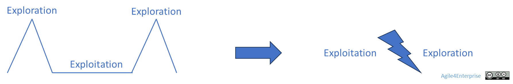

# Piloter le changement continu !

Propriétaire: Laurent Morisseau

- Sommaire

<aside>
✨

**Objectif**

Aujourd'hui, **le changement est devenu permanent et structurel**. Il ne s'agit plus de piloter des transformations ponctuelles, mais **d'intégrer le changement au fonctionnement quotidien de l'organisation**.

L’enjeu est de **concilier adaptation rapide et création de valeur durable**, tout en évitant les pièges de l'inertie ou de la désorganisation.

</aside>

# L’enjeu du changement

## Décrypter le changement

L’agilité est souvent perçue comme la capacité à s’adapter rapidement. Mais elle est bien plus que cela : **c’est la capacité d'une organisation vivante à naviguer dans la complexité du changement**.

<aside>
❓

**Alors de quel changement parle-t-on ?**

S’agit-il d’un changement progressif et incrémental, façonnant l’entreprise au quotidien ?

Ou d’un bouleversement brutal, provoqué par une crise ou une rupture technologique ?

Est-il induit par des dynamiques internes à l’organisation, ou par des mutations externes du marché ?

</aside>

Comprendre ces nuances est essentiel pour construire une organisation qui **ne subit pas**, mais **absorbe, transforme et anticipe** le changement pour en tirer parti.

## **Vers une nouvelle gestion du changement en entreprise**

*Evolution du modèle, d’une approche alternée à une approche simultanée*

## Le changement radical

<aside>
🔥

Un changement radical, en vrai : Michelin

Pendant 125 ans, Michelin a construit son empire sur un produit unique : le pneu. En 2012, alors que 97 % de son chiffre d’affaires vient encore de cette activité, Jean-Dominique Senard, son nouveau PDG, décide de transformer Michelin en acteur de la mobilité durable.

Plutôt que d’attendre la rupture, il l’anticipe et l’oriente :

- **Investissement précoce dans l’hydrogène**.
- **Création d’un écosystème d’innovation ouverte**.
- Lancement d’un produit de rupture : le pneu VISION (sans air, biodégradable, connecté).

Michelin n’a pas seulement réagi au marché : elle a redéfini sa place dans l’écosystème, et son modèle économique.

> Résultat : valorisation doublée, diversification réussie, leadership technologique renforcé.
> 
</aside>

## D’une alternance cyclique à une coexistence continue

Historiquement, la gestion du changement reposait sur une [alternance](https://www.notion.so/La-fabrique-du-changement-14a90eaf28ff8085bd03d715bfdae69e?pvs=21):

- **De [périodes d’exploitation](https://www.notion.so/L-entreprise-paradoxale-14a90eaf28ff801db7c0fdcea85e40f3?pvs=21)** des actifs existants pour optimiser la rentabilité,
- **De [phases d’exploration](https://www.notion.so/L-entreprise-paradoxale-14a90eaf28ff801db7c0fdcea85e40f3?pvs=21)** de nouvelles opportunités pour préparer l'avenir.

Mais aujourd’hui, cette alternance n’est plus viable. **Les cycles se raccourcissent et se télescopent :**

> L’exploitation et l’exploration doivent cohabiter.
> 

Le changement n’est plus une crise exceptionnelle à gérer. C’est **le fonctionnement normal d'un système vivant**

<aside>
🧑‍🎓

**L'exploitation**

Elle se concentre sur l'optimisation des activités existantes pour en améliorer l'efficacité et la rentabilité. Le but est de préserver les avantages concurrentiels viables le plus longtemps possible.

Le changement se traduit ici par des **programmes de transformation** de type excellence opérationnelle.

</aside>

<aside>
🧑‍🎓

**L'exploration**

Elle implique la recherche et le développement de nouvelles opportunités, produits ou marchés, en quête d’innovations pour rester compétitif.

Le changement se traduit ici par un **repositionnement stratégique**.

</aside>

<aside>
📚

En savoir plus sur la [fabrique du changement en entreprise](https://www.notion.so/La-fabrique-du-changement-14a90eaf28ff8085bd03d715bfdae69e?pvs=21)

</aside>

### L’ambidextrie organisationnelle comme système dynamique

L’entreprise ambidextre, à la fois dans l’exploitation de marchés matures et l’exploration de marchés émergents

## L’ambidextrie organisationnelle comme système dynamique

L’agilité d’entreprise ne choisit pas. Elle orchestre. Elle pilote cette cohabitation, **l’[ambidextrie organisationnelle](https://www.notion.so/Faire-cohabiter-plusieurs-horizons-strat-giques-13690eaf28ff816f931efc5a173335bc?pvs=21),** comme un flux, pas comme une tension à arbitrer une fois pour toutes.

Pour que cela tienne dans le temps, l’entreprise doit :

- Basculer de l’un à l’autre sans rupture,
- Maintenir une cohérence collective sans figer l’organisation.

<aside>
❓

Votre organisation est-elle capable d'orchestrer cette transformation de manière dynamique, durable et efficace ?

</aside>

# Les moteurs du changement

## Une dynamique entre adaptation et intention stratégique

Le changement est mû par deux forces complémentaires :

- **L'adaptation** ([**déterminisme darwinien**](https://www.notion.so/Les-moteurs-du-changement-14a90eaf28ff80c3abaad41e4a4370cc?pvs=21)) : survivre en s’ajustant continuellement à un environnement instable,
- **L'intention stratégique** ([**volontarisme stratégique**](https://www.notion.so/Les-moteurs-du-changement-14a90eaf28ff80c3abaad41e4a4370cc?pvs=21)) : choisir d’agir sur son avenir en créant ses propres opportunités.

L’agilité vit dans la tension entre ces deux forces. **C’est dans cette tension vivante que réside la capacité réelle de transformation.**

> Trop d’intention sans adaptation = dogmatisme.
> 

> Trop d’adaptation sans intention = opportunisme désordonné.
> 

Entre ces deux extrêmes, l’**inertie organisationnelle** agit souvent comme un frein au changement. 

## Des stratégies diversifiées de changement

L’entreprise ne se contente pas d’adapter son organisation aux contraintes : elle façonne son environnement et influence les règles du jeu, en alternant différentes réponses aux changements :

- **Défendre** ce qui reste viable,
- **Passer à l’offensive** pour provoquer les mutations, en innovant ou en redéfinissant ses offres.
- En combinant les deux, adaptation et création de rupture, dans un cycle maîtrisé.

<aside>
📚

En savoir plus sur les [moteurs du changement en entreprise](https://www.notion.so/Les-moteurs-du-changement-14a90eaf28ff80c3abaad41e4a4370cc?pvs=21)

</aside>

## Le changement continu : Un nouvel impératif stratégique

### Du changement projeté au changement intégré

Le changement n’est plus **un projet ou un programme à initier**. C’est **un système à maintenir vivant,** intégré aux processus de l’entreprise**.**

- **La stratégie devient adaptative** : évolutive, itérative, participative, nourrie par les signaux faibles.
- **Le design organisationnel** devient flexible et reconfigurable, permettant de structurer l’entreprise pour absorber l’incertitude et favoriser l’émergence de nouvelles capacités stratégiques.
- **L’exécution** intègre l'expérimentation et l'apprentissage en continu.

Loin d’être un simple ajustement, cette approche implique une transformation en profondeur de la manière dont l’entreprise conçoit son fonctionnement.

## Cadencer le changement

Imbrication des boucles adaptatives de l’opérationnelle à la stratégie

Le changement n’est pas chaotique. Il doit être [**rythmé**](https://www.notion.so/Les-4-cadences-du-changement-et-de-l-apprentissage-13b90eaf28ff8091b4cce85974f50938?pvs=21) par des ****cadences de pilotage synchronisées :

- **Stratégique** : revisite le cap (trimestrielle à annuelle), arbitrer,
- **Tactique** : arbitrage des objectifs (mensuelle),
- **Opérationnelle** : ajustements des initiatives (hebdomadaire ou continu), réagir aux imprévus, intégrer le réel.

> Leur alignement = des boucles adaptatives qui constituent le système nerveux de l’agilité organisationnelle.
> 

<aside>
🔥

***Exemple de cadences en action***

*Une entreprise de services B2B a structuré son pilotage en synchronisant :*

- ***Cadence stratégique** : Tous les ans le PDG révise les ambitions stratégiques avec les actionnaires. Tous les 4 mois, le comité exécutif révise les grands objectifs.*
- ***Cadence tactique** : Chaque trimestre, les comités de direction définissent les objectifs tactiques. Chaque mois, les managers réévaluent les projets en cours selon leur contribution aux objectifs.*
- ***Cadence opérationnelle** : chaque semaine, les équipes adaptent leur Backlog et priorisent en fonction des retours clients et de la progression vers les objectifs.*

*Résultat : la stratégie n’est plus un document figé. Elle se développe en parallèle de son exécution.*

Pour le PDG, « L’agilité, ce n’est pas aller plus vite. C’est rester aligné quand tout s’accélère. »

</aside>

<aside>
📚

En savoir plus sur l’[approche simultanée du changement](https://www.notion.so/L-approche-simultan-e-le-changement-continu-et-mergent-14a90eaf28ff808d8c31cb052208f601?pvs=21)

</aside>

## **Continuité de création de valeur et gestion des risques**

> Être agile, c’est créer de la valeur durable même dans l’instabilité.
> 

<aside>
💡

Piloter le changement continu ne suffit pas : **il faut aussi garantir la continuité de création de valeur :**

- La valeur perçue par les utilisateurs et clients des produits ou des services,
- La valeur pour les parties prenantes de l’entreprise.

Créer de la valeur sans développement - croissance, innovation, internationalisation ou diversification - reste difficile, même si ces leviers comportent des risques. Par conséquent, la stratégie est un processus continu, tout comme le changement qu’elle entraîne.

</aside>

Cela suppose :

1. **Piloter par la valeur**, pas par le livrable.
2. **Co-créer avec l’écosystème**, pour capter les signaux faibles et renforcer l’adéquation offre/besoin.
3. **S’adapter sans se trahir** : préserver son identité tout en évoluant.

<aside>
💡

**Un avantage concurrentiel difficilement réplicable**

Savoir gérer le changement en continu est une capacité qu’une entreprise ne peut ni acheter ni copier facilement. C’est pourquoi elle représente un avantage concurrentiel à développer pour une entreprise.

</aside>

---

# Limites du cadre : Entreprise instable ou entreprise agile ?

**Agile4Enterprise** est conçu pour **piloter l'évolution continue dans un cadre structurant vivant**, pas pour maximiser la discontinuité permanente.

Il accompagne :

- Les organisations qui veulent construire un changement durable,
- Celles qui veulent orchestrer leur transformation,
- Celles qui cherchent **l’agilité structurelle**, pas **l’instabilité stratégique**.

## Ce que le cadre présuppose

La transformation agile durable suppose :

- **Des niveaux de décision lisibles et pilotés**,
- **Des rôles de transformation incarnés mais temporaires**,
- **Des cycles de décisions stratégique et tactique réguliers**,
- **Un engagement progressif vers une capacité d’auto-pilotage collective.**

Cela correspond à une vision **évolutive, cumulative, consolidante** de la transformation.

## Ce que le cadre n'est pas conçu pour

Agile4Enterprise **ne vise pas** :

- À piloter des environnements **sans stabilisation progressive**,
- À organiser des **mutations par destruction/réinvention fréquentes**,
- À accompagner des organisations où **la volatilité et la recomposition permanente sont stratégiques.**

Dans ces contextes, l'objectif n'est pas de construire une capacité vivante durable, mais de **maximiser l’agilité brute au prix d’une discontinuité assumée**. Ce n’est pas notre choix d’agilité d’entreprise.

<aside>
🔥

***Exemples d’organisations instables***

- ***Organisations de crise permanente** (ONG humanitaire, interventions d'urgence, forces spéciales),*
- ***Collectifs artistiques, créatifs, expérimentaux** (compagnies éphémères, design de rupture),*
- ***Écosystèmes décentralisés et communautés autogérées** (DAO, open source, projets Web3).*

*Dans ces environnements :*

- *La cohérence globale est optionnelle,*
- *Le changement de forme est constant,*
- *L'ancrage est perçu comme un frein, non comme une force.*
</aside>

---

# Alors, s’adapter ou oser ?

## Piloter l’audace dans un monde incertain

L’agilité d’entreprise pourrait être perçue comme une posture d’adaptation permanente, trop modeste pour transformer vraiment. Mais ce n’est pas une posture défensive, il pose une autre ambition :

> C’est une manière de **retrouver une liberté de manœuvre stratégique** là où l’incertitude paralyse.
> 

Ce cadre n’est pas là pour éviter les risques, il est là pour permettre à l’entreprise **de prendre des risques intelligemment :**

- Pas des risques subis.
- Pas des ruptures désincarnées.

Mais des **mouvements** stratégiques rendus visibles, partagés collectivement, et portés dans la durée. C’est une **discipline pour rendre possible les paris** dans des conditions où le collectif est outillé pour traverser l’incertitude, et non pas la subir. Ce n’est pas parce qu’on transforme lentement qu’on transforme petit. C’est parce qu’on veut que ça dure.

## Un pari stratégique, dans Agile4Enterprise, c’est un PACTE

Le risque du cadre agile, c’est de devenir une machine à optimiser l’existant. **Agile4Enterprise** résiste à cela. Il ne cherche pas qu’à “fluidifier les flux” ou à “responsabiliser les équipes” dans le vide. Il structure la transformation **pour qu’elle puisse réellement produire des décisions différentes**, des trajectoires divergentes, des formes de rupture choisies. 

Un pari stratégique n’est pas un slogan, un cap abstrait. C’est une dynamique collective d’engagement, soutenue par des arbitrages, des rôles, et des tensions à habiter. La stratégie n’est pas décorrélée du pilotage. L’alignement systémique est le cœur du cadre. La stratégie est **ancrée dans le système vivant. Ce cadre rend la stratégie activable.**

---

## Et maintenant ?

Où en êtes-vous concrètement ?

✅ Nous avons une **vision stratégique**, revue régulièrement, et partagée.

✅ Nos équipes savent **qui décide quoi**, à quel rythme.

✅ Nous adaptons nos projets en fonction des retours terrain, **sans attendre la fin d’un cycle**.

✅ Les priorités sont revisitées au moins **une fois par mois**.

✅ La valeur produite est mesurée **autrement que par les livrables ou les délais**.

> **Moins de 3 cases cochées ?** Vous êtes en mouvement. Mais êtes-vous en pilotage ?
> 

---

# 🔑 **Points clés à retenir**

**Agile4Enterprise** ne propose pas seulement de s’adapter en continu, mais de piloter autrement :

- Pour que vos **ambitions stratégiques soient habitées**, pas décoratives.
- Pour que vos **ruptures deviennent activables**, pas seulement désirées.
- Pour que votre transformation **devienne un engagement structuré**, pas une intention floue.

**Agile4Enterprise permet des pivotements, des mutations profondes, m**ais **dans un cadre orchestré et évolutif**, pas dans une logique d'instabilité permanente ou de destruction programmée.

> **Agile4Enterprise** n’est pas un cadre d’adaptation. C’est un cadre pour **piloter l’audace et l’ambition dans un monde incertain et complexe.** Il ne pense pas petit. Il pense juste. Dans le mouvement. Et pour de vrai.
> 

<aside>
💡

La performance de l’agilité se mesure par son efficacité et son efficience dans le changement et l’apprentissage, ainsi que dans l’augmentation de valeur, durablement.

</aside>

### 👉 Et maintenant ? [Les niveaux de décisions](https://www.notion.so/Les-4-niveaux-de-prise-de-d-cision-Piloter-un-syst-me-vivant-19290eaf28ff80049db0c684a64e4fb0?pvs=21), car le changement s’incarne dans les décisions qui vont nous mener à l’action.