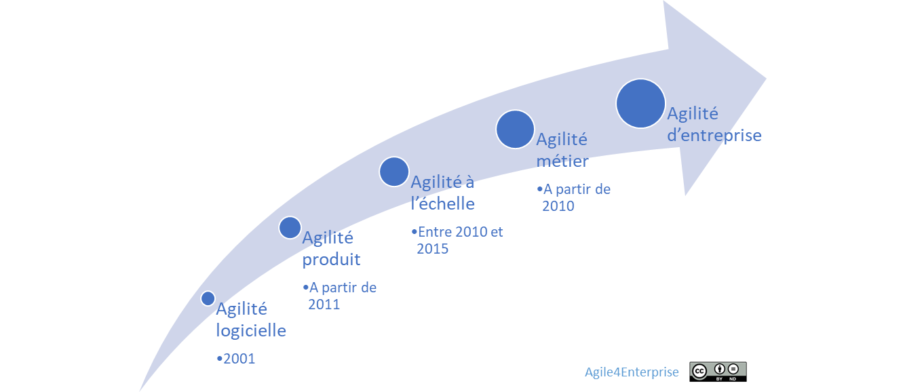

# Pourquoi un nouveau Framework agile ? Pourquoi maintenant ?

Propriétaire: Laurent Morisseau

- Sommaire

<aside>
✨

**Objectif**

Pourquoi un **nouveau Framework agile** est-il nécessaire aujourd’hui ?

Nous allons retracer l'évolution de l’agilité, depuis son application aux équipes jusqu’à l’échelle de l’entreprise, pour montrer que la **Business Agility** ne se limite pas à généraliser l’agilité d’équipe.

L’objectif est d’articuler une approche qui équilibre **optimisation globale** et **adaptation locale**, tout en intégrant tous les [niveaux de prises de décisions](https://www.notion.so/Les-4-niveaux-de-prises-de-d-cisions-19290eaf28ff80049db0c684a64e4fb0?pvs=21) de l’entreprise.

</aside>

# **De l'agilité d'équipe à la Business Agility : Une évolution stratégique**

Evolution de l’agilité : de l’équipes à la Business Agility

L’agilité a émergé comme une réponse aux défis de complexité et d’incertitude, d’abord dans le développement logiciel, puis en s’étendant progressivement à l’ensemble de l’entreprise. Cette transformation s’est opérée en plusieurs phases successives, chaque étape apportant un nouveau niveau de maturité et d’intégration organisationnelle.

## **De l’agilité logicielle à l’agilité produit : Placer l’utilisateur au cœur de la valeur**

L’agilité logicielle s’est imposée avec le Manifeste Agile en 2001, en promouvant des cycles de développement courts, itératifs et incrémentaux. Son objectif principal était de répondre rapidement aux besoins des utilisateurs et de s’adapter aux évolutions du marché.

Avec la montée du [**Lean Startup**](https://www.notion.so/Lean-StartUp-18390eaf28ff80bc8928d9d864ef7628?pvs=21) et du **Design Thinking**, l’agilité a évolué vers une **logique produit**, où la réussite ne repose plus sur la livraison d’un projet conforme aux spécifications, mais sur la capacité à maximiser la valeur utilisateur. Ce glissement a conduit à la mise en place d’équipes pluridisciplinaires, incluant la phase de Discovery, et autonomes, orientées vers la création d’impact.

## **L’agilité à l’échelle : Coordonner la collaboration multi-équipes**

À mesure que les organisations adoptaient des pratiques agiles, un défi majeur est apparu : comment maintenir une efficacité et une cohérence lorsque plusieurs équipes travaillent sur des produits ou services complexes ?

L’**agilité à l’échelle** est alors devenue une nécessité, avec l’apparition de Frameworks tels que [**LeSS](https://www.notion.so/A4E-et-LeSS-13490eaf28ff80409221d42e45847c94?pvs=21), [SAFe](https://www.notion.so/A4E-et-SAFe-Scaled-Agile-Framework-13490eaf28ff802da4d9d0513fd502b7?pvs=21), Nexus et Scrum@Scale**. Ces approches visent à faciliter la synchronisation et la collaboration entre équipes, tout en préservant l’autonomie et la flexibilité caractéristiques des méthodes agiles.

Par ailleurs, l’avènement du **DevOps** en 2009 a permis d’intégrer pleinement la phase d’exploitation au sein du cycle de développement, en brisant les silos entre développement et exploitation. L’automatisation, la livraison continue et la gestion des opérations en flux tirés ont renforcé l’agilité des entreprises dans la mise sur le marché de leurs solutions.

## **L’agilité métier : Vers une entreprise agile**

Avec le succès des pratiques agiles dans l’IT, d’autres fonctions ont progressivement adopté ces approches : **marketing, finance, RH, juridique…** Cette extension a donné naissance à l’**agilité métier**, dont l’objectif est d’aligner les différentes fonctions de l’entreprise sur des cycles rapides d’apprentissage et d’adaptation.

Cependant, il ne suffit pas que chaque département devienne agile de manière isolée. Pour qu’une entreprise bénéficie réellement des principes de l’agilité, elle doit orchestrer cette transformation de manière systémique.

## **La Business Agility : Une révolution organisationnelle et culturelle**

Aujourd’hui, la **Business Agility** va plus loin. Il ne s’agit plus uniquement de rendre des équipes ou des départements agiles, mais de transformer toute l’entreprise en un système capable de **s’adapter en permanence** aux changements de marché et aux attentes des clients.

Cette transformation ne repose pas uniquement sur des méthodes et Frameworks. Elle nécessite une refonte en profondeur des modes de gouvernance, des processus de décision et des modèles organisationnels. La **stratégie agile**, la **conduite du changement en continu**, et l’**apprentissage organisationnel** deviennent alors des leviers essentiels pour développer une entreprise véritablement résiliente et réactive.

Ainsi, l’agilité n’est plus seulement un outil de gestion de projet ou de développement logiciel. Elle est devenue une philosophie d’entreprise, fondée sur l’**expérimentation rapide, la collaboration transverse et la création de valeur en continu**, permettant aux organisations d’évoluer dans un environnement de plus en plus incertain.

Ainsi, l’agilité a évolué d’une approche centrée sur les équipes vers une transformation globale.

<aside>
📚

En savoir plus sur l’[évolution de l’agilité en entreprise](https://www.notion.so/Une-br-ve-histoire-de-l-agilit-13690eaf28ff81a8b639f28c4c4a6bcd?pvs=21)

</aside>

## L’entreprise agile est différente de l’agilité d’équipe (et de la business agility)

Si l’agilité est née au sein des équipes pour répondre à des enjeux locaux d’incertitude et de complexité, l’évolution vers l’**agilité d’entreprise** ne se résume pas simplement à une généralisation de ces pratiques à grande échelle. Une [**entreprise agile**](https://www.notion.so/Pourquoi-une-entreprise-agile-Pourquoi-maintenant-19190eaf28ff8011ae3eecfe210badba?pvs=21) ne se limite pas à une collection d’équipes agiles. Elle ne se définit pas uniquement par l’adoption des valeurs du Manifeste Agile ou par l’application de Frameworks à l’échelle. C’est une vision à la fois naïve et romantique de l’entreprise, sûrement due à ses racines [inspirées de la contre-culture américaine des années 1960](https://www.notion.so/Le-probl-me-de-l-agilit-d-entreprise-13690eaf28ff81c59a69ce9582faa7a5?pvs=21).

Elle repose sur le développement de **capacités organisationnelles spécifiques**, lui permettant de naviguer dans un environnement incertain et d’adapter en continu son modèle économique et son organisation.

Or, la **Business Agility**, telle qu’elle est souvent envisagée, reste encore fortement ancrée dans une logique opérationnelle, où l’accent est mis sur l’extension de l’agilité des équipes à l’ensemble de l’entreprise. Cette vision, bien que séduisante, est réductrice et ne permet pas d’adresser pleinement les **défis stratégiques et structurels** d’une véritable entreprise agile.

*Agilité d’équipe et agilité d’entreprise sont distinctes*

L’agilité d’équipe et l’agilité d’entreprise poursuivent des logiques fondamentalement différents. Les confondre conduit à des échecs et à des limites dans la transformation agile de toute l’entreprise.

### **L’agilité d’équipe : Un levier d’optimisation opérationnelle**

L’agilité d’équipe est **orientée vers l’opérationnel** et s’appuie sur des boucles d’apprentissage rapides pour améliorer en continu la livraison de valeur. Elle répond aux besoins immédiats des équipes et des utilisateurs finaux, en favorisant une approche **émergente et ascendante**.

Ses principales caractéristiques :

- **Une réponse locale** aux défis d’incertitude et de complexité,
- **Une optimisation locale de la performance**, axée sur l’amélioration continue,
- **Un cycle de changement permanent**, structuré par des itérations et des expérimentations fréquentes,
- **Une logique bottom-up**, où l’innovation et l’adaptation émergent des équipes.

L’agilité d’équipe est donc efficace pour gérer des projets complexes, améliorer la collaboration et maximiser la satisfaction client. Cependant, elle ne suffit pas pour transformer une entreprise dans son ensemble, car elle n’adresse pas les **enjeux organisationnels, structurels et stratégiques**.

### **L’agilité d’entreprise : Une transformation organisationnelle et stratégique**

Contrairement à l’agilité d’équipe, l’agilité d’entreprise a une **portée globale**. Elle ne concerne pas uniquement les pratiques opérationnelles mais touche la **structure, la gouvernance, la culture et le modèle économique**. Son objectif est d’adapter en permanence l’organisation aux évolutions du marché et aux transformations stratégiques.

Ses caractéristiques distinctives :

- **Une réponse stratégique et systémique** à l’incertitude et à la complexité,
- **Une recherche d’optimisation globale**, visant la cohérence et la pérennité de l’organisation,
- **Une recherche de stabilité incrémentale**, pour préserver durablement les avantages concurrentiels,
- Une démarche **délibérée** et **descendante alignée sur la vision et les objectifs de l’entreprise**, qui nécessite un cadre clair et une intention stratégique forte.

L’agilité d’entreprise ne repose pas uniquement sur la multiplication des équipes agiles. Cette seule approche est insuffisante, voire potentiellement contre-productif. Au contraire, elle implique une **transformation des modes de gouvernance, des processus de prise de décision et du design organisationnel**, pour permettre une coordination fluide et une capacité d’adaptation collective.

### **Les limites des approches de Business Agility actuelles**

### **Un focus excessif sur l’agilité opérationnelle**

L’un des écueils de la **Business Agility**, telle qu’elle est souvent mise en œuvre, est qu’elle repose essentiellement sur l’**agilité d’équipe et l’agilité à l’échelle**. Elle vise avant tout à améliorer la livraison et la performance des équipes, mais sans nécessairement remettre en question les **fondements structurels et stratégiques** de l’entreprise.

Cela entraîne plusieurs limites :

- **Un changement centré sur l’opérationnel**, sans prise en compte des défis organisationnels,
- **Une difficulté à aligner les transformations locales sur des enjeux stratégiques globaux**,
- **Un manque d’impact sur la gouvernance et la prise de décision à haut niveau**, limitant l’évolution du modèle d’affaires.

### **Le risque d’une standardisation inadaptée**

Pour passer à l’échelle, de nombreuses entreprises s’appuient sur des F**rameworks d’agilité à l’échelle**. Ces modèles, bien que structurants, souffrent de plusieurs limites :

- **Une approche prescriptive**, laissant peu de place à l’adaptation aux spécificités de l’organisation,
- **Un modèle uniforme**, appliqué sans discernement aux différentes fonctions de l’entreprise, réduisant son efficacité,
- **Un coût et une complexité élevés**, rendant difficile leur adoption à grande échelle et créant parfois plus de rigidité que d’agilité.

Par conséquent, l’application de ces Frameworks ne garantit pas une transformation réussie et peut parfois être contre-productive, en introduisant des processus trop rigides qui freinent l’adaptation réelle de l’entreprise.

<aside>
📚

En savoir plus sur [cette problématique d’agilités](https://www.notion.so/Le-probl-me-de-l-agilit-d-entreprise-13690eaf28ff81c59a69ce9582faa7a5?pvs=21)

</aside>

# **Agile4Enterprise : Une approche réinventée pour une agilité d’entreprise systémique**

Face aux limites des approches traditionnelles de la **Business Agility**, **Agile4Enterprise** adopte une démarche différente. Plutôt que de se limiter à l’extension de l’agilité d’équipe à l’échelle de l’organisation, ce Framework vise à **réconcilier** ces approches complémentaires, et à **aligner** les dynamiques **opérationnelles, tactiques et stratégiques** afin de créer une entreprise véritablement agile.

<aside>
⚠️

[Agilité d’équipe et agilité d’entreprise](https://www.notion.so/Le-probl-me-de-l-agilit-d-entreprise-13690eaf28ff81c59a69ce9582faa7a5?pvs=21) sont fondamentalement différentes. Mais les deux doivent cohabiter pour optimiser globalement et adapter localement.

</aside>

## **Une approche équilibrée et complémentaire**

Agile4Enterprise repose sur un équilibre subtil entre **deux dynamiques essentielles**, souvent perçues comme opposées mais pourtant nécessaires à la performance durable d’une entreprise :

- **Optimisation globale & adaptation locale**
    
    → Un équilibre entre la nécessité d’une **vision stratégique cohérente** et la **flexibilité opérationnelle des équipes**.
    
    → L’équivalent agile du célèbre adage **"Penser globalement, agir localement"**.
    
- **Performance immédiate & innovation continue**
    
    → L’agilité ne se limite pas à la gestion du quotidien ; elle doit aussi permettre d’**anticiper et façonner l’avenir**.
    
- **Stabilité stratégique & dynamique des équipes**
    
    → Une entreprise agile ne doit pas sacrifier la **cohérence et la durabilité de ses avantages concurrentiels** au profit d’un **changement constant et désorganisé**.
    
- **Approche descendante & émergence ascendante**
    
    → L’agilité d’entreprise ne peut être uniquement "bottom-up". Une **vision claire et un cadre stratégique fort** sont indispensables pour structurer l’adaptation locale.
    
- **Changement incrémental & ajustements continus**
    
    → L’agilité ne signifie pas chaos : elle repose sur une **gestion maîtrisée du changement**, combinant **transformation structurée et adaptation agile au quotidien**.
    
- **Intégration du changement au cœur du pilotage stratégique**
    
    → Plutôt que d’être perçu comme un obstacle, le changement devient un **processus naturel et continu**, intégré à la gestion des risques et à la prise de décision.
    

### **Un impact profond sur toute l’entreprise**

Contrairement aux approches limitées à l’optimisation opérationnelle, Agile4Enterprise **adresse les décisions stratégiques et tactiques**, engageant ainsi la **direction et le management intermédiaire**. Là où l’agilité d’équipe reste souvent cantonnée à des enjeux d’exécution, ce Framework assure un **alignement global** qui permet une véritable transformation de l’entreprise, sans se limiter aux seuls processus de delivery.

## **Un Framework Complémentaire aux Approches Existantes**

Loin d’être un modèle unique et rigide, Agile4Enterprise s’appuie sur une approche **holistique et agnostique**, combinant **multiméthodes et multi-Frameworks**. Son objectif est de **compléter** et **enrichir** les démarches actuelles :

- **Méthodes agiles opérationnelles** (Scrum, [Kanban](https://www.notion.so/Kanban-17590eaf28ff8002ac08fead95b04e5a?pvs=21), Extreme Programming, etc.)
- **Frameworks d’agilité à l’échelle** ([SAFe](https://www.notion.so/A4E-et-SAFe-Scaled-Agile-Framework-13490eaf28ff802da4d9d0513fd502b7?pvs=21), [LeSS](https://www.notion.so/A4E-et-LeSS-13490eaf28ff80409221d42e45847c94?pvs=21), Nexus, Scrum@Scale, etc.)
- **Approches d’exécution stratégique agile** ([OKR](https://www.notion.so/OKR-un-outil-de-l-agilit-strat-gique-et-tactique-14590eaf28ff80b3b0f7e344d0764762?pvs=21), [Lean Portfolio Management](https://www.notion.so/Lean-portfolio-management-16f90eaf28ff80f6b4f2d32d142a9a8f?pvs=21), [Beyond Budgeting](https://www.notion.so/Beyond-Budgeting-17690eaf28ff801cb67af44359daca4d?pvs=21))

Plutôt que d’introduire un énième framework normatif, Agile4Enterprise apporte **une pièce essentielle** à l’édifice de l’agilité d’entreprise : **l’intégration fluide de l’agilité dans la structure, la gouvernance et la stratégie**.

L’enjeu n’est pas de **finaliser** une transformation agile, mais de **permettre une évolution continue**, où l’entreprise est **capable de se transformer en permanence**.

## **Une approche pragmatique et réaliste de l’agilité d’entreprise**

Si Agile4Enterprise s’inscrit dans la **Business Agility**, il ne se contente pas de **scaler** l’agilité opérationnelle. **Son ambition est plus large** :

- **Ne pas se limiter au cadre agile traditionnel**
    
    L’agilité d’entreprise ne peut être réduite à un simple déploiement d’équipes Scrum ou Kanban. Agile4Enterprise **intègre des disciplines variées**, allant du **design organisationnel** à la **gestion du changement**, en passant par la **stratégie d’entreprise et la gouvernance adaptative**.
    
- **Une approche pragmatique et actionnable**
    
    Plutôt qu’un modèle idéalisé et théorique, ce Framework est **conçu pour être opérationnellement applicable**, s’adaptant aux réalités des entreprises, quelle que soit leur taille ou leur secteur.
    
- **Une alternative aux modèles prescriptifs**
    
    Alors que de nombreux Frameworks imposent des **processus rigides**, Agile4Enterprise propose un **cadre flexible**, permettant aux organisations de choisir **les leviers d’agilité adaptés à leur contexte**.
    

## **Un alignement dynamique au service du changement continu**

Plutôt que de raisonner en **niveaux hiérarchiques figés**, Agile4Enterprise structure l’agilité autour de [**niveaux de décision**](https://www.notion.so/Les-4-niveaux-de-prises-de-d-cisions-19290eaf28ff80049db0c684a64e4fb0?pvs=21). Cette approche permet de garantir un **alignement dynamique**, en intégrant **toutes les strates de l’organisation dans un processus de changement permanent**.

**Les 4 niveaux de décision agiles :**

📌 **Stratégique** : Définition des orientations à long terme et des priorités globales.

📌 **Tactique** : Alignement des grandes initiatives sur la vision stratégique.

📌 **Opérationnel** : Gestion des cycles d’adaptation et d’amélioration continue.

📌 **Exécution** : Boucles de feedback et pilotage agile du quotidien.

Grâce à cette approche, le **changement ne subit plus l’inertie des structures rigides** : il devient un **levier naturel et structuré de transformation continue**.

## **Vers une nouvelle génération d’agilité d’entreprise**

Agile4Enterprise ne se positionne pas comme une simple **alternative** aux Frameworks existants. Il s’agit d’une **approche intégratrice**, qui permet de dépasser les limites des modèles actuels en :

✔ **Réconciliant l’agilité d’équipe et l’agilité d’entreprise**

✔ **Offrant une approche holistique et adaptative**

✔ **Structurant une gouvernance agile réellement efficace**

✔ **Alignant vision stratégique, décisions tactiques et pratiques opérationnelles**

✔ **Permettant une évolution continue au sein des organisations**

> C’est cette approche différenciante qui a conduit à un nouveau [Framework d’Agilité d’Entreprise](https://www.notion.so/Le-Framework-Agile4Enterprise-14290eaf28ff80448ac8e72cd9499274?pvs=21), pour franchir une nouvelle étape : **de la Business Agility à une véritable Agilité d’Entreprise**.
> 

---

# 🔑 Points clés à retenir

1. **L’évolution de l’agilité** : Partie d’une approche centrée sur les équipes et le développement logiciel, elle s’est progressivement élargie à l’agilité produit, puis à l’agilité à l’échelle, avant d’atteindre aujourd’hui la **Business Agility**, qui vise une transformation systémique de l’entreprise.
2. **L’agilité d’équipe et l’agilité d’entreprise sont distinctes** :
    - L’**agilité d’équipe** est opérationnelle, ascendante et favorise une amélioration continue dans des cycles courts.
    - L’**agilité d’entreprise** est stratégique, descendante et vise une stabilité incrémentale en intégrant l’ensemble des dimensions organisationnelles.
3. **Les limites des approches actuelles de Business Agility** : Elles reposent principalement sur l’extension de l’agilité d’équipe et des **Frameworks d’agilité à l’échelle**, qui peuvent manquer de flexibilité et ne pas adresser les défis organisationnels et stratégiques.
4. **Une approche équilibrée et systémique est nécessaire** : Plutôt que de chercher à généraliser l’agilité d’équipe à toute l’organisation, il s’agit de construire un alignement dynamique entre **stratégie, tactique et opérationnel**, en intégrant une **agilité organisationnelle** qui permet une adaptation continue.
5. **Agile4Enterprise apporte une vision complémentaire** : Ce Framework ne remplace pas les approches existantes mais les enrichit en structurant une **gouvernance agile**, en intégrant **différents niveaux de décision**, et en facilitant un **changement maîtrisé et continu**.

L’enjeu n’est pas simplement d’appliquer des principes agiles, mais de les transformer en **un véritable levier stratégique et organisationnel**, garantissant une capacité d’adaptation permanente et cohérente.