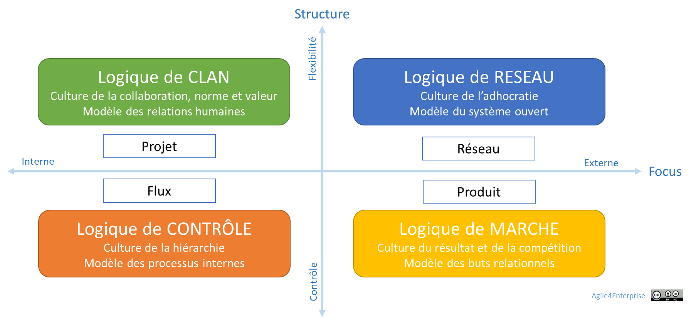

# Culture Agile et Transformation Vivante

✨**Objectif**

Dans **Agile4Enterprise**, la culture et la performance émergent ensemble d’un alignement entre le business model et le modèle opératoire.

Plutôt que de chercher une culture agile unique, ce chapitre montre comment chaque **archétype** génère sa propre dynamique culturelle, et comment, en la cartographiant, vous anticipez son impact concret sur vos résultats.

🧑‍🎓**Ce que vous allez apprendre ici**

- Pourquoi il n’existe pas *une* culture agile, mais des logiques culturelles spécifiques à chaque archétype.
- Comment utiliser le **Canvas Culture & Archétype** pour guider vos diagnostics et actions.

## De l’archétype à la culture

Les schémas classiques imposent souvent une structure uniforme à toute l’entreprise, mais :

- Un **département produit** privilégie la compétition et la scalabilité.
- Une **équipe R&D** mise sur l’expérimentation et la coopération.
- Une **usine** cherche la stabilité et l’excellence opérationnelle.
- Un **écosystème de partenaires** valorise l’ouverture et l’innovation.

Chaque unité développe sa propre logique culturelle, que vous devez reconnaître avant d’agir. On retrouve ce principe avec les archétypes :

- **Flux** → **culture contrôle** : Fiabilité, excellence opérationnelle.
- **Produit** → **culture marché** : Compétition, scalabilité.
- **Projet**%2013490eaf28ff8030a8aeecf9206d94ea.md) → **culture clan** : Coopération, expérimentation.
- **Réseau** → **culture adhocratie** : Innovation, ouverture.

Choisir un archétype, c’est donc :

1. Définir vos **processus et structures** (modèle opératoire),
2. Cultiver un **ensemble de croyances et pratiques** (culture),
3. Produire un **impact sur la performance**.

### La culture de la transformation durable

La culture n’est jamais figée. Elle se construit dans le mouvement, à travers les interactions humaines, les ajustements collectifs et les tensions qui évoluent. Transformer une culture ne consiste pas à remplacer un modèle par un autre, mais à développer une capacité collective à avancer en continu dans l’incertitude. Chaque action engendre d’ailleurs de nouvelles zones d’incertitude. Ce paradoxe assumé rappelle que changer, c’est apprendre à fonctionner dans un cadre non déterministe et une complexité sans cesse renouvelée. D’où la nécessité d’une approche adaptative, qui ne vise pas un état final, mais nourrit des mécanismes d’évolution permanente.

## Le canevas « Culture & Archétype »

Pour éclairer ce lien, utilisez ce canevas en atelier, à l’instar de celui de TechNova :

➿**TechNova**

Le **coach agile d’entreprise** souhaite guider le COMEX, non pour déployer un seul modèle, mais pour faire cohabiter et aligner ces quatre cultures dans une vision partagée :

| **SCRIPt** | **Flux** | **Produit** | **Projet** | Réseau |
| --- | --- | --- | --- | --- |
| **Structure** | Lignes de production Kanban | Équipes stables, Product Owner | Équipes ad hoc | Rôles fluides, écosystème ouvert |
| **Capacités** | Excellence opérationnelle | Go-to-market rapide | Innovation rapide, prototypage | Veille, partenariats externes |
| **Reconnaissance** | Objectifs de performance | Prime à la croissance | Valorisation de l’apprentissage | Labels innovation |
| **Individus** | Experts en Lean et DevOps | Product managers, devs | Chercheurs, designers | Communautés de pratiques |
| **Processus** | Flux tiré, cycles courts | Backlog persistant, KPI| Sprints d’expérimentation | Ateliers collaboratifs, hackathons |
| **Culture émergente** | Esprit Lean et fiabilité | Esprit start-up et compétition | Curiosité, prise de risque | Ouverture, coopération |

Cohérence ne signifie pas homogénéité : chaque unité stratégique doit adapter son modèle opératoire à sa réalité, tout en restant alignée sur une vision globale et une culture commune.

## 👣 Et concrètement, lundi matin ?

- Pour chaque archétype, cartographiez la situation actuelle selon les cinq dimensions SCRIPt.
- Dans la ligne « Culture émergente », décrivez le profil de valeurs et comportements induits.
- Le résultat : 4 mini-profils culturels prêts à guider vos actions.

## 🔑 Points clés à retenir

- **4 cultures agiles** coexistent et influencent la performance.
- **Canvas SCRIPt × Archétype** : outil de diagnostic et d’alignement.

