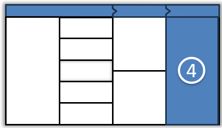
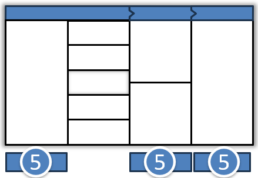

# Guide de l’outil ACTE

✨**Objectif**

Ce chapitre vous présente **ACTE**, le canevas central pour orchestrer une transformation d’unité. Il permet de relier stratégie, modèle opératoire et exécution concrète dans une séquence claire en 5 étapes.

ACTE rend visible les écarts entre ambition et réalité opérationnelle, pour guider la transformation sans déconnexion ni injonction floue.

🧑‍🎓**Ce que vous allez apprendre ici**

- Ce qu’est ACTE et pourquoi il structure la transformation d’une entité.
- Comment relier ambition stratégique, transformation organisationnelle et plan d’action dans un processus fluide.
- Comment cartographier votre modèle opératoire actuel avec les 5 dimensions SCRIPt.

📚**Petit lexique**

- **Ambition stratégique** : stratégie à 1 an, traduite en OKR globaux pour l’unité.
- **OKR tactiques** : objectifs à 3 mois, différenciés entre enjeux business et transformation.
- **GAP analysis** : identification des écarts entre l’état actuel et la cible.

## Qu’est-ce que l’ACTE ?

**ACTE** — *Agile Canevas pour la Transformation d’Entité* — est un outil à la fois **visuel** et **processuel** qui :

- Articule **trois niveaux de décision** : stratégique, tactique et opérationnel
- Couvre les **5 dimensions SCRIPt d’une organisation** : Structure, capacités, individus, reconnaissance et processus
- S’intègre aux **cycles OKR**.

Il s’applique aux unités stratégiques et se décline ensuite au niveau de chaque unité tactique, puis opérationnelle.

> Pourquoi ACTE ? Pour rassembler autour d’un même outil dirigeants, managers, coachs et convertir les ambitions en actions mesurables.

### Les 5 étapes clés

#### 1. Ambition à un an

- **Animateur principal** : Coach agile d’organisation
- **Participants** : CODIR de l’unité stratégique
- **But** : Formaliser l’ambition à un an.
- **Livrables** :
  - Ambition stratégique
  - Maximum 3 OKR stratégiques
- **Comment** : Atelier 1/2 à 1 journée
  1. Présentation de la vision *business*
  2. Définition des OKR stratégiques

#### 2. Photo actuelle SCRIPt

- **Animateur principal** : Coach agile organisation
- **Participants** : CODIR
- **But** : Cartographier votre modèle opératoire existant.
- **Livrables** : Canevas SCRIPt actuel
- **Comment** : Atelier collaboratif 2 h
  1. Chacun note sa perception actuelle sur les 5 cases SCRIPt
  2. Synthèse et divergences

#### 3. OKR tactiques et GAP analysis

- **Animateur principal** : Coach agile tactique
- **Participants** : Responsables de chaque unité tactique
- **But** :
  - Choisir une cible en identifiant un **archétype Agile4X** inspirant.
  - Détecter écarts
  - Définir OKR tactiques
- **Livrables** :
  - SCRIPt cible,
  - OKR tactique Business (performance)
  - OKR tactique Transformation (culture et organisation)
- **Comment** : atelier 1/2 à 1 journée
  1. Identification des écarts clés
  2. Formulation d’OKR tactiques

#### 4. Plan de transformation

- **Animateur principal** : Agile Master
- **Participants** : Par équipe
- **But** : Détail des initiatives et responsabilités
- **Livrables** :
  - Plan de transformation sous forme de liste d’initiatives
  - Budget
- **Comment** : Atelier 2 heures
  1. Identifier les actions contribuant aux OKR tactiques
  2. Assigner des responsabilités

#### 5. Suivi et ajustement

- **Animateur principal** : Coach agile tactique
- **Participants** : Par équipe
- **But** : Cadencer revues OKR et ajustements
- **Livrables** :
  - Calendrier de revue (hebdomadaire, trimestrielle)
  - OKR et plan de transformation ajustés
- **Comment** : Atelier 2 heures
  1. Cadencement des rituels OKR
  2. Définition des indicateurs de progrès

➿**TechNova**

**Du Projet au Produit** : la domotique chez TechNova

Début 2024, l’entreprise lance un prototype de système domotique en mode projet pilote. Les premiers retours clients sont prometteurs, alors la direction souhaite désormais passer à l’échelle sans retomber dans le prototype jetable. Les responsables traduisent cette transformation dans l’ACTE :

**1. Ambition & OKR stratégiques (1 an)** :

- **Ambition** : Hisser la domotique TechNova à l’échelle nationale.
- **OKR stratégiques** :
  1. **Tripler le chiffre d’affaires** d’ici fin 2024.
  2. **Taux de satisfaction** >= 85 % (NPS).
- **KPI :**
  - **Taux de qualité** < 2 % d’incidents critiques.

**2. Photo actuelle vs cible SCRIPt** :

La transformation se traduit par :

| Dimension | Aujourd’hui (Projet) | Cible (Produit) |
| --- | --- | --- |
| **Structure** | Équipe temporaire, rôle de chef de projet | Équipe produit dédiée, Product Owner domotique |
| **Capacités** | Compétences R&D et découverte produit | Time-To-Market fonctionnalité à moins de deux semaines, feed-back utilisateur |
| **Processus** | Revue projet hebdomadaire | Backlog continu, sprints de deux semaines, OKR pour les objectifs du produit |
| **Individus** | Consultants externes, turnover post-pilote | Équipe stable, pair-programming, formation métier |
| **Reconnaissance** | Nouvelles compétences acquises | KPI de produit centré utilisateur |

**Temporalité** : L’horizon de la cible est fixé à 1 an.

**3. OKR tactiques et GAP** pour le premier trimestre :

- GAP analysis :
  - Gestion de projet ≠ gestion de produit
  - Équipe projet ≠ Équipe produit
- OKR tactiques :
  - *Business* : Lancer notre offre packagée domotique avec succès (+15 % CA).
  - *Transformation* : Pouvoir livrer un incrément produit tous les 15 jours.

**4. Plan de transformation** : T1 2024

| Initiative | Responsable | Cadence revue |
| --- | --- | --- |
| Créer une équipe produit domotique | Product Manager | Revue produit mensuelle |
| Mettre en place un Backlog produit | Product Owner | Sprint bimensuel |
| Déployer un pipeline CI/CD | DevOps lead | Revue qualité bimensuelle |

**5. Suivi et rituels** :

- **Daily stand-up** (15 min) centré bogue et fonctionnalités
- **Sprint review** bimensuelle avec parties prenantes
- **Revue trimestrielle ACTE** : ajustement vision, OKR et plan de transformation

**Bénéfices attendus** : Cycle produit pérenne, prévisibilité accrue, engagement client renforcé.

## 👣 Et concrètement, lundi matin ?

Lancez votre premier atelier ACTE :

1. Constituez votre équipe : direction, coach agile, manager, Product Owner, Business Owner.
2. Préparez le canevas imprimé ou sur un outil collaboratif.
3. Posez les questions essentielles :
    - *Structure* : Comment l’organisation du travail soutient-elle la stratégie ?
    - *Capacités* : Avons-nous les moyens de délivrer ce qui est attendu ?
    - *Processus* : Quels processus clés appuient la stratégie ?
    - *Individus* : Quelles compétences devons-nous mobiliser pour réussir ?
    - *Reconnaissance* : Que valorisons-nous vraiment dans notre organisation ?
    - *Performance* : Pilotons-nous avec les bons indicateurs ?
    - *Culture* : Notre état d’esprit favorise-t-il la réussite ?

## 🔑 Points clés à retenir

ACTE apporte un cadre pour rendre la transformation visible, concrète et actionnable :

- Permet de relier la stratégie à l’organisation.
- Crée un langage commun entre directions, managers et équipes.
- Aligne ambition, structure, compétences et culture.
- S’intègre dans une gouvernance adaptative.

