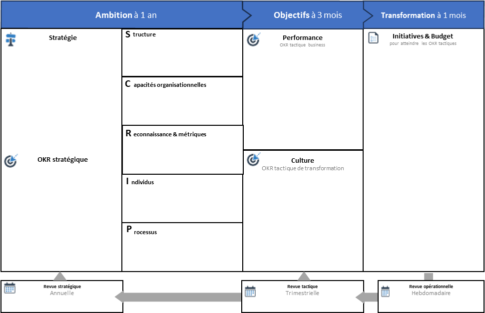

# Guide de l’outil ACTE

✨ **Objectif** Ce chapitre vous présente **ACTE**, le canevas central pour orchestrer une transformation d’unité stratégique. Il permet de relier ambition stratégique, modèle opératoire et exécution concrète dans une séquence claire en 5 étapes. ACTE rend visibles les écarts entre ambition et réalité opérationnelle, pour guider la transformation sans déconnexion ni injonction floue.

🧑‍🎓 **Ce que vous allez apprendre** - Ce qu’est ACTE et pourquoi il structure la transformation d’une entité stratégique de manière dynamique et mesurable. - Comment relier vision stratégique, transformation organisationnelle et plan d’action dans un processus fluide. - Comment cartographier votre modèle opératoire actuel avec les 5 dimensions SCRIP. - Comment formuler des **OKR tactiques** à double entrée : impact business et culture d’exécution.

📚 **Petit lexique** - **Ambition stratégique** : stratégie à 1 an, traduite en OKR globaux pour l’unité. - **OKR tactiques** : objectifs à 3 mois, différenciés entre enjeux business et transformation. - **GAP analysis** : identification des écarts entre l’état actuel et la cible. - **Initiatives** : actions concrètes planifiées pour atteindre les OKR définis.

Outil ACTE (Agile Canevas pour la Transformation d’Entité)

# Qu’est-ce qu’ACTE ?

**ACTE** — *Agile Canevas pour la Transformation d’Entité* — est un outil à la fois **visuel** et **processuel** qui :

- Relie **stratégie ↔ exécution** : cohérence, alignement, développement stratégique
- Articule **trois niveaux de décision** : stratégique, tactique, opérationnel
- Couvre les **5 dimensions d’une organisation :** Structure, Capacités, Individus, Reconnaissance, Processus (SCRIP)
- S’intègre nativement aux **cycles OKR**

Il s’applique globalement au niveau d’une unité centrale et se décline au niveau de chaque unité tactique.

> Pourquoi ACTE ? Pour rassembler autour d’une même table dirigeants, managers, coachs et transformer les ambitions en actions mesurables.
> 

## Les 5 étapes clés

### 1. Vision à un an

Animateur principal : Direction

- **But** : formaliser votre ambition et vos OKR stratégiques.
- **Livrables** :
    - Ambition stratégique
    - Max. 3 OKR stratégiques
- **Comment** : atelier 1/2 journée
    1. Présentation de la vision *business*
    2. Définition des OKR stratégiques

---

### 2. Photo actuelle SCRIP

Animateurs principaux : Coach Agile Org / top management

- **But** : cartographier votre modèle opératoire existant.
- **Livrables** : Canevas SCRIP actuel
- **Comment** : atelier collaboratif 2h
    1. Chacun note sa perception actuelle sur les 5 cases SCRIP
    2. Synthèse et divergences

---

### 3. OKR tactiques & GAP analysis

Animateurs principaux : Coach agile  / Business owner

- **But** :
    - Choisir une cible, identifiant un **archétype Agile4X** inspirant.
    - Détecter écarts & définir OKR tactiques
- **Livrables** :
    - *OKR Business* (impact)
    - *OKR Transformation* (culture & organisation)
- **Comment** : atelier 2 heures
    1. Identification des écarts clés
    2. Formulation d’OKR tactiques
    3. Priorisation selon effort/valeur

---

### 4. Plan de transformation

Animateurs principaux : PO / team leader

- **But** : Détail des initiatives & responsabilités
- **Livrables** :
    - Plan de transformation sous forme de liste d’initiatives
- **Comment** : atelier 1 heure
    1. Identifier les actions contribuant aux OKR tactiques
    2. Assigner des responsabilités

---

### 5. Suivi et ajustement

Animateur principal : Agile master

- **But** : Cadencer revues OKR & ajustements
- **Livrables** :
    - Calendrier de revue (hebodmadaire, trimestrielle, annuelle)
    - OKR et plan de transformation ajustés
- **Comment** : atelier 1 heure
    1. Cadencement des rituels OKR
    2. Définition des indicateurs de progrès

🧑‍🎓 ## ACTE TechNova : passage de l’archétype Projet à Produit pour la domotique **Contexte** TechNova a lancé fin 2024 un prototype de système domotique sous forme de projet pilote : équipe ad hoc détachée 3 mois, focus proof-of-concept. Les premiers retours clients sont prometteurs, la direction veut passer à l’échelle sans retomber en mode prototype jetable. ### 1. Vision & OKR stratégiques (1 an) - **Vision** : hisser la domotique Technova à l’échelle du marché français. - **OKR stratégiques** : 1. **CA domotique x3** d’ici fin 2025. 2. **Taux de satisfaction** >= 90 % (NPS). - **KPI :** - **Taux de qualité** < 2 % d’incidents critiques. ### 2. Photo actuelle vs cible SCRIPt La direction décide d’évoluer l’organisation projet d’aujourd’hui vers une organisation produit d’ici un an. Cela se traduit par : | Dimension | Aujourd’hui (Projet) | Cible (Produit) | | --- | --- | --- | | **Structure** | Équipe temporaire, rôle de chef de projet | Squad produit dédiée, Product Owner domotique | | **Capacités** | Compétences R&D & découverte produit | Compétences DevOps, TTM à moins de deux semaines, feedback utilisateurs | | **Processus** | Revue projet hebdomadaire | Backlog continu, sprints bimensuels, OKR tactiques produit | | **Individus** | Consultants externes, turnover post-pilote | Équipe stable, pair-programming, formation métier | | **Reconnaissance** | Nouvelles compétences acquises | KPI de produit (CA, NPS), centrée utilisateur | **temporalité** : la cible est à horizon 1 an. ### 3. OKR tactiques & GAP - **GAP analysis** : - Gestion de projet ≠ gestion de produit - Squad projet ≠ autonome produit - **OKR tactiques** : - *Business* : Lancer 1 offre packagée domotique (+15 % CA Q1). - *Transformation* : Pouvoir livrer l’incrément produit tous les 15 jours. ### 4. Plan de transformation | Initiative | Responsable | Échéance | Cadence revue | | --- | --- | --- | --- | | Créer squad produit domotique | CPO | T1 2024 | Revue produit mensuelle | | Mettre en place Backlog continu | Product Owner | T2 2024 | Sprint bimensuel | | Déployer pipeline CI/CD | DevOps Lead | T3 2024 | Revue qualité bimensuelle | | Former équipe au support 24/7 | RH & Coach | T4 2024 | Rétrospective trimestrielle | ### 5. Suivi & rituels - **Daily stand-up** (10 min) centré bugs & features - **Sprint review** bimensuelle avec parties prenantes - **Revue trimestrielle ACTE** : ajustement vision, OKR & plan de transformation **Bénéfices attendus** → Cycle produit pérenne, prévisibilité accrue, engagement client renforcé, ROI optimisé.

## 👣 Et concrètement, lundi matin ?

1. **Réservez 2 h** pour un atelier ACTE.
2. **Constituez votre équipe** : direction, coach agile, manager, PO, business lead, 1 facilitateur.
3. **Préparez** le canevas imprimé ou sur outil collaboratif.
4. Et posez les bonnes questions :
    - *Structure* :  Comment l’organisation du travail soutient-elle la stratégie ?
    - *Capacités* : Sommes-nous capables de délivrer ce que cela exige ?
    - *Processus* : Quels processus clés supportent la stratégie ?
    - *Individus* : Les compétences sont-elles suffisantes pour son exécution ?
    - *Reconnaissance* : Que valorisons-nous vraiment dans notre organisation ?
    - *Performance* : Pilote-t-on avec les bons indicateurs ?
    - *Culture* : A-t-on le bon état d’esprit pour se mettre en succès ?

---

#