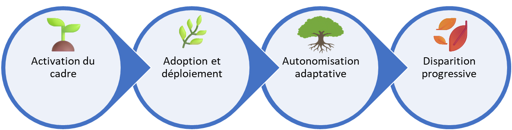

# Le but du cadre est de disparaître

✨**Objectif**

Le but d’**Agile4Enterprise** est :

- De (ré)apprendre à **évoluer collectivement** dans l’incertitude et piloter le changement, sans dépendance méthodologique,
- Puis de disparaître.

## Pourquoi ce cadre existe-t-il

Imaginez une organisation qui, sans intervention externe, anticipe les tensions, ajuste ses priorités et crée de la valeur en permanence. La mission d’**Agile4Enterprise** est d’accélérer l’évolution de l’entreprise, lui permettant ainsi de naviguer dans l’incertitude et de piloter le changement par elle-même — jusqu’au jour où elle aura construit son propre cadre pour y répondre.

### Timeline type (0–18 mois)

| Phase | Durée | Objectif clé |
| --- | --- | --- |
| **0—3 mois** | Activation du cadre | Installer les rituels et former les rôles de base |
| **3—9 mois** | Adoption | Faire vivre les ateliers stratégiques et tactiques |
| **9—12 mois** | Autonomisation | Transférer progressivement les responsabilités |
| **12—18 mois** | Disparition progressive | Retirer les rôles de transformation et mesurer l’autonomie réelle |

### Fonctions essentielles du Framework

Le cadre est là pour :

1. **Accélérer la mutation** : Passer d’une organisation réactive à proactive.
2. **Révéler les tensions** sous-jacentes, invisibles ou ignorées.
3. **S’ancrer** : Rituels et rôles pour structurer la transformation.
4. **Transférer la compétence** : le temps que le changement soit devenu une capacité interne.

## Pourquoi et quand il doit disparaître

> Transformer est un acte temporaire. Piloter par le vivant est une capacité permanente.

L’agilité devient un avantage concurrentiel quand les compétences stratégiques de l’entreprise rencontrent sa capacité à se transformer durablement. Le cadre peut être retiré lorsque :

1. **L’adaptation est spontanée** : des boucles de retour fonctionnent naturellement à tous les niveaux.
2. **Les compétences sont intégrées** : le changement fait partie de l’ADN et s’active au quotidien.
3. **Les défis sont constants** : le statu quo est en permanence remis en question dans toute la hiérarchie.
4. **L’incertitude devient fertile** : chaque évolution est accueillie comme une source d’innovation.

Le succès d’**Agile4Enterprise** ne se mesure pas :

- Au nombre d’équipes formées,
- Au nombre de rôles créés,
- Au taux d’adoption des outils du cadre.

Il se jauge au moment où l’organisation peut dire :

> **« Nous n’en avons plus besoin. Nous savons naviguer dans l’incertitude et le changement ensemble. »**

🔥

À ce moment-là, **Agile4Enterprise** aura accompli sa mission. Et il devra disparaître pour laisser la place à une entreprise vivante et auto-organisée. Et c’est ainsi qu’il est censé réussir.

