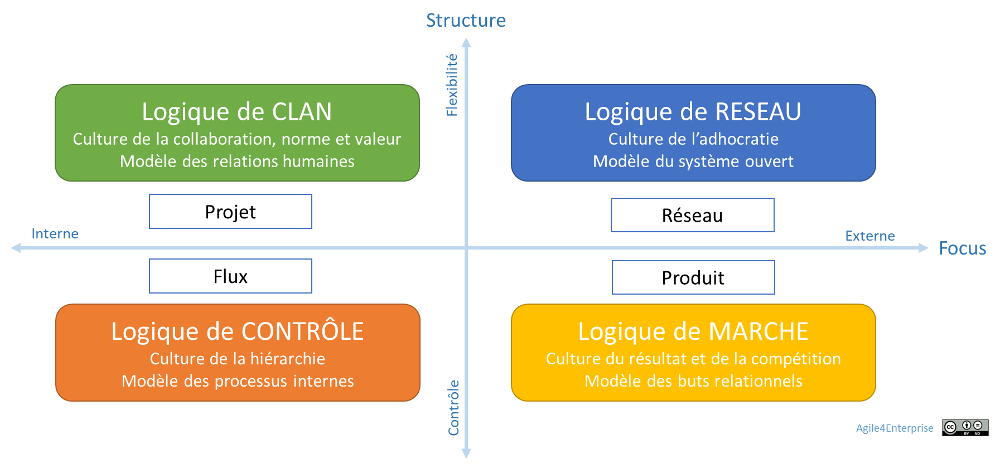

# Culture Agile et Transformation Vivante

Propriétaire: Laurent Morisseau

- Sommaire

<aside>
✨

**Objectif**
Dans Agile4Enterprise, la **culture** et la **performance** [**émergent](https://www.notion.so/Agile4X-Les-forces-organisationnelles-14290eaf28ff8004874de93022c243f8?pvs=21)** ensemble d’un alignement stratégique entre votre business model adaptatif et votre modèle opératoire agile. Plutôt que de chercher une « culture agile » unique, ce chapitre montre comment chaque **archétype** génère sa propre dynamique culturelle, et comment, en la cartographiant, vous anticipez son impact concret sur vos résultats (qualité, délai, innovation…).

</aside>

## Plusieurs “cultures agiles”, pas une

A*daptée du modèle de Quinn et Rohrbraugh*

Loin d’être uniforme, chaque **archétype agile** exprime une **logique culturelle dominante** :

- **Flux** → culture Lean, fiabilité, excellence opérationnelle
- **Produit** → culture Marché, compétition, scalabilité
- **Projet** → culture Clan, coopération, expérimentation
- **Réseau** → culture Adhocratie, innovation, ouverture

Les schémas classiques imposent souvent une structure uniforme à toute l’entreprise, mais :

- Une **BU produit** privilégie la compétition et la scalabilité.
- Une **équipe R&D** mise sur l’expérimentation et la coopération.
- Une **usine ou un centre de services** cherche la stabilité et l’excellence opérationnelle.
- Un **écosystème de partenaires** valorise l’ouverture et l’innovation.

Chaque **archétype Agile4Enterprise** (Flux, Produit, Projet, Réseau) crée une **logique culturelle** distincte qu’il faut reconnaître avant d’agir. **L’adaptation est essentielle.**

<aside>
➿

**TechNova** illustre bien cette diversité avec son **portefeuille hétérogène :**

- **Exploitation capteurs (Flux)** : usines synchronisées, exigences qualité, Lean.
- **Domotique résidentiel (Produit)** : time-to-market, différenciation, support client.
- **Cloud industriel (Produit/Flux)** : performance opérationnelle + évolutivité.
- **R&D IA embarquée (Projet/Réseau)** : expérimentation, coopération transverse.
- **Partenariats RSE (Réseau)** : innovation ouverte, enjeux sociétaux.

Face à ces BU, la direction a vite compris : impossible de tout standardiser ; chaque activité appelle une organisation sur-mesure, et surtout accepte un **culture différente**.

</aside>

## De l’archétype à la culture

Choisir un archétype, c’est donc :

1. Définir vos **processus et structures** (modèle opératoire)
2. Cultiver un **ensemble de croyances et pratiques** (culture)
3. Produire un **impact sur la performance** (qualité, time-to-market, innovation…)

Chaque archétype façonne un **écosystème culturel** qu’il faut cartographier avant d’agir.

<aside>
➿

TechNova a donc nommé un **Coach Agile d’Entreprise** pour guider le COMEX : non pour déployer un seul modèle, mais pour faire cohabiter et aligner ces quatre cultures dans une vision partagée.

**Cohérence** ne signifie pas **homogénéité** : chaque unité stratégique doit adapter son modèle opératoire à sa réalité tout en restant alignée sur une **vision globale et une culture commune**.

</aside>

### La culture de la transformation durable

Dans Agile4Enterprise, la **culture organisationnelle** n’est pas un état stable. C’est **un processus en mouvement**, résultant des interactions humaines, des ajustements organisationnels et des tensions évolutives.

> Transformer une culture, ce n’est pas remplacer un modèle par un autre.
> 
> 
> C’est activer une capacité collective à évoluer en continu **dans l’incertitude**.
> 

Chaque action de transformation génère de nouvelles formes d’incertitude. **C’est un paradoxe assumé** : évoluer, c’est apprendre à vivre dans un cadre non déterministe et dans une complexité renouvelée.

Ce paradoxe souligne l’importance d’une approche adaptative de la transformation, qui ne cherche pas à imposer un état final, mais à cultiver des mécanismes d’évolution continue.

## Le Canvas “Culture & Archétype”

Pour éclairer ce lien, utilisez ce **Canvas** en atelier, à l’instar de celui de TechNova :

| **SCRIP** | **Flux** | **Produit** | **Projet** |  |
| --- | --- | --- | --- | --- |
| **Structure** | Lignes de production Kanban | Squads stables, PO | Équipes ad hoc, cellules tests | Rôles fluides, écosystème ouvert |
| **Processus** | Flux tiré, cycles courts | Backlog continu, KPIs | Sprints d’expérimentation | Ateliers collaboratifs, hackathons |
| **Capacités** | Excellence opérationnelle | Go-to-market rapide | Innovation rapide, prototypage | Veille, partenariats externes |
| **Reconnaissance** | Objectifs de performance | Prime à la croissance | Valorisation de l’apprentissage | Distinctions RSE, labels innovation |
| **Individus** | Spécialistes Lean | Product managers, devs | Chercheurs, designers | Communautés de pratiques |
| **Culture émergente** | Discipline Lean et fiabilité | Esprit start-up & compétition | Curiosité, prise de risque | Ouverture, coopération |

> Mode d’emploi
> 
> - Pour chaque archétype, notez vos réalités actuelles sur les cinq dimensions SCRIP.
> - En cellule “Culture émergente”, décrivez le profil de valeurs et comportements produits.
> - Le résultat : 4 mini-profils culturels prêts à guider vos actions.

## Pourquoi commencer par ce Canvas

1. **Visibilité** immédiate des dynamiques culturelles par archétype
2. **Anticipation** des impacts sur la performance (qualité, délai, innovation…)
3. **Alignement** entre stratégie, modèle opératoire et culture réelle
4. **Dialogue structuré** en COMEX ou en atelier multi-BU

## Enchaîner sur les 6 aptitudes culturelles

Une fois vos cultures cartographiées, vous adresserez les **6 aptitudes** pour faire vivre la transformation :

| **Aptitude** | **Description** |
| --- | --- |
| 1. Comprendre & diagnostiquer | Cartographier croyances, pratiques et influences culturelles. |
| 2. Prendre conscience & activer | Créer l’urgence et engager l’ensemble des acteurs. |
| 3. Coconstruire | Déconstruire l’existant et expérimenter collectivement de nouveaux rituels et symboles. |
| 4. Donner du sens & fixer la direction | Définir une vision partagée et la relier au passé et aux enjeux futurs. |
| 5. Engager & mobiliser | Responsabiliser, valoriser les talents et diffuser l’énergie. |
| 6. Impliquer & aligner le management | Faire incarner le changement par les dirigeants et fédérer la ligne managériale. |

> **Astuce atelier**
> 
> 
> Dessinez ce tableau à côté du Canvas “Culture & Archétype” : dans chaque case, notez vos actions prioritaires pour progresser sur l’aptitude, archétype par archétype.
> 

---

## 7. Résultat attendu

- **Profils culturels** précis pour chaque BU, avec valeurs et pratiques.
- **Plan d’actions** par aptitude & archétype, pour faire évoluer chaque culture.
- **Gouvernance agile unifiée**.

<aside>
➿

TechNova est ainsi passé d’un portefeuille hétérogène risquant le chaos, à un écosystème agile vivant, performant et résilient.

</aside>

---

# 🔑 Points clés à retenir

- **4 cultures agiles** coexistent et influencent la performance.
- **Canvas SCRIP × Archétype** : outil de diagnostic et d’alignement immédiat.
- **6 aptitudes** : feuille de route pour ancrer une transformation culturelle durable.
- **TechNova** démontre que cartographier ces cultures permet de concilier innovation, fiabilité et croissance.

---

---

# Annexes

# Synthèse des logiques culturelles

| **Logique Culturelle (Quinn & Rohrbaugh)** | **Archétype Agile** | **Caractéristiques générales** | **Caractéristiques RH associées** |
| --- | --- | --- | --- |
| [**Contrôle](https://www.notion.so/Les-mod-les-organisationnels-une-approche-culturelle-15e90eaf28ff8007833ff2ce6c1bcea7?pvs=21) (Hiérarchie, Processus)** | [Flux](https://www.notion.so/Agile4Flow-Arch-type-Flux-13490eaf28ff809bac54ed5deaa8a257?pvs=21) | Standardisation, Lean, Excellence Opérationnelle | Standardisation des compétences, excellence opérationnelle, Lean RH |
| [**Marché](https://www.notion.so/Les-mod-les-organisationnels-une-approche-culturelle-15e90eaf28ff8007833ff2ce6c1bcea7?pvs=21) (Résultats, Compétition)** | [Produit](https://www.notion.so/Agile4Product-Arch-type-Produit-13490eaf28ff80b29733f767568ab6a5?pvs=21) | Performance, Time-to-Market, Scalabilité | Gestion des talents axée sur la performance, rapidité d’exécution, scalabilité des équipes |
| [**Clan](https://www.notion.so/Les-mod-les-organisationnels-une-approche-culturelle-15e90eaf28ff8007833ff2ce6c1bcea7?pvs=21) (Collaboration, Valeurs)** | [Projet](https://www.notion.so/Agile4Project-Arch-type-Projet-agile-13490eaf28ff8030a8aeecf9206d94ea?pvs=21) | Co-construction, Autonomie, Expérimentation | Développement de communautés de pratiques, intelligence collective, gestion participative |
| [**Réseau](https://www.notion.so/Les-mod-les-organisationnels-une-approche-culturelle-15e90eaf28ff8007833ff2ce6c1bcea7?pvs=21) (Innovation, Agilité)** | [Réseau](https://www.notion.so/Agile4Network-Arch-type-R-seau-13490eaf28ff805c8fcfeed28b68a77b?pvs=21) | Flexibilité, Structure décentralisée, Innovation rapide | Culture de l’expérimentation, structures décentralisées, flexibilité des carrières |

## Zoom sur les 4 cultures

### **Logique de Contrôle & Archétype Flux**

<aside>
💡

**Optimisation des processus, efficience opérationnelle, stabilité**

</aside>

La [logique de **contrôle**](https://www.notion.so/Les-mod-les-organisationnels-une-approche-culturelle-15e90eaf28ff8007833ff2ce6c1bcea7?pvs=21) valorise la structure, l’efficacité et la standardisation. Les organisations qui s’y inscrivent s’appuient sur des **processus disciplinés** pour garantir la continuité et la prévisibilité.

L’[**archétype Flux**](https://www.notion.so/Agile4Flow-Arch-type-Flux-13490eaf28ff809bac54ed5deaa8a257?pvs=21) trouve naturellement sa place dans cette logique. Issu du **Lean et du Kanban**, il vise à **optimiser la chaîne de valeur** en réduisant les gaspillages et en maximisant l’**efficacité opérationnelle,** en assurant une **exécution stable et fiable**.

***Cas d’application :***

- *Entreprises industrielles optimisant leur **chaîne d’approvisionnement**.*
- *Centres de services adoptant des **systèmes de gestion en flux tiré**.*
- *Organisations où la **qualité et la fiabilité des opérations** sont des priorités.*

> L’agilité dans une logique de contrôle passe par l’optimisation des flux de valeur, une adaptabilité de la capacité à la demande, et la responsabilisation des équipes sur la performance opérationnelle.
> 

### **Logique de Marché & Archétype Produit**

<aside>
💡

**Compétition, résultats, performance, différenciation**

</aside>

Les entreprises adoptant une [logique de **marché**](https://www.notion.so/Les-mod-les-organisationnels-une-approche-culturelle-15e90eaf28ff8007833ff2ce6c1bcea7?pvs=21) sont centrées sur la **croissance, l’innovation et la performance commerciale**. Leur enjeu majeur est de maximiser leur **impact sur le marché** en développant des **produits compétitifs** et différenciants.

L’[**archétype Produit**](https://www.notion.so/Agile4Product-Arch-type-Produit-13490eaf28ff80b29733f767568ab6a5?pvs=21) correspond parfaitement à cette approche. Il repose sur une **stratégie orientée résultats**, où la gestion de l’innovation, du time-to-market et de l’expérience client sont des éléments clés. L’entreprise optimise son organisation pour **industrialiser et scaler ses produits** tout en restant compétitive.

***Cas d’application :***

- *Entreprises technologiques développant des **produits innovants à forte croissance**.*
- *Startups cherchant un **product-market fit rapide et efficace**.*
- *Organisations focalisées sur la **scalabilité et la croissance**.*

> L’agilité dans une logique de marché repose sur une exécution rapide, l’expérimentation et une capacité d’adaptation aux tendances du marché.
> 

---

### **Logique de Clan & Archétype Projet**

<aside>
💡

**Collaboration, engagement, normes et valeurs partagées**

</aside>

Les organisations adoptant une [**logique de clan**](https://www.notion.so/Les-mod-les-organisationnels-une-approche-culturelle-15e90eaf28ff8007833ff2ce6c1bcea7?pvs=21) favorisent l’esprit d’équipe, la cohésion, la culture du collectif et le leadership participatif. L’organisation fonctionne comme une **communauté soudée**, où la coopération et l’implication des collaborateurs sont des moteurs de la performance. Les décisions sont prises en concertation avec les équipes.

L’[**archétype Projet**](https://www.notion.so/Agile4Project-Arch-type-Projet-agile-13490eaf28ff8030a8aeecf9206d94ea?pvs=21) s’inscrit dans cette approche en mettant en avant des **équipes autonomes**, travaillant sur des initiatives **orientées apprentissage et expérimentation**. Ce modèle privilégie la dynamique de **co-construction et d’innovation en groupe**, où l’objectif est moins la standardisation que la création de valeur émergente.

***Exemples d’application :***

- *Startups et entreprises en phase de **recherche et développement**.*
- *Organisations privilégiant une **culture participative et horizontale**.*
- *Collectifs de travail où **l’intelligence collective** est un levier clé.*

> L’agilité dans une logique de clan repose sur l’autonomie et l’engagement des équipes dans des projets porteurs de sens.
> 

---

### **Logique de Réseau & Archétype Réseau**

<aside>
💡

**Innovation, adhocratie, coopération, ouverture**

</aside>

La [**logique de réseau**](https://www.notion.so/Les-mod-les-organisationnels-une-approche-culturelle-15e90eaf28ff8007833ff2ce6c1bcea7?pvs=21) privilégie l’adaptabilité, l’innovation rapide et les organisations fluides. Les entreprises qui s’y rattachent misent sur la réactivité et la capacité à saisir les opportunités en s’appuyant sur des **écosystèmes ouverts et collaboratifs**.

L’[**archétype Réseau**](https://www.notion.so/Agile4Network-Arch-type-R-seau-13490eaf28ff805c8fcfeed28b68a77b?pvs=21) s’intègre parfaitement dans ce modèle. Il repose sur une **structure décentralisée**, où les équipes sont interconnectées mais autonomes. L’objectif est de développer une **organisation adaptable et évolutive**, capable de capter les opportunités en temps réel.

***Cas d’application :***

- *Incubateurs et accélérateurs de startups.*
- *Organisations favorisant l’**innovation rapide** et les **expérimentations à grande échelle**.*
- *Entreprises en **mode startup interne**, développant des **mini-structures autonomes***
- *Entreprises misant sur un **modèle entrepreneurial ouvert**.*

> L’agilité dans une logique de réseau s’appuie sur une structure adaptable et des équipes autonomes favorisant l’expérimentation et l’innovation.
> 

---

## **Vers une agilité culturelle alignée avec l’entreprise**

L’intégration des **archétypes agiles** dans les **logiques culturelles** permet une **approche ciblée de la transformation agile**. Chaque organisation doit ajuster son modèle opératoire en fonction de **son ADN culturel** et de **son contexte stratégique**.

Plutôt que d’imposer un modèle unique d’agilité, il s’agit de composer avec les dynamiques culturelles existantes et de les orienter progressivement vers une agilité organisationnelle cohérente avec les enjeux stratégiques de l’entreprise.

<aside>
💡

**Une entreprise véritablement agile n’est pas celle qui applique des méthodes agiles, mais celle qui adapte son mode de fonctionnement en alignant stratégie, culture et organisation de manière systémique**.

</aside>

<aside>
📚

En savoir plus sur l’[approche culturelle des modèles organisationnels](https://www.notion.so/Les-mod-les-organisationnels-une-approche-culturelle-15e90eaf28ff8007833ff2ce6c1bcea7?pvs=21)

</aside>

---

## Les aptitudes culturelles clés de la transformation

Agile4Enterprise s’appuie sur un principe fondamental : **une organisation ne change durablement que si elle développe des compétences collectives d’adaptation culturelle**.

Le think tank KTr[[1](https://www.notion.so/L-agilit-RH-13490eaf28ff80d5955dd24b80af5cff?pvs=21)] a identifié **6 aptitudes** essentielles :

1. **Comprendre et diagnostiquer**
    - Analyser la culture et l’état d’esprit en place, au-delà des valeurs déclarées.
    - Identifier croyances, pratiques et influences culturelles.
    - Se remettre en question et s’inspirer de l’interne et de l’externe.
2. **Prendre conscience et activer le changement**
    - Sensibiliser à la nécessité du changement et à ses enjeux.
    - Créer un sentiment d’urgence et une dynamique collective.
    - Favoriser l’appropriation du changement à tous les niveaux.
3. **Coconstruire la transformation**
    - Déconstruire l’existant pour reconstruire un état souhaité.
    - Modifier les rituels, symboles et systèmes organisationnels.
    - Encourager le dialogue et l’expérimentation.
4. **Donner du sens et fixer une direction**
    - Définir une vision claire et cohérente avec l’identité de l’organisation.
    - Articuler les bénéfices attendus et les ancrer dans les pratiques.
    - Relier passé, présent et futur pour fédérer les équipes.
5. **Engager et mobiliser les équipes**
    - Stimuler l’initiative et responsabiliser les acteurs du changement.
    - Capitaliser sur les talents internes et renforcer la motivation.
    - Appuyer sur des relais de transformation pour diffuser l’énergie.
6. **Impliquer et aligner le management**
    - Expliciter les risques du statu quo et renforcer la résilience face à l’incertitude.
    - Favoriser l’alignement et l’incarnation du changement par les dirigeants.
    - Mobiliser la ligne managériale pour porter la transformation.

Ce cadre permet d’ancrer durablement la capacité de transformation de l’organisation.

1. [https://www.capacite-transfo.org](https://www.linkedin.com/redir/redirect?url=http%3A%2F%2Fwww%2Ecapacite-transfo%2Eorg&urlhash=draK&trk=about_website)

---