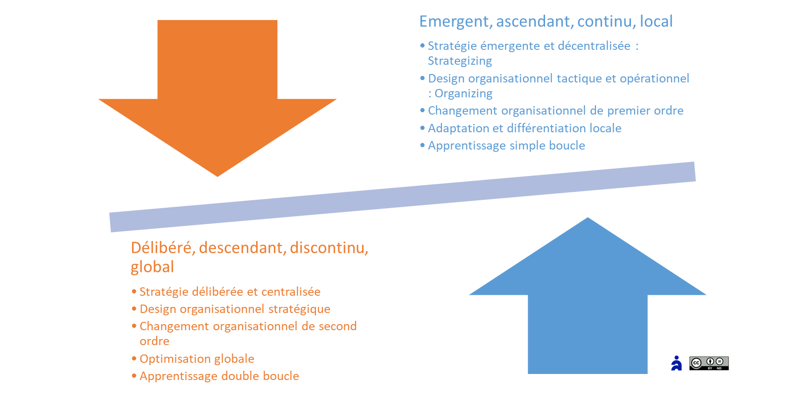

# La démarche de la transformation

- Sommaire

<aside>
✨

**Objectif**

*Un changement simultanément local, global, structuré et adaptatif*

La transformation agile ne peut reposer uniquement sur des initiatives Bottom-up ni se résumer à un déploiement Top-down. Elle requiert une **démarche mixte**, articulant :

- **Une dynamique ascendante** : émergente, incrémentale, portée par les équipes.
- **Une dynamique descendante** : délibérée, structurée, portée par la stratégie.

L’objectif est de garantir à la fois **l’adaptation continue** du système (court terme) et **sa transformation en profondeur** (long terme), tout en maintenant l’alignement entre à tous les niveaux décisionnels.

</aside>

La transformation agile ne peut reposer uniquement sur des initiatives Bottom-up ni se résumer à un déploiement Top-down. Elle requiert une **démarche mixte**, articulant :

- **Une dynamique ascendante** : émergente, incrémentale, portée par les équipes.
- **Une dynamique descendante** : délibérée, structurée, portée par la stratégie.

🎯 L’objectif est de garantir à la fois **l’adaptation continue** du système (court terme) et **sa transformation en profondeur** (long terme), tout en maintenant l’alignement entre niveaux opérationnel, tactique, stratégique et corporate.

# Principes d’une démarche mixte

<aside>
🎯

Être capable de gérer le [changement continu](https://www.notion.so/L-approche-simultan-e-le-changement-continu-et-mergent-14a90eaf28ff808d8c31cb052208f601?pvs=21) pour la performance d’aujourd’hui, tout en incubant un [changement révolutionnaire](https://www.notion.so/La-fabrique-du-changement-14a90eaf28ff8085bd03d715bfdae69e?pvs=21) pour préparer l’avenir.

</aside>

La transformation agile est à l’origine avant tout une démarche ascendante partant des équipes (logicielles). Cependant, l’agilité à l’échelle a amené une démarche descendante du management mal assumée, venant en opposition à l’agilité opérationnelle.

Pour réconcilier ces approches, l’entreprise agile a besoin d’une démarche mixte et équilibrée :

- Ascendante, émergente, continue, et locale :
    - [Stratégie émergente](https://www.notion.so/La-fabrique-de-la-strat-gie-13690eaf28ff81429de6ef6e608ea01a?pvs=21) et décentralisée, via la tactique et l’opérationnel  : [Strategizing](https://www.notion.so/La-fabrique-de-la-strat-gie-13690eaf28ff81429de6ef6e608ea01a?pvs=21)
    - Design organisationnel tactique et opérationnel : [Organizing](https://www.notion.so/Organizing-une-approche-du-design-op-rationnel-14490eaf28ff80a3980ce541e1075585?pvs=21)
    - [Changement organisationnel de premier ordre](https://www.notion.so/Le-changement-organisationnel-13e90eaf28ff80e6ba90ed12c5f3bb17?pvs=21),
    - Adaptation et différentiation locale,
    - [Apprentissage simple boucle](https://www.notion.so/Les-capacit-s-de-l-entreprise-agile-13690eaf28ff8182abccc48ebecb3bf6?pvs=21).
- Descendante, délibérée, discontinue, et globale :
    - [Stratégie délibérée](https://www.notion.so/La-fabrique-de-la-strat-gie-13690eaf28ff81429de6ef6e608ea01a?pvs=21) et centralisée,
    - Design organisationnel stratégique,
    - [Changement organisationnel de second ordre](https://www.notion.so/Le-changement-organisationnel-13e90eaf28ff80e6ba90ed12c5f3bb17?pvs=21),
    - Optimisation globale,
    - [Apprentissage double boucle](https://www.notion.so/Les-capacit-s-de-l-entreprise-agile-13690eaf28ff8182abccc48ebecb3bf6?pvs=21).

L’enjeu est de synchroniser ces dynamiques par une **gouvernance intégrée**, avec des **cadences communes** et des **modèles mentaux partagés**.

<aside>
📚

En savoir plus sur la [transformation](https://www.notion.so/Section-VII-La-transformation-agile-Passez-l-ACTE-18290eaf28ff80d6922cf0c7d93c1be4?pvs=21)

</aside>

## La gouvernance de la transformation

Généralement, les transformations agiles opérationnelles sont des programmes de transformation agile au mieux sponsorisées par la direction, et déléguées aux coach agiles internes ou externes, dans certains départements. Et plus généralement, les programmes de transformation sont délégués aux agents de la transformation.

Cependant, cette transformation **Agile4Enterprise** est au service de la stratégie globale de l’entreprise. La gouvernance de la transformation doit donc être intégrée à la gouvernance de l’entreprise. Ce n’est pas un pilotage de transformation à part entière. Elle doit à la fois être intégrée au quotidien des équipes ET au pilotage stratégique comme levier d’une performance durable.

### Niveau Portfolio

Le but est d’amener l’entreprise vers le [niveau de maturité Portfolio](https://www.notion.so/Le-mod-le-de-maturit-IMPACTE-18b90eaf28ff8053a419ccaa7d91bc21?pvs=21). A ce niveau, cette transformation touche plus spécifiquement la fonction corporate. Et au-delà de la gouvernance et de la [boîte à outils](https://www.notion.so/L-Agilit-Portfolio-en-action-17a90eaf28ff8048bf54db4b5c52c4d7?pvs=21), il s’agit surtout de changer de modèle mental (nous avons parlé d’[agilité cognitive](https://www.notion.so/L-agilit-strat-gique-13490eaf28ff80e2b4d8f6ab581de0f3?pvs=21)) ! 

<aside>
🎯

Ce niveau a deux objectifs : 

1. L’agilité Portfolio est en place dans l’entreprise,
2. Les niveaux Portfolio et stratégiques sont bien alignés dynamiquement.
    
    Pour ce second point, il faut qu’au moins une unité stratégique ait atteint le niveau de maturité d’agilité stratégique pour passer au niveau Portfolio.
    
</aside>

**L’agent du changement : le coach agile d’entreprise**

Le rôle faisant office d’agent du changement pour amener l’agilité au niveau portfolio est le [**coach agile d’entreprise**](https://www.notion.so/Les-r-les-de-la-transformation-agile-17b90eaf28ff804ea65eeb4b0d94c877?pvs=21).

<aside>
🦸

Rôle de transformation agile : [Coach agile d’entreprise](https://www.notion.so/Les-r-les-de-la-transformation-agile-17b90eaf28ff804ea65eeb4b0d94c877?pvs=21)

</aside>

### Niveau Stratégique

Le but est d’amener chaque unité stratégique vers le [niveau de maturité Stratégique](https://www.notion.so/Le-mod-le-de-maturit-IMPACTE-18b90eaf28ff8053a419ccaa7d91bc21?pvs=21).

A ce niveau, cette transformation touche à la direction de l’unité stratégique. A nouveau, les transformations agiles opérationnelles sont des programmes de transformation au mieux sponsorisées par la direction, et déléguées aux coach agiles internes ou externes. Pour les mêmes raisons, la gouvernance de la transformation doit être intégrée à la gouvernance de l’unité.

**Intégration outil ACTE**

C’est pourquoi les initiatives de cette transformation se retrouvent dans la partie transformation de l’[outil ACTE](https://www.notion.so/Guide-de-l-outil-ACTE-13490eaf28ff802e8fcde2047f78143b?pvs=21), pour atteindre les OKR tactiques et stratégiques de l’organisation. Le rythme de la transformation est portée par la cadence de changements [tactiques](https://www.notion.so/La-gouvernance-adaptative-tactique-13b90eaf28ff8066aa8bc5c28ac35645?pvs=21) et [stratégiques](https://www.notion.so/La-gouvernance-adaptative-strat-gique-13b90eaf28ff800996ccf4dc1e54bcc6?pvs=21) : les [cycles OKR](https://www.notion.so/OKR-un-outil-de-l-agilit-strat-gique-et-tactique-14590eaf28ff80b3b0f7e344d0764762?pvs=21) typiquement trimestriels.

La roadmap de la transformation est donc coconstruite par les équipes, avec une planification juste-à-temps (cycle OKR après cycle OKR), tout en restant aligné avec les objectifs business.

Ainsi, le modèle opératoire agile se construit de manière agile, itérative et incrémentale, sur des cadences trimestrielles et annuelles. C’est la consolidation de toutes les initiatives réussies (c’est-à-dire ayant eu l‘impact souhaité) au service des OKR, eux-mêmes au service d’une stratégie adaptative pour le succès du business model.

<aside>
🎯

Ce niveau a deux objectifs : 

1. L’agilité Stratégique est en place au niveau des unités stratégiques,
2. Les niveaux stratégiques et tactiques sont bien alignés dynamiquement.
    
    Il faut qu’au moins une unité tactique ait atteint le niveau de maturité d’agilité tactique pour passer au niveau stratégique.
    
</aside>

**L’agent du changement : le coach agile d’organisation**

Le rôle faisant office d’agent du changement pour amener l’agilité au niveau des unités stratégiques est le [**coach agile d’organisation**](https://www.notion.so/Les-r-les-de-la-transformation-agile-17b90eaf28ff804ea65eeb4b0d94c877?pvs=21).

<aside>
🦸

Rôle de transformation agile : [Coach agile d’organisation](https://www.notion.so/Les-r-les-de-la-transformation-agile-17b90eaf28ff804ea65eeb4b0d94c877?pvs=21)

</aside>

### Niveau tactique

Le but est d’amener chaque unité tactique vers le [niveau de maturité Tactique](https://www.notion.so/Le-mod-le-de-maturit-IMPACTE-18b90eaf28ff8053a419ccaa7d91bc21?pvs=21).

Les initiatives de cette transformation se retrouvent dans la partie transformation de l’[outil ACTE](https://www.notion.so/Guide-de-l-outil-ACTE-13490eaf28ff802e8fcde2047f78143b?pvs=21), pour atteindre les OKR tactiques et stratégiques de l’organisation. Le rythme de la transformation est portée par la cadence de changements [tactiques](https://www.notion.so/La-gouvernance-adaptative-tactique-13b90eaf28ff8066aa8bc5c28ac35645?pvs=21) avec les [cycles OKR](https://www.notion.so/OKR-un-outil-de-l-agilit-strat-gique-et-tactique-14590eaf28ff80b3b0f7e344d0764762?pvs=21) typiquement trimestriels.

La roadmap de la transformation est donc coconstruite par les équipes, avec une planification juste-à-temps (cycle OKR après cycle OKR), tout en restant aligné avec les objectifs business.

Ainsi, le modèle opératoire agile se construit de manière agile, itérative et incrémentale, sur des cadences trimestrielles. C’est la consolidation de toutes les initiatives réussies (c’est-à-dire ayant eu l‘impact souhaité) au service des OKR.

**L’agent du changement : le coach agile**

Le rôle faisant office d’agent du changement pour amener l’agilité au niveau des unités tactiques est le [**coach agile**](https://www.notion.so/Les-r-les-de-la-transformation-agile-17b90eaf28ff804ea65eeb4b0d94c877?pvs=21). Il s’incarne dans différents rôles dans les Frameworks de l’agilité à l’échelle.

<aside>
🦸

Rôle de transformation agile : [Coach agile](https://www.notion.so/Les-r-les-de-la-transformation-agile-17b90eaf28ff804ea65eeb4b0d94c877?pvs=21)

</aside>

### Niveau opérationnel

Le but est d’amener chaque unité opérationnelle (équipe) vers le [niveau de maturité Opérationnelle](https://www.notion.so/Le-mod-le-de-maturit-IMPACTE-18b90eaf28ff8053a419ccaa7d91bc21?pvs=21). Le rôle faisant office d’agent du changement pour amener l’agilité au niveau des unités opérationnelles est l’[agile master](https://www.notion.so/Les-r-les-de-la-transformation-agile-17b90eaf28ff804ea65eeb4b0d94c877?pvs=21). Il s’incarne dans différents rôles dans les méthodes agiles classiques : Scrum master, Kanban master, coach XP…

<aside>
🦸

Rôle de transformation agile : [Agile Master](https://www.notion.so/Les-r-les-de-la-transformation-agile-17b90eaf28ff804ea65eeb4b0d94c877?pvs=21)

</aside>

---

# Les cadences de transformation

Elles suivent naturellement les cycles de changement aux différents niveaux.

4 cadences de changement et de gestion de risques

L’entreprise ne devient pas agile du jour au lendemain. Les transformations peuvent prendre plusieurs mois à plusieurs années, typiquement deux à trois ans pour l’agilité opérationnelle et à l’échelle. Nous n’avons pas encore suffisamment de retour d’expérience collective pour une transformation de l’entreprise. 7 ans est un chiffre classique pour la transformation Lean d’une entreprise. Nous pouvons nous attendre à cet horizon de temps pour une entreprise agile.

La question du déploiement est donc un sujet important. L’agilité étant au service de l’entreprise, la transformation va se faire plus pour répondre à des enjeux stratégiques, tactiques ou opérationnels qu’une transformation agile en tant que telle. Nous allons utiliser les cadences du changement pour déployer au fur et à mesure des besoins l’agilité dans toute l’organisation.

> *Par exemple, une partie d’une organisation multi services va s’organiser autour d’un objectif stratégique commun. Si l’objectif est atteint, la structure sera de fait réorganisée pour exploiter l’actif qui en résulte, plutôt que chaque équipe retourne dans son service. C’est la différence avec une approche projet, ou une fois l’objectif atteint, on reprend l’organisation initiale.*
> 

Ces cadences de changement portent sur la stratégie, et donc sur toutes les dimensions de l’entreprise : capacités organisationnelles, structure, processus, individus, systèmes de reconnaissances.

<aside>
💡

Les cadences du changement rythment donc la transformation de l’entreprise.

</aside>

Par exemple, le déploiement des OKR dans l’entreprise se cale sur les cycles [OKR](https://www.notion.so/OKR-un-outil-de-l-agilit-strat-gique-et-tactique-14590eaf28ff80b3b0f7e344d0764762?pvs=21) :

- Les OKR tactiques se déploient au fur et à mesure des cycles tactiques,
- Les OKR stratégiques au fur et à mesure des cycles stratégiques.

Nous avons vu que les [unités sont stables encours de cycle, et peuvent changer au démarrage d’un nouveau cycle](https://www.notion.so/Une-approche-mixte-et-cadenc-e-du-changement-18290eaf28ff806ab935cdfd0c0ff10e?pvs=21) :

- Les unités stratégiques sont stables au sein d’un cycle stratégique,
- Les unités tactiques sont stables au sein d’un cycle tactique,
- Les unités opérationnelles sont stables au sein d’un cycle opérationnel.

<aside>
🧰

En savoir plus sur les [4 cadences de changement](https://www.notion.so/Les-4-cadences-du-changement-et-de-l-apprentissage-13b90eaf28ff8091b4cce85974f50938?pvs=21)

</aside>

---

# Les outils de la transformation

C’est pour cela que les outils développés spécifiquement pour ce Framework ont pour vocation à réunir les individus autour d’une même table avec des rôles et des points de vue différents pour aligner toute l’organisation.

- Au niveau Entreprise : [Le modèle de maturité **IMPACTE](https://www.notion.so/Le-mod-le-de-maturit-IMPACTE-18b90eaf28ff8053a419ccaa7d91bc21?pvs=21),** Indicateur de Maturité et de Progression Agile pour la Transformation d’Entreprise
- Au niveau Portfolio : [L’outil PACTE](https://www.notion.so/Guide-de-l-outil-PACTE-17a90eaf28ff8007ae71e576ac507f7e?pvs=21), Portfolio Agile Canevas pour la Trajectoire d’Entreprise
- Au niveau Stratégique :
    - [L’outil ACTE](https://www.notion.so/Guide-de-l-outil-ACTE-13490eaf28ff802e8fcde2047f78143b?pvs=21), Agile Canevas pour la Transformation d’Entreprise
    - [Le radar](https://www.notion.so/Radar-de-l-entreprise-agile-13490eaf28ff80288f7dcd0fee927567?pvs=21)

<aside>
💡

Rechercher l’**IMPACTE** pour l’entreprise

En passant un **PACTE** globalement

Pour passer à **l’ACTE** localement

</aside>

<aside>
💝

Ps : Ces outils sont [Open Source](http://opensource.agile4enterprise.com/), vous pouvez vous en servir, contribuer, et les diffuser.

</aside>

---

# Les rôles de l’entreprise agile

## Les rôles agiles

Les rôles agiles sont des rôles de transformation. Dans notre approche, un agile master ou un coach agile, peu importe son niveau, n’est pas là pour durer dans le temps car les équipes, les collectifs doivent pouvoir s’auto organiser.

Les rôles de transformation se situent à chaque niveau de prises de décisions :

- [**Agile master**](https://www.notion.so/Les-r-les-de-la-transformation-agile-17b90eaf28ff804ea65eeb4b0d94c877?pvs=21) au niveau de l’équipe,
- [**Coach agile**](https://www.notion.so/Les-r-les-de-la-transformation-agile-17b90eaf28ff804ea65eeb4b0d94c877?pvs=21) au niveau des unités tactiques,
- [**Coach agile organisation**](https://www.notion.so/Les-r-les-de-la-transformation-agile-17b90eaf28ff804ea65eeb4b0d94c877?pvs=21) au niveau des unités stratégiques,
- [**Coach agile entreprise**](https://www.notion.so/Les-r-les-de-la-transformation-agile-17b90eaf28ff804ea65eeb4b0d94c877?pvs=21) au niveau de l’entreprise.

## Les rôles internes

Les rôles internes - leader, manager, collaborateur - ne sont pas des rôles de transformation. En revanche, ils ont chacun un changement de modèle mental à parcourir pour que l’entreprise globalement aille vers plus d’agilité.

> *Par exemple, le leader agile joue un rôle clé en garantissant une stratégie dynamique et en facilitant la mise en œuvre des ajustements stratégiques nécessaires pour maintenir un avantage concurrentiel.*
> 

Ces rôles doivent également s’ajuster selon les [zones de management](https://www.notion.so/Les-zones-de-management-14590eaf28ff80fc9395fe20b7c9f556?pvs=21). C’est l’[agilité managériale](https://www.notion.so/L-agilit-manag-riale-18b90eaf28ff8023814bdcc2e0240ac4?pvs=21) en action.

> Mais en partant de la stratégie, c’est-à-dire en proposant une transformation au service de la stratégie, donc intégré à la gouvernance, alors la **gouvernance de cette transformation doit également être intégrée à la [gouvernance de l’entreprise](https://www.notion.so/La-gouvernance-adaptative-Portfolio-15f90eaf28ff80f493d9ed25cf094433?pvs=21)**.
> 

---

# 🔑 Points clés à retenir

| Dynamique | Nature | Objectifs principaux | Concepts associés |
| --- | --- | --- | --- |
| **Ascendante** | Émergente, locale | Amélioration continue, adaptation tactique | Strategizing, Organizing, simple boucle |
| **Descendante** | Délibérée, globale | Transformation structurelle, alignement | Structuring, Designing, double boucle |

## Gouvernance multi-niveaux de la transformation

### Niveau Opérationnel – *Exécution continue*

- **Objectif** : Atteindre la maturité opérationnelle de chaque équipe.
- **Cadence** : Daily + Revue hebdo ou bimensuelle
- **Logique** : Auto-organisation et pilotage du flux

---

### Niveau Tactique – *Alignement court terme*

- **Objectif** : Atteindre la maturité d’agilité tactique (OKR, initiatives, priorités partagées)
- **Cadence** : Revue tactique trimestrielle
- **Outil** : ACTE (Agile Canevas pour la Transformation d’Entreprise)

---

### Niveau Stratégique – *Design stratégique agile*

- **Objectif** : Maturité stratégique des business units, alignement avec la vision corporate
- **Cadence** : Cycle OKR annuel + revue trimestrielle
- **Outils** : ACTE (transformation), OKR (stratégie), radar de maturité

---

### Niveau Portfolio – *Pilotage de la trajectoire globale*

- **Objectif** : Implémenter une gouvernance adaptative corporate (IMPACTE)
- **Cadence** : Revue annuelle + synchronisation avec le stratégique
- **Outil** : PACTE (Portfolio Agile Canevas pour la Trajectoire d’Entreprise)

## Les rôles de transformation

| Niveau | Rôle clé | Fonction principale |
| --- | --- | --- |
| Équipe | **Agile Master** | Soutien à l'auto-organisation |
| Tactique | **Coach Agile** | Structuration tactique, facilitation d’impact |
| Stratégique | **Coach Organisation** | Alignement entre structure et stratégie |
| Portfolio | **Coach Entreprise** | Accompagnement systémique de la transformation |