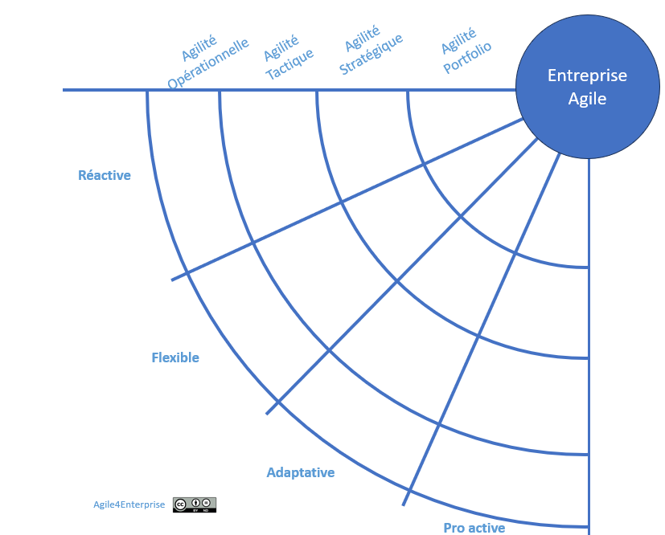

# Modèle de maturité IMPACTE

Propriétaire: Laurent Morisseau

- Sommaire

<aside>
✨

**Objectif**

Découvrir comment le **modèle IMPACTE** vous aide à :

1. Mesurer la maturité agile à chaque strate de votre organisation (équipe, chaîne de valeur, business unit, corporate).
2. Diagnostiquer précisément vos forces et points de blocage sur quatre capacités (réactivité, flexibilité, adaptabilité, proactivité).
3. Structurer un plan d’amélioration continue via des ateliers ciblés et des indicateurs clairs.
</aside>

**Outil IMPACTE** (Indicateur de Maturité et de Progression Agile pour la Transformation d’Entreprise)

## Pourquoi le modèle IMPACTE ?

Le modèle **IMPACTE** (Indicateur de Maturité et de Progression Agile pour la Transformation d’Entreprise) complète le **Radar** en fournissant :

- Un **diagnostic multi-strate**, du niveau équipe jusqu’à la gouvernance corporate.
- Une vision unifiée des **4 capacités agiles** à chaque profondeur de décision.
- Un **fil rouge** pour piloter l’évolution agile : mesurer, comparer, ajuster.

> IMPACTE = Agile4D x Agile4C
> 

### À chaque niveau, son radar

Le [radar](https://www.notion.so/Radar-de-l-entreprise-agile-13490eaf28ff80288f7dcd0fee927567?pvs=21) se décline à **tous les niveaux de décision** : équipe, chaîne de valeur, business unit, entreprise. La transformation agile ne se fait pas en « big bang » sur toute l’entreprise en même temps, elle progresse **par strates successives**. La question clé devient alors :

<aside>
❓

À quelle profondeur doit-on mener la transformation ?

</aside>

## Structure & dimensions

IMPACTE décline la maturité agile selon **4 dimensions** :

| Dimension | Niveau décisionnel | Rôle pilote |
| --- | --- | --- |
| **Portfolio** | Corporate | Coach agile d’entreprise |
| **Stratégique** | Business unit | Coach agile d’organisation |
| **Tactique** | Chaîne de valeur | Coach agile |
| **Opérationnelle** | Équipe | Agile Master |

Sur chacune de ces dimensions, on évalue les **4 capacités** :

- **Réactivité** (courte fenêtre)
- **Flexibilité** (ajustements moyens termes)
- **Adaptabilité** (transformations durables)
- **Proactivité** (anticipation et innovation)

---

## Niveaux de maturité synthétiques

| Niveau | Description générale | Objectif clé |
| --- | --- | --- |
| **1** | **Initial** : absence de cadres et de boucles agiles | Mettre en place un cycle de feedback |
| **2** | **Émergent** : premiers pilots et ajustements locaux | Formaliser des rituels de revue |
| **3** | **Structuré** : processus et rôles définis | Standardiser et documenter les pratiques |
| **4** | **Avancé** : agilité à l’échelle et coordination | Coordonner dynamiquement les strates |
| **5** | **Amélioration continue** : agilité systémique | Instaurer l’auto-apprentissage et l’anticipation |

> Le même référentiel 1→5 s’applique du Niveau 1 (Initial) au Niveau 5 (Amélioration continue) pour chaque dimension.
> 

---

## 5 étapes pour animer votre diagnostic

1. **Préparation**
    - Sélectionner la dimension (Portfolio, Stratégique, Tactique ou Opérationnelle).
    - Définir les objectifs et la cible de maturité pour chaque capacité.
2. **Collecte**
    - Questionnaire individuel ou atelier collaboratif pour auto-notation (scores 1–5).
3. **Consolidation**
    - Calculer la moyenne des scores par capacité et tracer le radar IMPACTE.
4. **Analyse & priorisation**
    - Identifier les plus grands écarts (cible vs réel).
    - Déterminer 2 actions prioritaires par capacité.
5. **Plan d’action & suivi**
    - Assigner responsables, échéances et indicateurs.
    - Planifier une revue trimestrielle ou mensuelle selon la strate.

---

<aside>
➿

## IMPACTE TechNova

Suite a une analyse de son département avec IMPACTE, TechNova Capteurs décide d’un plan d’actions cohérent à tous les niveaux de décisions :

</aside>

| **Niveau de maturité** | **Réactif** | **Flexible** | **Adaptatif** | **Proactif** |
| --- | --- | --- | --- | --- |
| **Portfolio** (Corporate) | En situation de crise (pénurie de composants capteurs), la DG a rapidement réalloué des budgets R&D pour sécuriser les approvisionnements. | A commencé à diversifier ses partenariats (fournisseurs capteurs alternatifs) mais reste dépendant d’une seule gamme de produits. | Suit les tendances IoT via des études de marché trimestrielles et module son portefeuille de projets capteurs en conséquence. | Lance aujourd’hui un **programme d’écosystème IoT**, invitant partenaires et startups à co-développer de nouveaux usages capteurs. |
| **Stratégique** (Business Unit) | Réagit aux nouveaux entrants (concurrence low-cost) en ajustant ponctuellement les priorités, sans feuille de route long terme dédiée aux capteurs. | Ajuste son offre capteurs en mode agile (packs sur mesure), mais l’alignement entre R&D et ventes pâtit de silos fonctionnels. | A instauré un cycle semestriel de co-innovation client pour faire évoluer continûment la roadmap produit capteur. | A initié une **stratégie de licences logicielles** pour capteurs, anticipant la convergence hardware-software et capturant de nouvelles parts de marché. |
| **Tactique** (Chaîne de Valeur) | Redistribue les équipes techniques sur la ligne de production lors d’anomalies capteurs urgentes, mais sans processus standardisé. | Les ateliers de calibration capteurs sont flexibles, mais des frictions apparaissent entre services qualité et production. | Peut déployer de nouveaux modules capteurs en 4 semaines grâce à un pipeline CI/CD hardware-software. | Met en place un **lab de terrain mobile** pour tester proactivement de nouveaux capteurs chez des clients clés et anticiper les besoins. |
| **Opérationnel** (Équipe) | Les squads techniques corrigent en quelques heures les incidents capteurs signalés par les clients. | Les développeurs et techniciens reconfigurent leurs tâches journalières pour intégrer de nouveaux drivers capteurs sans remettre en cause le sprint. | Adaptent en continu le firmware capteur à partir des feedbacks utilisateurs recueillis chaque sprint. | Proposent chaque fin de sprint des pistes d’amélioration (hardware et software) ou de nouveaux capteurs à prototyper en mini-ateliers. |

---

# 🔑 Points clés à retenir

- **Un même référentiel 1→5**, déployé sur 4 dimensions, pour un diagnostic fin et cohérent.
- **Passage à l’action systématique** : chaque écart devient une action prioritaire.
- **Revue régulière** (trimestrielle ou mensuelle) selon la strate, pour piloter la transformation continue.

> IMPACTE vous donne le cadre pour mesurer, comparer et faire progresser votre agilité, du cœur de vos équipes jusqu’à la gouvernance corporate.
> 

<aside>
🔎

[Manuel Facilitateur IMPACTE](https://www.notion.so/Manuel-Facilitateur-IMPACTE-In-Progress-20290eaf28ff800b9d5ef5ab512e6bc8?pvs=21)

</aside>

### 👉 Et maintenant ? Découvrir comment faire un [diagnostique avec Agile4Enterprise](https://www.notion.so/Faire-un-diagnostique-A4E-1f490eaf28ff80379945c3a2ffaecbca?pvs=21) !

---