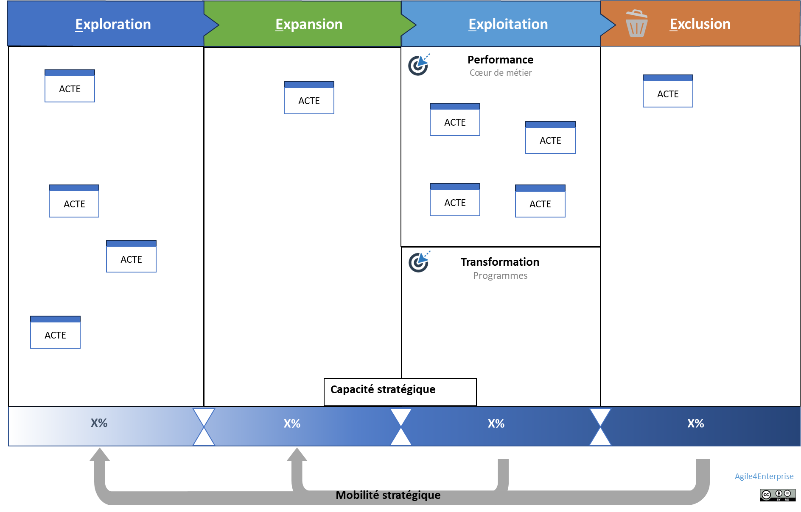

# Guide de l’outil PACTE

<aside>
📌

**Objectif : Donner une trajectoire claire aux investissements et transformations**

- Modèle basé sur les 4E : **Exploration, Expansion, Exploitation, Exclusion**.
- Permet d’équilibrer **innovation, croissance et performance**.
- Aide à structurer **les arbitrages et décisions stratégiques**.
</aside>

Visuel de l’outil PACTE

## Donner une trajectoire claire aux investissements et transformations

> ***P**ortfolio **A**gile **C**anevas pour la **T**rajectoire d’**E**ntreprise, évolutive, engageante et équilibrée*
> 

L'outil PACTE est conçu pour soutenir la stratégie de l'entreprise dans un environnement complexe et dynamique. Il sert de cadre de pilotage pour arbitrer, prioriser et coordonner les investissements stratégiques à l'échelle de l'organisation.

Nous utilisons un canevas pour rassembler au même endroit toutes les informations pour prendre des décisions au niveau du portefeuille stratégique. L’idée est de se focaliser sur les [changements de zones](https://www.notion.so/Le-mod-le-A4E-de-l-agilit-portfolio-13490eaf28ff803a884fc20066900149?pvs=21) des actifs stratégiques, les capacités stratégiques et la mobilité stratégique associées.

## Un canevas pour piloter les trajectoires stratégiques

PACTE est un tableau de visualisation dynamique basé sur les quatre zones du modèle 4E :

- **Exploration** : détection et expérimentation d'opportunités.
- **Expansion** : passage à l'échelle d'un modèle viable.
- **Exploitation** : intégration dans le cœur de métier.
- **Exclusion** : retrait ou réallocation de ressources.

Chaque actif stratégique de l'entreprise (activité, initiative, produit, service, capacité...) est positionné dans l'une de ces zones. Le mouvement d'une zone à l'autre constitue un changement stratégique, engageant des décisions et des investissements.

Le tableau fonctionne à la manière d'un [**Kanban](https://www.notion.so/Kanban-17590eaf28ff8002ac08fead95b04e5a?pvs=21) stratégique** : il permet de limiter le nombre d'éléments dans chaque zone pour se concentrer sur l'essentiel :

*A priori, les limites ne sont pas pertinentes sur le cœur de métier, en revanche, elles le sont sur la partie transformation. L’expansion est une phase particulière. Le but est de passer un business model viable  à l’échelle. Cela représente un effort important, en temps et en budget, pour l’entreprise et un risque important pour le développement puis pour son intégration en phase d’exploitation. C’est pour cela qu’il est recommandé de se focaliser sur une expansion à la fois.*

Cette logique de flux est essentielle pour favoriser la prise de décision continue et la gestion adaptative du portefeuille.

## Encadrer les arbitrages stratégiques

L'outil PACTE intègre la notion de **capacité stratégique**. Pour chaque zone 4E, on associe une enveloppe budgétaire, un pourcentage d'investissement ou un nombre de postes, défini par la direction. Cela permet d'établir un cadre explicite d'arbitrage entre ambition, ressources et contraintes.

Ce cadre favorise l'alignement entre ambitions stratégiques (par exemple les OKR) et les moyens alloués aux initiatives. Il soutient la responsabilité de la direction dans ses choix d'investissement.

## Articuler vision globale et exécution locale

Les actifs stratégiques figurant dans PACTE sont portés par les unités stratégiques et modélisés par l'outil [ACTE](https://www.notion.so/Guide-de-l-outil-ACTE-13490eaf28ff802e8fcde2047f78143b?pvs=21). L'ensemble des ACTEs de l'entreprise sont ainsi encapsulés dans un PACTE unique ou décliné par niveau :

- **PACTE corporate** : portefeuille d'activités et de métiers de l'entreprise.
    
    *Par exemple, en reprenant notre ESN, le portefeuille du département formation est constitué de son catalogue de formations. Certaines formations sont les “vaches à lait”, en phase d’exploitation, d’autres les “stars” de demain en développement, certaines ne fonctionnent plus et seront enlevés du catalogue, quand d’autres en exploration feront leur apparition prochainement.*
    
- **PACTE stratégique** : portefeuille d'initiatives des unités stratégiques.
    
    Les éléments représentés sont des initiatives stratégiques de l’unité. Ce sont des initiatives nécessaires pour le succès des OKR stratégiques et l’atteinte des KPI.
    
    <aside>
    🧰
    
    C’est le principe du [**Lean Portfolio Management**](https://www.notion.so/Lean-portfolio-management-16f90eaf28ff80f6b4f2d32d142a9a8f?pvs=21) de Safe.
    
    </aside>
    
- **PACTE tactique** : portefeuille de fonctionnalités ou de services portés par des unités tactiques.
    
    *Par exemple, la formation cyber sécurité du catalogue peut contenir un module praticien en développement, un module fondations en e-learning en exploitation, et un modèle expert en exploration.*
    

Cette déclinaison permet un **pilotage en cascade aligné** sur les différents niveaux de stratégie, tout en respectant l'autonomie des unités. Elle soutient la stratégie délibérée par les ratios et les limites de capacité, mais laisse place à une stratégie émergente par la mise en mouvement des actifs et la visibilité offerte.

<aside>
💡

Passer un **PACTE** pour mieux passer à l’[ACTE](https://www.notion.so/Guide-de-l-outil-ACTE-13490eaf28ff802e8fcde2047f78143b?pvs=21)

</aside>

Enfin, les changements dans ce tableau doivent avoir un impact sur l’allocation des ressources et des compétences. Du point de vue de l’agilité portfolio, cela se traduit par de la [mobilité stratégique](https://www.notion.so/La-mobilit-strat-gique-une-solution-pour-une-organisation-dynamique-14390eaf28ff801fa7fbef124c330c15?pvs=21) entre les unités stratégiques.

## Gouverner les mouvements stratégiques

PACTE rend visibles les mouvements entre zones 4E. Ces mouvements représentent les **décisions stratégiques** : accélérer une expansion, décider d'un retrait, intégrer dans le cœur de métier.

Ces décisions doivent s'accompagner de [**mobilités stratégiques**](https://www.notion.so/La-mobilit-strat-gique-une-solution-pour-une-organisation-dynamique-14390eaf28ff801fa7fbef124c330c15?pvs=21) : allocation de compétences, reconfiguration d'équipes, mise à disposition de ressources. PACTE est alors un support pour **coordonner la transformation organisationnelle** à partir de la stratégie.

Il permet aussi d'évaluer les impacts d'une stratégie sur l'organisation actuelle, et d'anticiper les adaptations à opérer : design organisationnel, gouvernance, capacités à développer.

## Un outil intégré au pilotage cadencé

PACTE est lié aux [**cadences de changement**](https://www.notion.so/Les-4-cadences-du-changement-et-de-l-apprentissage-13b90eaf28ff8091b4cce85974f50938?pvs=21) du Framework Agile4Enterprise :

- La **cadence Portfolio** (annuelle) permet de revisiter les grands équilibres et la trajectoire d'ensemble.
- La **cadence Stratégique** (annuelle ou semestrielle) permet d'ajuster les ambitions et de piloter les zones d'expansion et d'exclusion.
- La **cadence Tactique** (trimestrielle) permet de suivre les avancées et les livrables associés aux actifs.

L'intégration avec les [OKR](https://www.notion.so/OKR-un-outil-de-l-agilit-strat-gique-et-tactique-14590eaf28ff80b3b0f7e344d0764762?pvs=21) permet d'assurer un **pilotage par l'impact**, en mettant en résonance ambitions, ressources et résultats. Le passage d'un actif d'une zone à une autre constitue souvent une validation d'OKR ou l'ouverture d'une nouvelle ambition.

Un des principes de cette méthode est de limiter le nombre d’OKR à chaque niveau de décisions, typiquement trois pour les OKR stratégiques. Il s’agit de focaliser son effort sur ce qui est important maintenant, et non de diluer son effort. Cette limite est basée sur le nombre et non la capacité car les OKR reflètent les ambitions de la stratégie de l’entreprise. Se baser sur la capacité risque de freiner les ambitions. Mais il faut pourtant avoir les moyens de ses ambitions ! Et donc ce sont les initiatives liées aux OKR qui vont être arbitrées et priorisées par rapport à la capacité et au budget. C’est pourquoi dans cet outil PACTE, en face de chaque horizon d’investissement, nous mettons la capacité stratégique (budget, % investissement, …) associée pour avoir ce cadre d’arbitrage. Définir ces ratios fait partie de la capacité stratégique, responsabilité de la direction.

PACTE devient ainsi un support de gouvernance stratégique intégré, connecté à la réalité du terrain et aux capacités de l'organisation. Il aide à passer d'une stratégie intentionnelle à une exécution réelle, tout en renforçant la capacité d'adaptation continue de l'entreprise.

---

# 🔑 Points clés à retenir

> ⚡️ Pourquoi utiliser PACTE ?
> 
> 
> PACTE permet de :
> 
> - Visualiser l'équilibre entre les zones de transformation et d'exploitation
> - Orchestrer les arbitrages d'investissements et de compétences
> - Coordonner les mouvements stratégiques avec les unités d'exécution
> - Aligner stratégie, exécution et design organisationnel
> - Piloter le changement de manière rythmée et adaptative

> 🛠️ Fiche outil : PACTE en pratique
> 
> - Format : tableau visuel en colonnes (4E), post-its ou cartes pour chaque actif
> - Données associées à chaque actif : unité porteuse, état actuel, KPIs, OKRs, budget, équipe en charge, date de passage prévue
> - Fréquence de revue : trimestrielle (cadence tactique), annuelle (cadence stratégique ou portfolio)
> - Participants : équipe dirigeante, responsables stratégiques, managers, PMO, coachs transformation