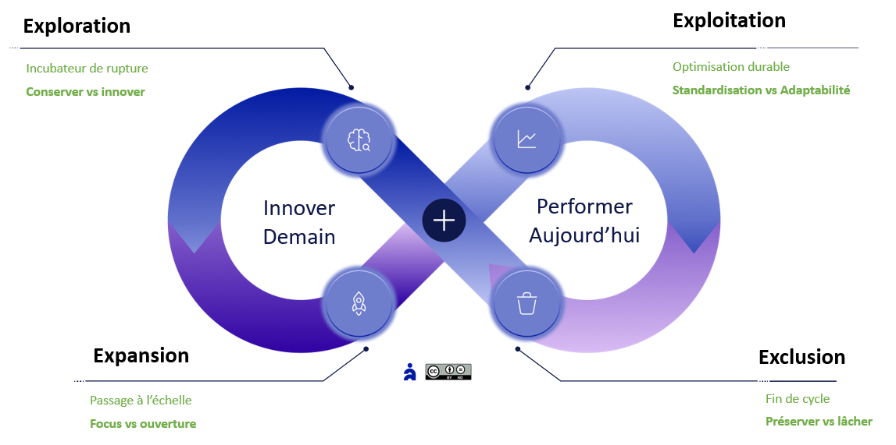

# Navigation stratégique par polarités

✨**Objectif**

Pourquoi les archétypes seuls ne suffisent pas ? Ils doivent être mis en tension pour éviter la rigidité. **Agile4Enterprise** introduit la **navigation par polarités** comme principe de pilotage : plutôt que trancher entre deux vérités opposées, il s’agit d’orchestrer consciemment les oscillations. Cela permet à l’organisation de rester vivante, cohérente et évolutive dans un environnement complexe.

🧑‍🎓**Ce que vous allez apprendre ici**

- Ce que sont les polarités, en quoi elles diffèrent des dilemmes ou des paradoxes.
- Quelles sont les tensions structurantes dans chaque zone stratégique.
- Pourquoi l’agilité durable passe par une navigation consciente dans les tensions — et non leur résolution forcée.

📚**Petit lexique**

- **Polarité** : tension féconde entre deux pôles qui ne s’annulent pas (ex. stabilité vs changement). Elle se gère dans le temps, elle ne se résout pas.
- **Mécanisme de régulation** : pratiques ou rôles qui permettent de maintenir la polarité active sans qu’un pôle prenne tout le pouvoir.
- **Tension stratégique** : déséquilibre observable entre deux impératifs légitimes (ex. alignement stratégique vs autonomie locale).
- **Revue de polarité** : moment rituel où l’on explore les déséquilibres, non pour les lisser, mais pour ajuster les dynamiques.

## Pourquoi passer de statique à dynamique ?

**Agile4X** n’a pas vocation à classer les organisations, mais à offrir des repères partagés dans un contexte de flou, d’hybridation et de mouvement. Il invite à se demander : « Ici, pour cette activité, à ce moment… quel archétype portons-nous vraiment ? » C’est pourquoi il intègre un garde-fou explicite : les **polarités**.

**Quelques définitions** :

- **Dilemme** : choix exclusif (A ou B) → il nécessite un arbitrage.
- **Paradoxe** : opposition apparente de deux vérités contraires → il entraîne une cohabitation permanente.
- **Polarité** : tension durable entre deux pôles complémentaires → chacun apporte des forces, mais expose aussi à des dérives s’il est surinvesti.

Cette dernière ne se réduit pas à un choix à arbitrer, mais doit être gérée dans la durée. La solution consiste à osciller consciemment entre les deux. Selon les phases ou les contextes, l’un peut dominer, à condition de s’appuyer sur des mécanismes de régulation. Plutôt que de figer un archétype, cette logique rend le cadre vivant et antifragile :

- En intégrant la tension comme donnée structurelle du changement,
- En instituant une gouvernance par polarités plutôt que par consensus,
- En ouvrant la voie à une transformation non linéaire, adaptée à la complexité réelle.

## Les polarités fondatrices d’Agile4Enterprise

### La polarité principale de l’agilité d’entreprise : Stabilité ⇄ Changement

- Trop de stabilité, c’est l’inertie,
- Trop de changement, c’est le chaos.

Elle est incarnée dans le modèle Agile4E : **performer aujourd’hui ⇄ innover demain**

### Les polarités par zone stratégique

| Zone Agile4E | Polarité dominante |
| --- | --- |
| **Exploration** | Conserver ⇄ innover|
| **Expansion** | Concentrer ⇄ ouvrir |
| **Exploitation** | Standardiser ⇄ adapter |
| **Exclusion** | Préserver ⇄ lâcher |

Pour naviguer dans ce modèle, **Agile4Enterprise** maintient les tensions vivantes grâce à des revues de polarités intégrées aux cadences de changement. Ces revues ne cherchent pas à constater ce qui fonctionne, mais à explorer ce qui tire dans deux directions.

 **Revue de polarité** :

Rituel où l’on examine les déséquilibres, non pour les gommer, mais pour ajuster les dynamiques. Elles s’inscrivent dans l’agenda des revues existantes. Chaque zone du modèle représente un ancrage temporaire autour d’une polarité dominante.

🌀**Exemple** :
*

- Lancer un produit par un projet initial, puis le stabiliser dans une structure pérenne.
- Préserver, au sein d’une organisation produit, des poches de projets pour tester des idées radicales sans perturber le reste.
- *Reprojétiser* un produit afin de le réorienter stratégiquement.

*

### Les autres polarités

De nombreuses polarités traversent une organisation. Nous en avons croisé au fil de ce guide :

1. **Alignement stratégique ⇄ autonomie locale**
2. **Cadre structurant ⇄ émergence contextuelle**
3. **Évolution continue ⇄ rupture stratégique**
4. **Centralisation stratégique ⇄ décision distribuée**
5. **Uniformisation culturelle ⇄ hétérogénéité organisationnelle**

➿**TechNova**

**Piloter par polarités, pas par consensus** :

Pour traiter durablement la tension entre exploration IA et exploitation Capteurs, la direction intègre les polarités dans ses revues mensuelles. On cartographie chacune avec ses deux pôles, les dérives potentielles et les mécanismes d’équilibrage :

- **Tension** : Prédictibilité (capteurs) ⇄ Innovation distribuée (IA)
- **Oscillation structurée** : MVP IA isolé par des « bascules de fonctionnalité », tout en préservant les SLA critiques.
- **Mécanisme de régulation** : revue bimensuelle entre départements, arbitrée par le coach entreprise.

**Résultat** : Elle devient lisible, gouvernable, et même féconde. L’alignement ne se décrète plus, il se négocie par cycle.

## 👣 Et concrètement, lundi matin ?

Lancez votre première cartographie dès lundi :

1. Identifiez une polarité en tension (ex. : *alignement vs autonomie*)
2. Cartographiez :
    - Les **Bénéfices** du pôle dominant actuel
    - Les **Risques** en cas de surinvestissement
    - Les **Bénéfices** du pôle opposé
    - Les **Risques** si trop d’opposition
3. Identifiez les signaux de dérive et mécanismes de régulation :
    - Qui incarne chaque pôle ?
    - Quelles pratiques permettent de garder la tension vivante ?
    - Quels indicateurs montrent la dérive ?
    - Quelle boucle de régulation est prévue ?

Puis intégrer cette navigation par polarités dans votre prochaine revue stratégique.

## 🔑 Points clés à retenir

- **Les archétypes** : points d’ancrage statiques.
- **Les polarités** : moteur dynamique d’oscillation consciente.
- Les polarités sont ce qui empêche le cadre de se figer. Elles sont le moteur interne de son adaptation.

