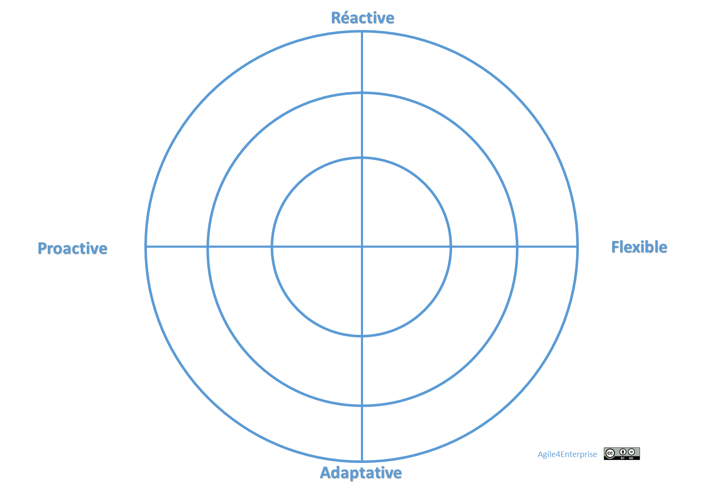

# Radar de l’entreprise agile

Propriétaire: Laurent Morisseau

# Le Radar

## Principes du radar

Le radar est l’outil associé au [modèle de maturité IMPACTE](https://www.notion.so/Le-mod-le-de-maturit-IMPACTE-18b90eaf28ff8053a419ccaa7d91bc21?pvs=21). Il permet aux organisations d’évaluer leur agilité sur quatre axes fondamentaux : **réactivité**, **flexibilité**, **adaptabilité** et **proactivité**.

### Les axes

Ce radar est constitué de 4 axes correspondants aux [4 capacités organisationnelles principales de l’agilité d’entreprise](https://www.notion.so/Les-4-capacit-s-organisationnelles-cl-s-13790eaf28ff8077bff1ecf61771656f?pvs=21) : Réactif, flexible, adaptable, et proactif.

### Une évaluation par rapport à une cible

L’évaluation ne se fait pas dans l’absolu, mais en fonction d’un **objectif de transformation** fixé par l’organisation elle-même. Le radar mesure alors l’écart entre la situation actuelle et cette cible. Pour faciliter cet exercice, il est possible de s’appuyer sur les **signatures types** des [quatre archétypes agiles](https://www.notion.so/Les-4-arch-types-agiles-14290eaf28ff8004874de93022c243f8?pvs=21) (Flux, Produit, Projet, Réseau).

### L’échelle de maturité

Chaque capacité (réactif, flexible, adaptatif, proactif) est évaluée sur une **échelle de 1 à 5**, permettant de visualiser les progrès dans la transformation :

| **Niveau** | **Description** |
| --- | --- |
| **1 - Initial** | Pratiques ponctuelles, rigides, sans cadre agile ni retour d’expérience structuré. |
| **2 - Émergent** | Premières expérimentations locales ; la dynamique agile débute. |
| **3 - Structuré** | L’agilité est ancrée dans les pratiques, les retours d’expérience sont systématiques. |
| **4 - Avancé** | Agilité à l’échelle, coordination inter-niveaux, forte capacité d’adaptation. |
| **5 - Amélioration continue** | Agilité systémique consolidée, auto-apprentissage, anticipation stratégique. |

### **Initial (Niveau 1)**

- Actions ponctuelles, peu structurées.
- Tout repose sur une approche statique et planification annuelle uniquement.
- Processus rigides et statiques sans ajustements intermédiaires.
- Pas de cadre agile formalisé.

Transition au niveau supérieur : Mettre en place des processus adaptatifs et introduire des cycles de feedback.

### **Émergent (Niveau 2)**

- Approche expérimentale, premiers résultats concrets.
- Premiers processus agile mis en place en mode pilote.

Transition au niveau supérieur : Renforcer la cohésion entre niveaux stratégiques et opérationnels.

### **Structuré (Niveau 3)**

- Pratiques agiles bien ancrées dans les équipes et les unités.
- Utilisation systématique des feedbacks pour améliorer les processus.

Transition au niveau supérieur : Favoriser une approche systémique et des ajustements dynamiques.

### **Avancé (Niveau 4)**

- Agilité à l’échelle, alignement des différents niveaux de l’organisation.
- Forte réactivité et capacité d’adaptation.

Transition au niveau supérieur : Favoriser une approche systémique et des ajustements dynamiques.

1. **Amélioration continue** :
    - Agilité systémique, culture d’amélioration continue et d’apprentissage organisationnel.
    - Ancrer une culture d’amélioration continue et d’apprentissage organisationnel.
    - Anticipation proactive et création de valeur durable.

### **Amélioration continue** (Niveau 5)

- **Agilité systémique consolidée** : tous les niveaux de l’organisation (opérationnel, tactique, stratégique, portfolio) sont interconnectés, alignés dynamiquement et fonctionnent comme un écosystème agile cohérent.
- **Réactivité anticipée** : les signaux faibles sont détectés et exploités en amont, les mécanismes de réponse sont préconfigurés ou automatisés.
- **Flexibilité fluide** : les structures, processus et rôles peuvent être reconfigurés sans friction, selon les besoins de l’environnement ou de la stratégie.
- **Adaptabilité organique** : l’organisation évolue de manière continue par auto-apprentissage, sans dépendre d’impulsions externes.
- **Proactivité stratégique** : capacité à initier le changement à l’échelle de l’écosystème, à influencer les dynamiques de marché ou de secteur.
- **Décision distribuée et en temps réel** : les décisions pertinentes sont prises au plus proche de l’action, soutenues par des données fiables, dans des boucles temps court.
- **Culture d’entreprise** : les collaborateurs incarnent les principes de l’agilité, l’organisation régénère constamment ses capacités et sa pertinence stratégique.

**Transition au niveau optimisé :**

- Intégrer les apprentissages dans l’ADN de l’organisation.
- Déployer des modèles d’auto-régulation et d’évolution continue à tous les niveaux.
- Piloter la performance en intégrant impact stratégique, apprentissage collectif et contribution au long terme.

## **Déclinaison du radar par axe (capacités)**

Rappel des [4 capacités organisationnelles clés à développer pour une entreprise agile](https://www.notion.so/Les-4-capacit-s-organisationnelles-cl-s-13790eaf28ff8077bff1ecf61771656f?pvs=21) :

<aside>
💡

**Dans une entreprise agile, quatre capacités clés définissent quatre stratégies de réponse variées face au changement incrémental et continu, et à la gestion du risque et de l’incertitude :**

- **Réactivité** → Gérer les imprévus et opportunités sans les subir.
- **Flexibilité** → Ajuster l’organisation sans remettre en cause toute l’organisation.
- **Adaptabilité** → Transformer l’entreprise pour qu’elle reste compétitive.
- **Proactivité** → Être acteur du changement avant qu’il ne soit subi.

Ces capacités clés sont développées en mode agile dans une démarche d’**amélioration continue**.

</aside>

Les questions auxquelles nous souhaitons répondre, dans le cadre d’une transformation agile sont :

<aside>
❓

Quel est le niveau souhaité de réactivité, de flexibilité, d’adaptabilité et de proactivité ?

</aside>

<aside>
❓

Où en sommes-nous aujourd’hui ?

</aside>

- [**Axe Réactive](https://www.notion.so/Les-4-capacit-s-organisationnelles-cl-s-13790eaf28ff8077bff1ecf61771656f?pvs=21) (court terme)**
    - Répondre immédiatement aux urgences et imprévus.
    - Prise de décision rapide et gestion des risques.
    - Exécution immédiate des actions sans transformation profonde, sans anticipation, mais sans remettre en cause la planification.
- [**Axe Flexible](https://www.notion.so/Les-4-capacit-s-organisationnelles-cl-s-13790eaf28ff8077bff1ecf61771656f?pvs=21) (moyen terme)**
    - Ajustements temporaires aux changements sans modifier la structure, basés sur les feedbacks pour ajuster les priorités.
    - L'organisation peut ajuster ses priorités à plusieurs niveaux (stratégique, tactique, opérationnel) grâce à une meilleure coordination.
    - Adaptation des méthodes, produits et services aux besoins variés.
    - Capacité à absorber les chocs plutôt que d’y réagir brutalement.
- [**Axe Adaptatif](https://www.notion.so/Les-4-capacit-s-organisationnelles-cl-s-13790eaf28ff8077bff1ecf61771656f?pvs=21) (long terme)**
    - Transformation durable des stratégies, processus et structures, basé sur une gestion dynamique des objectifs, et des feedbacks continus.
    - Investissement dans les compétences et évolution organisationnelle.
    - Vision long terme pour rester compétitif face aux évolutions du marché et des besoins des parties prenantes
    - Planification adaptative basée sur les événements (event-driven).
- [**Axe Proactif](https://www.notion.so/Les-4-capacit-s-organisationnelles-cl-s-13790eaf28ff8077bff1ecf61771656f?pvs=21) (anticipation)**
    - Initier le changement et expérimenter avant que le besoin n’émerge.
    - Déclencher des cycles d’apprentissage et d’amélioration continue, intégration fluide des retours terrain dans les décisions stratégiques.
    - Être acteur du changement plutôt que de le subir.
    - Anticipation proactive des opportunités et des risques.

# Déclinaison par archétype agile

Le radar peut être appliqué **par archétype organisationnel** (Flux, Produit, Projet, Réseau), chacun ayant une **signature propre** selon sa finalité stratégique. Cela permet de refléter les priorités et dynamiques propres à chaque archétype tout en utilisant la même échelle  - réactif, flexible, adaptatif, proactif.

<aside>
🔎

Voir le radar de l’[archétype Projet](https://www.notion.so/Agile4Project-Arch-type-Projet-agile-13490eaf28ff8030a8aeecf9206d94ea?pvs=21)

</aside>

<aside>
🔎

Voir le radar de l’[archétype Produit](https://www.notion.so/Agile4Product-Arch-type-Produit-13490eaf28ff80b29733f767568ab6a5?pvs=21)

</aside>

<aside>
🔎

Voir le radar de l’[archétype Flux](https://www.notion.so/Agile4Flow-Arch-type-Flux-13490eaf28ff809bac54ed5deaa8a257?pvs=21)

</aside>

<aside>
🔎

Voir le radar de l’[archétype Réseau](https://www.notion.so/Agile4Network-Arch-type-R-seau-13490eaf28ff805c8fcfeed28b68a77b?pvs=21)

</aside>