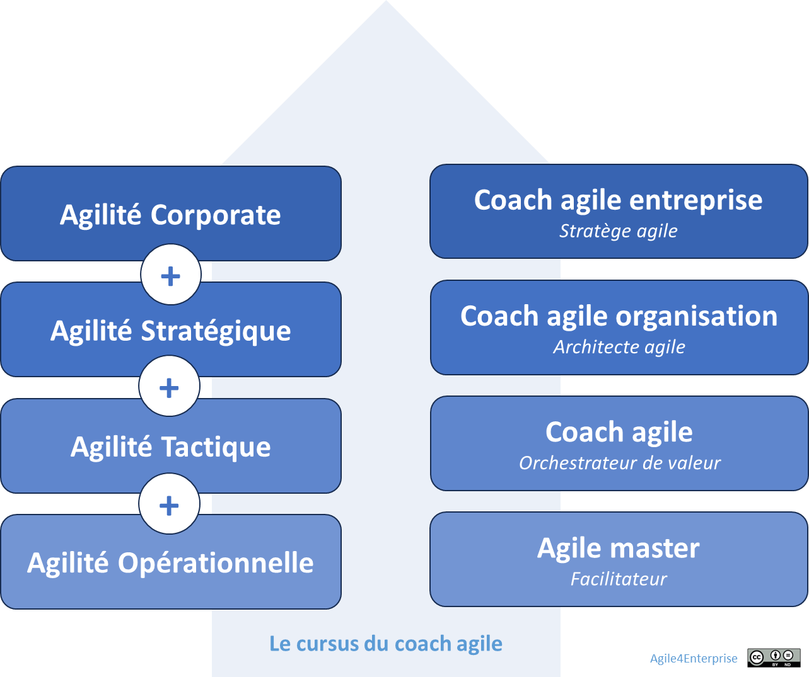

# Rôles de la transformation agile

🔘 **Objectif** Découvrez comment les **4 rôles de transformation agile** – Agile Master, Coach Agile Tactique, Coach Organisation et Coach d’Entreprise – se coordonnent pour porter une agilité **vivante**, **contextuelle** et **durable**, de l’équipe au COMEX.

Les 4 rôles de coach agile

# Rôles de l’entreprise agile

## Rôles internes

Les rôles internes (leaders, managers, collaborateurs) ne sont **pas des rôles de transformation** mais doivent **changer de posture mentale**.

> *Par exemple, le leader agile joue un rôle clé en garantissant une stratégie dynamique et en facilitant la mise en œuvre des ajustements stratégiques nécessaires pour maintenir un avantage concurrentiel.*
> 

Ces rôles doivent également s’ajuster selon les zones de management : C’est l’agilité managériale en action.

## **Rôles de transformation**

Les **rôles de transformation** ne sont pas des fonctions permanentes : ce sont des **catalyseurs** appelés à disparaître quand l’organisation devient **auto-transformante**. Leur mission : faciliter, structurer et aligner les pratiques agiles, tout en maintenant la posture critique grâce aux Shadow Roles (Agile4Entropy).

Chaque rôle est un **levier de transformation situé** au service de l’agilité dans sa dimension locale et systémique. Tous doivent maîtriser les fondations du framework **Agile4Enterprise** et s'inscrire dans une dynamique d’apprentissage continu, appuyée par un cursus de formation dédié.

| Rôle | Mission clé | Shadow Role |
| --- | --- | --- |
| **Agile Master** | Fluidifie l’équipe & aligne les OKR | Catalyseur d’Émergence |
| **Coach Tactique** | Structure la chaîne de valeur & OKR | Perturbateur Tactique |
| **Coach Organisation** | Fait dialoguer stratégie & tactique | Dissident Stratégique |
| **Coach d’Entreprise** | Orchestration portfolio & gouvernance | Bousculeur de Transfo. |

**Version “light”** pour TPE/PME

- Fusion Agile Master + Coach Tactique → **Orchestrateur Agile**
- Simplifier en 2 rôles : **Équipe** & **Entreprise**

---

## 3 missions clés par rôle

**Agile Master**

1. Installer un cadre multiméthodes adapté.
2. Mettre en place l’amélioration continue et les feedback rapides.
3. Mesurer la fluidité (WIP, cycles courts).

🔎 En savoir plus sur le rôle Agile Master

**Coach Tactique**

1. Coconcevoir le modèle opératoire.
2. Piloter les OKR tactiques.
3. Synchroniser cadences stratégique/tactique.

🔎 En savoir plus sur le rôle Coach agile tactique

**Coach Organisation**

1. Déployer IMPACTE & ACTE.
2. Mettre en place une gouvernance adaptative.
3. Cultiver la culture agile (archétypes).

🔎 En savoir plus sur le rôle Coach agile organisation

**Coach d’Entreprise**

1. Cartographier le portefeuille (4E, PACTE).
2. Animer le COMEX en revue adaptative.
3. Piloter l’écosystème des coaches.

🔎 En savoir plus sur le rôle Coach agile entreprise

---

➿ **TechNova** Dans la salle du COMEX, lundi matin : > « Comment financer notre prototype IA sans sacrifier le CA des capteurs historiques ? » lance la Directrice des Opérations. > > > « La domotique doit s’étendre maintenant, pas dans trois ans ! » rétorque le Directeur Commercial. > Pendant que le CFO brandit ses tableurs, le CTO plaide pour le programme RSE – en vain. Chaque BU défend son modèle opératoire : flux pour l’exploitation, produit pour la domotique, réseau pour la R&D. Le débat tourne en rond : pas de décision claire, pas d’arbitrages partagés. **Le Coach Agile d’Entreprise** propose alors un atelier 4E pour cartographier leurs cinq activités : - Capteurs : Exploitation - Domotique : Expansion - Cloud industriel : Expansion - Prototype IA : Exploration - Projets RSE : Exclusion Armé d’un grand tableau PACTE, il trace les zones, invite chaque membre à placer un post-it. Le silence retombe, la vision se fait nette. En quelques minutes, les tensions s’éclaircissent : 1. **Entrée expansion** devient un point d’arbitrage programmé : un “Kill Review” mensuel décidera de continuer ou d’arrêter chaque pilote. 2. **Court terme vs Long terme** trouve sa réponse dans un jeu d’OKR d’entreprise liant résultats trimestriels et jalons R&D. 3. **Centralisation vs Autonomie** se traduit par un comité PACTE restreint, qui délègue certaines décisions tactiques tout en gardant un fil rouge stratégique. Au terme de l’atelier, le COMEX adopte un plan d’action clair : budgets réalloués, calendrier des revues et indicateurs partagés. TechNova a désormais une **gouvernance agile unifiée**, capable de piloter un portefeuille hétérogène sans étouffer l’innovation.

## Checklist atelier onboarding

- [ ]  **Présenter** les 4 rôles & leur valeur ajoutée
- [ ]  **Distribuer** une carte de mission par rôle
- [ ]  **Jouer** un mini-cas réel en sous-groupes
- [ ]  **Identifier** qui peut endosser le Shadow Role
- [ ]  **Planifier** les premières revues (OKR, PACTE)

---

#